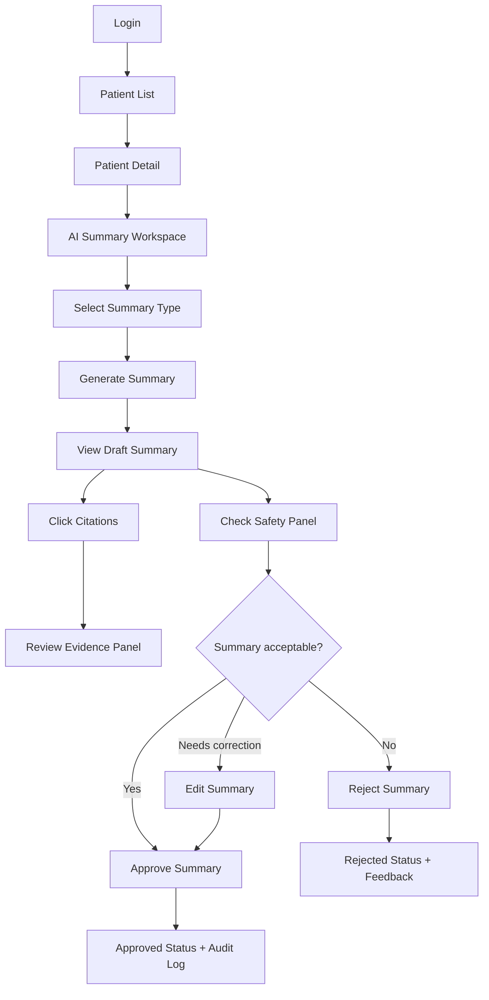

# UI Golden Path — Main Role: Doctor

## 1. Mục tiêu tài liệu

Tài liệu này mô tả **UI first golden path** cho role chính của hệ thống: **Doctor**.

Golden path là luồng lý tưởng từ khi bác sĩ đăng nhập đến khi tạo, kiểm tra và phê duyệt bản tóm tắt bệnh án do AI hỗ trợ.

Luồng này tập trung vào MVP:

```text
Doctor login
→ Open patient list
→ Open patient detail
→ Generate AI summary
→ Review citation-based summary
→ Check safety warnings
→ Edit if needed
→ Approve or reject
→ Audit log saved
```

---

# 2. Main Role

## 2.1 Primary actor

```text
Doctor
```

## 2.2 Doctor objective

Bác sĩ cần nhanh chóng hiểu tình trạng bệnh nhân từ nhiều nguồn bệnh án khác nhau, nhưng vẫn cần kiểm tra được nguồn gốc thông tin trước khi tin dùng summary.

## 2.3 Doctor success criteria

Doctor thành công khi:

- Tìm được bệnh nhân đúng.
- Xem được dữ liệu lâm sàng liên quan.
- Tạo được bản summary có cấu trúc.
- Click được citation để kiểm tra nguồn.
- Thấy rõ claim nào thiếu nguồn hoặc có mâu thuẫn.
- Chỉnh sửa được nội dung nếu cần.
- Approve/reject được summary.
- Hệ thống lưu lại version và audit log.

---

# 3. Golden Path Overview



---

# 4. Screen 1 — Login

## 4.1 Purpose

Xác thực bác sĩ và load quyền truy cập.

## 4.2 UI layout

```text
┌────────────────────────────────────────┐
│ Medical Record Summarization System    │
│                                        │
│ Email                                  │
│ [____________________________]         │
│ Password                               │
│ [____________________________]         │
│                                        │
│ [ Login ]                              │
│                                        │
│ Use hospital SSO                       │
└────────────────────────────────────────┘
```

## 4.3 UI fields

| Field | Type | Required |
|---|---|---:|
| Email | Text | Yes |
| Password | Password | Yes |
| Login button | Button | Yes |
| SSO option | Button/link | Production |

## 4.4 System behavior

- Validate credentials.
- Load user role.
- Create login audit event.
- Redirect doctor to Patient List.

## 4.5 Error states

| Error | UI message |
|---|---|
| Invalid credentials | Email hoặc mật khẩu không đúng. |
| Inactive account | Tài khoản không hoạt động. Vui lòng liên hệ IT Admin. |
| No role assigned | Tài khoản chưa được phân quyền. |

---

# 5. Screen 2 — Patient List

## 5.1 Purpose

Giúp bác sĩ tìm đúng bệnh nhân hoặc danh sách bệnh nhân được phân công.

## 5.2 UI layout

```text
┌────────────────────────────────────────────────────────────┐
│ Patient List                                                │
├────────────────────────────────────────────────────────────┤
│ Search: [ Patient ID / Name / Encounter ]  [ Search ]       │
│ Filters: Department [v] Status [v] Assigned to me [x]       │
├─────────────┬──────┬────────┬────────────┬────────────────┤
│ Patient ID  │ Age  │ Gender │ Encounter  │ Summary Status │
├─────────────┼──────┼────────┼────────────┼────────────────┤
│ P-001       │ 62   │ Male   │ Inpatient  │ Draft          │
│ P-002       │ 48   │ Female │ Outpatient │ No summary     │
└─────────────┴──────┴────────┴────────────┴────────────────┘
```

## 5.3 Display fields

| Field | Description |
|---|---|
| Patient ID / Hash | Mã bệnh nhân hoặc mã ẩn danh |
| Age | Tuổi |
| Gender | Giới tính |
| Current encounter | Loại encounter hiện tại |
| Department | Khoa/phòng |
| Last summary status | No summary, Draft, Approved, Rejected |
| Last updated | Lần cập nhật gần nhất |

## 5.4 Primary actions

| Action | Behavior |
|---|---|
| Search patient | Filter patient list |
| Click patient row | Open Patient Detail |
| Filter assigned to me | Show only assigned patients |
| View summary status | Quick status indicator |

## 5.5 Empty state

```text
Không tìm thấy bệnh nhân phù hợp với điều kiện tìm kiếm.
```

---

# 6. Screen 3 — Patient Detail

## 6.1 Purpose

Hiển thị context bệnh nhân và điểm vào cho AI Summary.

## 6.2 UI layout

```text
┌────────────────────────────────────────────────────────────┐
│ Patient Header                                              │
│ Patient ID: P-001 | Age: 62 | Gender: Male | Inpatient      │
│ Department: Internal Medicine | Status: Active              │
├────────────────────────────────────────────────────────────┤
│ Tabs: Overview | Encounters | Documents | AI Summary        │
├────────────────────────────────────────────────────────────┤
│ Overview                                                    │
│ - Reason for visit: Shortness of breath                     │
│ - Active problems: Diabetes, Hypertension                   │
│ - Recent labs: Creatinine 1.8 mg/dL                         │
│ - Current medications: Metformin, ...                       │
│                                                            │
│ [ Generate AI Summary ]                                     │
└────────────────────────────────────────────────────────────┘
```

## 6.3 Tabs

| Tab | Purpose |
|---|---|
| Overview | Patient snapshot from structured data |
| Encounters | Encounter timeline |
| Documents | Clinical notes and reports |
| AI Summary | Summary workspace |

## 6.4 Primary CTA

```text
Generate AI Summary
```

## 6.5 System behavior

When doctor clicks `Generate AI Summary`:

- Open AI Summary Workspace.
- Ask doctor to select summary type.
- Prepare evidence retrieval.

---

# 7. Screen 4 — AI Summary Workspace

## 7.1 Purpose

Đây là màn hình chính của MVP. Bác sĩ tạo, xem, kiểm tra citation, chỉnh sửa và approve/reject summary.

## 7.2 UI layout

```text
┌────────────────────────────────────────────────────────────────────┐
│ AI Summary Workspace                                                │
│ Patient ID: P-001 | Encounter: Inpatient | Last data update: 09:00 │
├────────────────────────────────────────────────────────────────────┤
│ Summary Type: [ Patient Snapshot v ]  Language: [ Vietnamese v ]    │
│ [ Generate ] [ Regenerate ]                                         │
├───────────────────────────────────────┬────────────────────────────┤
│ Left Panel: Draft Summary             │ Right Panel: Evidence      │
│                                       │                            │
│ 1. Patient Snapshot                   │ Source: Admission Note     │
│ Bệnh nhân nam, 62 tuổi... [1]         │ Date: 2026-05-20           │
│                                       │ Highlight:                │
│ 2. Active Problems                    │ "Past medical history..." │
│ Đái tháo đường type 2... [2]          │                            │
│                                       │ [Open full document]       │
│ 3. Recent Labs                        │                            │
│ Creatinine 1.8 mg/dL... [3]           │                            │
├───────────────────────────────────────┴────────────────────────────┤
│ Safety Panel                                                        │
│ Citation coverage: 95% | Unsupported claims: 1 | Conflicts: 0       │
│ Warning: 1 claim requires clinician review                          │
├────────────────────────────────────────────────────────────────────┤
│ [ Edit ] [ Approve ] [ Reject ] [ Export ]                          │
└────────────────────────────────────────────────────────────────────┘
```

---

# 8. AI Summary Workspace Components

## 8.1 Patient header

| Field | Description |
|---|---|
| Patient ID | Internal/de-identified ID |
| Encounter | Current encounter |
| Department | Department |
| Last data update | Latest source data timestamp |
| Summary status | Draft/Under review/Approved/Rejected |

## 8.2 Summary type selector

| Summary type | Description |
|---|---|
| Patient Snapshot | Tóm tắt nhanh bệnh nhân |
| Active Problem Summary | Tóm tắt vấn đề/chẩn đoán |
| Clinical Timeline | Timeline diễn biến |
| Medication Summary | Tóm tắt thuốc |
| Lab Highlight Summary | Tóm tắt xét nghiệm |
| Discharge Summary Draft | Bản nháp ra viện |

## 8.3 Summary panel

Display sections:

```text
Patient Snapshot
Active Problems
Recent Clinical Course
Medications
Labs and Imaging Highlights
Pending Issues / Follow-up
Needs Clinician Review
```

## 8.4 Citation badges

| Badge | Meaning |
|---|---|
| `[1]` normal | Supported claim |
| `[!]` yellow | Weak citation |
| `[Missing]` red | Missing citation |
| `[Conflict]` red | Conflicting sources |

## 8.5 Evidence panel

When doctor clicks citation:

- Show source document.
- Highlight exact source span.
- Show metadata.
- Allow opening full source.

Display fields:

```text
Source type
Document title
Document date
Author/department
Highlighted text span
Surrounding context
Source reliability
```

## 8.6 Safety panel

Shows:

```text
Citation coverage
Unsupported claim count
Weak citation count
Conflict count
Missing information
Approval blocking warnings
```

---

# 9. Golden Path Detailed Steps

## Step 1 — Doctor opens AI Summary Workspace

### User action

Doctor clicks:

```text
Generate AI Summary
```

### System response

- Opens workspace.
- Loads patient context.
- Displays summary type selector.

---

## Step 2 — Doctor selects summary type

### User action

Doctor selects:

```text
Patient Snapshot
```

### System response

- Shows expected sections.
- Shows estimated data sources to be used.
- Enables Generate button.

---

## Step 3 — Doctor clicks Generate

### User action

Doctor clicks:

```text
Generate
```

### System response

- Shows loading state.
- Runs retrieval.
- Builds evidence pack.
- Calls summarization model.
- Runs claim extraction.
- Runs citation verification.
- Runs safety check.
- Saves summary as draft.

### Loading state text

```text
Đang tạo bản tóm tắt từ dữ liệu bệnh án hiện có...
```

---

## Step 4 — System displays draft summary

### System response

Displays:

- Structured summary.
- Citation badges.
- Safety panel.
- Status = Draft.

### Summary status

```text
Draft — Cần bác sĩ kiểm duyệt trước khi sử dụng.
```

---

## Step 5 — Doctor clicks citation

### User action

Doctor clicks citation badge `[1]`.

### System response

- Evidence panel updates.
- Source text is highlighted.
- Audit event `view_citation` is created.

---

## Step 6 — Doctor reviews safety warnings

### User action

Doctor opens Safety Panel.

### System response

Displays:

```text
1 unsupported claim found.
0 conflicting claims found.
Citation coverage: 95%.
```

If unsupported claim exists:

```text
Claim: "Bệnh nhân có bệnh thận mạn giai đoạn 3."
Reason: Không tìm thấy bằng chứng hỗ trợ trong dữ liệu hiện có.
Recommended action: Edit or reject.
```

---

## Step 7A — Doctor approves summary

### User action

Doctor clicks:

```text
Approve
```

### Confirmation modal

```text
Bạn xác nhận đã kiểm tra bản tóm tắt và các citation liên quan?

[Cancel] [Confirm Approve]
```

### System response

- Status changes to Approved.
- approved_by and approved_at saved.
- Audit event created.
- Export button enabled.

---

## Step 7B — Doctor edits summary

### User action

Doctor clicks:

```text
Edit
```

### System response

- Summary text becomes editable.
- Changes tracked.
- Doctor can save edited version.

### Save behavior

- Status changes to Edited.
- Original AI version preserved.
- Edited text stored.
- Audit event `edit_summary` created.

---

## Step 7C — Doctor rejects summary

### User action

Doctor clicks:

```text
Reject
```

### Reject modal

```text
Reason:
[ Wrong citation v ]

Comment:
[ The medication change is not supported by the cited source. ]

[Cancel] [Reject Summary]
```

### System response

- Status changes to Rejected.
- Rejection reason saved.
- Audit event created.
- Feedback appears in quality dashboard.

---

# 10. Approval Blocking Rules

## 10.1 Hard block conditions

Approval should be blocked if:

| Condition | Reason |
|---|---|
| Critical unsupported claim exists | High patient safety risk |
| Wrong-patient evidence detected | Critical privacy/safety issue |
| Citation coverage below minimum threshold | Summary not traceable |
| Safety check failed | System cannot verify output |
| User does not have doctor role | Authorization issue |

## 10.2 Soft warning conditions

Approval can proceed with warning if:

| Condition | UI behavior |
|---|---|
| Weak citation exists | Show confirmation |
| Missing non-critical info | Show warning |
| Low confidence section | Show caution |
| Old source data | Show stale data warning |

---

# 11. UI State Definitions

| State | Description | Available actions |
|---|---|---|
| No summary | No AI summary generated | Generate |
| Generating | System is processing | Cancel if async |
| Draft | AI summary generated | Edit, Approve, Reject, Regenerate |
| Under review | Doctor opened/reviewing | Edit, Approve, Reject |
| Edited | Doctor edited text | Approve, Reject, Save |
| Approved | Doctor approved | Export, View, Archive |
| Rejected | Doctor rejected | Regenerate, View feedback |
| Error | Generation failed | Retry, Contact admin |

---

# 12. Empty and Error States

## 12.1 No clinical data

```text
Không đủ dữ liệu bệnh án để tạo bản tóm tắt.
Vui lòng kiểm tra clinical notes, encounter hoặc dữ liệu import.
```

## 12.2 Generation error

```text
Không thể tạo bản tóm tắt tại thời điểm này.
Vui lòng thử lại hoặc liên hệ IT Admin nếu lỗi tiếp tục xảy ra.
```

## 12.3 Citation source missing

```text
Không thể mở nguồn citation. Nguồn dữ liệu có thể đã bị xóa hoặc chưa được index.
```

## 12.4 Permission denied

```text
Bạn không có quyền thực hiện thao tác này.
Hoạt động đã được ghi nhận trong audit log.
```

---

# 13. UI Acceptance Criteria

| ID | Acceptance criteria |
|---|---|
| UI-01 | Doctor can login and see assigned patient list |
| UI-02 | Doctor can open patient detail |
| UI-03 | Doctor can generate Patient Snapshot summary |
| UI-04 | Summary is displayed by structured sections |
| UI-05 | Every supported clinical claim shows citation badge |
| UI-06 | Clicking citation opens evidence panel |
| UI-07 | Evidence panel highlights source text |
| UI-08 | Unsupported claims appear in Safety Panel |
| UI-09 | Doctor can edit summary |
| UI-10 | Doctor can approve summary |
| UI-11 | Doctor can reject summary with reason |
| UI-12 | Approved summary is locked from normal editing |
| UI-13 | Rejected summary can be regenerated |
| UI-14 | Every sensitive action creates audit log |
| UI-15 | UI clearly labels AI output as draft before approval |

---

# 14. Golden Path Demo Script

## 14.1 Demo scenario

```text
Patient: P-001
Encounter: Inpatient
Reason: Shortness of breath
Available data:
- Admission note
- Progress note
- Condition record
- Lab result
- Medication record
```

## 14.2 Demo steps

```text
1. Doctor logs in.
2. Doctor opens Patient List.
3. Doctor selects patient P-001.
4. Doctor opens Patient Detail.
5. Doctor clicks Generate AI Summary.
6. Doctor selects Patient Snapshot.
7. System generates draft summary.
8. Doctor clicks citation for diabetes claim.
9. Evidence panel shows source condition/admission note.
10. Doctor reviews Safety Panel.
11. Doctor edits one unclear sentence.
12. Doctor approves summary.
13. System shows status Approved.
14. Admin dashboard metrics update.
```

## 14.3 Demo success criteria

Demo is successful if the audience can see:

- AI summary generation.
- Citation-based verification.
- Unsupported claim warning.
- Doctor-in-the-loop approval.
- Auditability.
- Clear separation between AI draft and approved summary.

---

# 15. Recommended Next UI Screens After Golden Path

After completing golden path, design:

```text
1. Admin Quality Dashboard
2. Ingestion Management Screen
3. Audit Log Viewer
4. Safety Review Dashboard
5. Prompt/Model Config Screen
```

---

# 16. Final UI Principle

The UI must not make the AI output look like an official medical conclusion before doctor approval.

The most important UI design rule is:

> Every clinical claim should be easy to verify, every uncertainty should be visible, and every approval should be attributable to a clinician.
