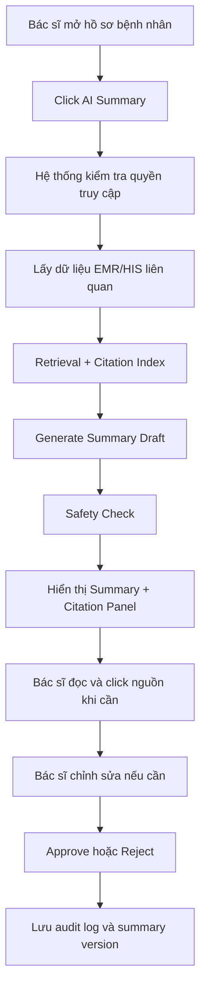
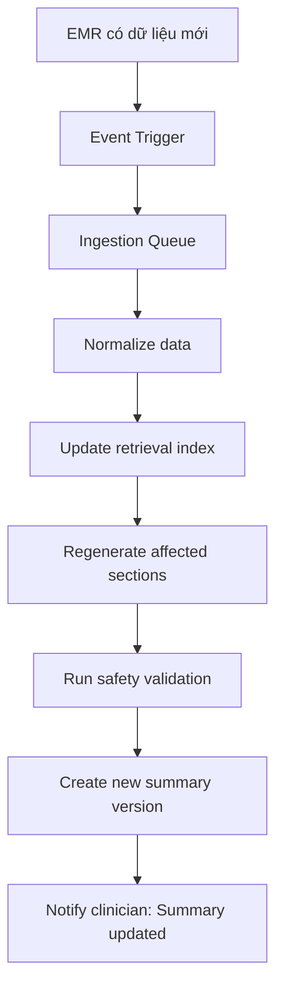
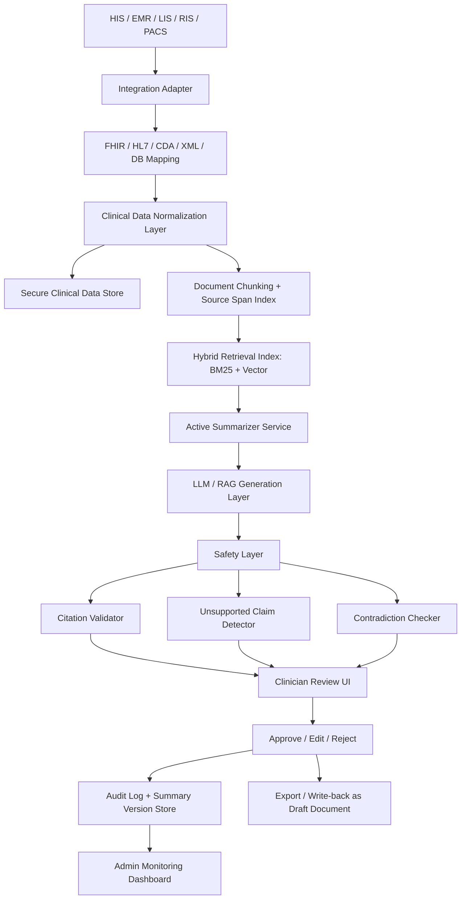

# PRD — Hệ thống Tóm tắt Bệnh án Tích hợp HIS/EMR

**Tên sản phẩm đề xuất:** Clinical Record Summarization Assistant  
**Phiên bản tài liệu:** v0.1  
**Ngôn ngữ:** Tiếng Việt  
**Ngày cập nhật:** 27/05/2026  
**Trạng thái:** Draft cho giai đoạn nghiên cứu, thiết kế MVP và định hướng production  
**Định vị sản phẩm:** Công cụ hỗ trợ tài liệu lâm sàng, không phải hệ thống chẩn đoán hoặc khuyến nghị điều trị tự động

---

## 1. Tóm tắt sản phẩm

Hệ thống Tóm tắt Bệnh án Tích hợp HIS/EMR là một ứng dụng AI hỗ trợ nhân viên y tế rà soát hồ sơ bệnh án nhanh hơn bằng cách tự động tạo bản tóm tắt có cấu trúc từ dữ liệu bệnh án điện tử, ghi chú lâm sàng, chẩn đoán, thuốc, xét nghiệm, dấu hiệu sinh tồn, kết quả cận lâm sàng và diễn biến điều trị.

Điểm khác biệt của sản phẩm không nằm ở việc “tóm tắt văn bản” đơn thuần, mà nằm ở bốn năng lực cốt lõi:

1. **Active Summarizer** — tự động cập nhật tóm tắt khi có dữ liệu bệnh án mới.
2. **Citation-based Summary** — mỗi nhận định lâm sàng quan trọng phải có dẫn nguồn về dữ liệu gốc.
3. **Hallucination Mitigation** — giảm rủi ro AI bịa thông tin bằng grounding, kiểm tra citation, kiểm tra mâu thuẫn và human-in-the-loop.
4. **EMR/HIS Integration** — tích hợp vào workflow bệnh viện qua FHIR/HL7/API hoặc adapter tùy hệ thống.

Sản phẩm nên được phát triển theo chiến lược **PARTNER + BUILD**:

- **Partner** với bệnh viện, nhà cung cấp HIS/EMR hoặc đơn vị triển khai để có dữ liệu, workflow và sandbox tích hợp thực tế.
- **Build** phần AI summarization, citation engine, safety layer, clinician review, audit log và monitoring.
- **Buy** các module phụ nếu cần, ví dụ ASR, OCR, hạ tầng private cloud hoặc connector thương mại.

---

## 2. Bối cảnh và vấn đề

### 2.1. Bối cảnh nghiệp vụ

Trong môi trường bệnh viện, hồ sơ của một bệnh nhân thường nằm rải rác ở nhiều màn hình và phân hệ:

- Thông tin hành chính và lượt khám trong HIS.
- Ghi chú bác sĩ, diễn biến điều trị, chẩn đoán trong EMR.
- Xét nghiệm trong LIS.
- Kết quả chẩn đoán hình ảnh trong RIS/PACS.
- Đơn thuốc và lịch sử dùng thuốc trong phân hệ dược.
- Tài liệu scan hoặc file đính kèm.
- Ghi chú điều dưỡng và bàn giao ca.

Khi bác sĩ cần xem lại bệnh án trước khi khám, chuyển khoa, hội chẩn hoặc ra viện, họ phải đọc nhiều note dài và nhiều kết quả rời rạc. Việc này tốn thời gian, dễ bỏ sót thông tin và làm tăng gánh nặng hành chính.

### 2.2. Vấn đề chính

| Mã | Vấn đề | Tác động |
|---|---|---|
| P-01 | Hồ sơ bệnh án dài, nhiều nguồn, khó đọc nhanh | Tăng thời gian chart review |
| P-02 | Thông tin quan trọng bị phân tán giữa note, xét nghiệm, thuốc, hình ảnh | Dễ bỏ sót dữ liệu khi ra quyết định lâm sàng |
| P-03 | Tóm tắt thủ công tốn thời gian và không nhất quán | Giảm năng suất bác sĩ/điều dưỡng |
| P-04 | AI tạo văn bản có thể hallucinate nếu không được kiểm soát | Rủi ro an toàn và pháp lý |
| P-05 | Nhiều bệnh viện không có FHIR đầy đủ | Cần adapter tích hợp linh hoạt |
| P-06 | Dữ liệu y tế là dữ liệu nhạy cảm | Cần bảo mật, phân quyền, audit log và kiểm soát xử lý dữ liệu |

### 2.3. Cơ hội sản phẩm

Một hệ thống tóm tắt bệnh án có citation và workflow duyệt bởi bác sĩ có thể tạo giá trị rõ ràng:

- Giảm thời gian đọc hồ sơ trước khám hoặc trước ra viện.
- Hỗ trợ tạo bản nháp discharge summary.
- Tăng tính nhất quán của tóm tắt lâm sàng.
- Giúp bác sĩ truy ngược nhanh về dữ liệu gốc.
- Tạo nền tảng cho documentation AI an toàn, có kiểm soát và phù hợp tích hợp EMR.

---

## 3. Mục tiêu sản phẩm

### 3.1. Mục tiêu kinh doanh/nghiệp vụ

| Mã | Mục tiêu | Chỉ số đo lường đề xuất |
|---|---|---|
| G-01 | Giảm thời gian bác sĩ rà soát hồ sơ bệnh nhân | Giảm ≥ 30% thời gian chart review trong pilot |
| G-02 | Tăng tốc tạo bản nháp discharge summary | Tạo draft trong < 60 giây với hồ sơ tiêu chuẩn |
| G-03 | Tăng khả năng truy xuất nguồn thông tin | ≥ 95% clinical claims có citation hợp lệ |
| G-04 | Giảm rủi ro hallucination | Unsupported claim rate < 2% sau safety filter |
| G-05 | Tạo workflow duyệt an toàn | 100% bản tóm tắt dùng chính thức phải được bác sĩ duyệt |
| G-06 | Tích hợp được với HIS/EMR thực tế | Có ít nhất 1 sandbox integration qua FHIR/API/adapter |

### 3.2. Mục tiêu người dùng

| Người dùng | Mục tiêu |
|---|---|
| Bác sĩ khám ngoại trú | Xem nhanh tiền sử, vấn đề hiện tại, thuốc và xét nghiệm gần nhất |
| Bác sĩ nội trú | Nắm nhanh diễn biến điều trị, thay đổi thuốc, kết quả xét nghiệm và kế hoạch |
| Điều dưỡng | Xem nhanh tình trạng hiện tại và pending tasks khi bàn giao ca |
| Nhân sự discharge planning | Tạo bản nháp tóm tắt ra viện có cấu trúc |
| Quản trị bệnh viện | Theo dõi chất lượng documentation và audit AI usage |
| IT/HIS team | Tích hợp an toàn, có logging, phân quyền và triển khai kiểm soát được |

### 3.3. Nguyên tắc thiết kế sản phẩm

1. **Clinician-in-control:** bác sĩ/nhân sự y tế luôn là người kiểm tra và phê duyệt cuối cùng.
2. **Citation-first:** không hiển thị clinical claim như một sự thật nếu không có nguồn hỗ trợ.
3. **No autonomous diagnosis:** hệ thống không tự chẩn đoán, không kê đơn và không khuyến nghị điều trị.
4. **Audit-by-design:** mọi thao tác tạo, xem, chỉnh sửa, duyệt, xuất summary đều phải được ghi log.
5. **Integration-ready:** thiết kế theo hướng FHIR-first nhưng có adapter fallback cho hệ thống cũ.
6. **Privacy-by-design:** dữ liệu y tế phải được mã hóa, phân quyền và hạn chế tối đa việc gửi ra public cloud.

---

## 4. Phạm vi sản phẩm

### 4.1. In-scope cho MVP

| Nhóm chức năng | Phạm vi MVP |
|---|---|
| Import dữ liệu bệnh án | Import từ file mẫu, mock FHIR bundle hoặc sandbox API |
| Tóm tắt bệnh án | Tạo patient snapshot, active problems, recent events, medications, labs, imaging highlights |
| Tóm tắt ra viện | Tạo bản nháp discharge summary |
| Citation | Mỗi claim quan trọng có citation đến note/lab/report/source object |
| Safety layer | Kiểm tra claim không có nguồn, mâu thuẫn, thiếu citation |
| HITL review | Bác sĩ xem, chỉnh sửa, approve/reject |
| Audit log | Lưu thao tác người dùng, model version, context hash, thời gian duyệt |
| Monitoring | Dashboard basic về latency, citation coverage, approval rate, edit rate |
| Export | Xuất summary dạng Markdown/PDF/draft note hoặc JSON |

### 4.2. Out-of-scope cho MVP

Các phạm vi sau không nên đưa vào MVP đầu tiên:

- Tự động chẩn đoán bệnh.
- Tự động khuyến nghị phác đồ điều trị.
- Tự động kê đơn.
- Tự động ghi vào bệnh án chính thức mà không có bác sĩ duyệt.
- Phân tích ảnh y tế để chẩn đoán X-ray/CT/MRI.
- Ambient clinical scribe đầy đủ từ hội thoại bác sĩ–bệnh nhân.
- Tự động mã hóa ICD/DRG để billing nếu chưa có kiểm thử chuyên sâu.
- Tích hợp toàn bộ PACS imaging viewer.

### 4.3. Giả định thiết kế

- Giai đoạn đầu dùng dữ liệu đã khử định danh, dữ liệu public hoặc dữ liệu sandbox.
- Production ưu tiên triển khai on-premise hoặc private cloud.
- Với bệnh viện chưa có FHIR, hệ thống cần adapter cho HL7 v2, CDA, XML, CSV hoặc database view.
- Output AI chỉ là bản nháp và cần nhân sự y tế duyệt.
- Sản phẩm không được định vị là thiết bị y tế chẩn đoán.

---

## 5. Persona người dùng

### 5.1. Persona 1 — Bác sĩ khám ngoại trú

**Tên đại diện:** Bác sĩ Lan  
**Mục tiêu:** Nắm nhanh lịch sử bệnh, thuốc hiện tại, dị ứng và xét nghiệm gần nhất trước khi gặp bệnh nhân.  
**Pain point:** Không có thời gian đọc toàn bộ hồ sơ dài, đặc biệt với bệnh nhân tái khám nhiều lần.  
**Nhu cầu sản phẩm:**

- Summary ngắn, có cấu trúc.
- Highlight dữ liệu mới nhất.
- Click được vào citation để xem nguồn.
- Biết rõ summary được cập nhật lúc nào.

### 5.2. Persona 2 — Bác sĩ nội trú

**Tên đại diện:** Bác sĩ Minh  
**Mục tiêu:** Theo dõi diễn biến điều trị trong thời gian nằm viện.  
**Pain point:** Nhiều progress note, nhiều kết quả xét nghiệm, nhiều thay đổi thuốc.  
**Nhu cầu sản phẩm:**

- Timeline theo ngày.
- Tóm tắt vấn đề đang hoạt động.
- Lab trend và medication changes.
- Cảnh báo thông tin mâu thuẫn hoặc thiếu nguồn.

### 5.3. Persona 3 — Điều dưỡng bàn giao ca

**Tên đại diện:** Điều dưỡng Hương  
**Mục tiêu:** Xem nhanh tình trạng bệnh nhân, pending tasks, lưu ý chăm sóc.  
**Pain point:** Bàn giao ca dễ thiếu thông tin nếu hồ sơ dài hoặc cập nhật liên tục.  
**Nhu cầu sản phẩm:**

- Current status ngắn gọn.
- Pending tasks.
- Recent abnormal vitals/labs.
- Không cần chi tiết phức tạp như bác sĩ.

### 5.4. Persona 4 — Quản trị bệnh viện/Quality team

**Tên đại diện:** Trưởng phòng Quản lý chất lượng  
**Mục tiêu:** Kiểm soát chất lượng sử dụng AI trong documentation.  
**Pain point:** Cần biết AI có tạo thông tin sai, bị chỉnh sửa nhiều, có audit đầy đủ không.  
**Nhu cầu sản phẩm:**

- Dashboard monitoring.
- Audit trail.
- Report theo khoa/phòng.
- Tỷ lệ approve/reject/edit.

### 5.5. Persona 5 — IT/HIS team

**Tên đại diện:** Kỹ sư tích hợp HIS  
**Mục tiêu:** Tích hợp AI assistant an toàn vào hệ thống hiện tại.  
**Pain point:** HIS/EMR có cấu trúc dữ liệu riêng, API chưa chuẩn, yêu cầu bảo mật cao.  
**Nhu cầu sản phẩm:**

- API rõ ràng.
- FHIR mapping.
- RBAC.
- Log và khả năng triển khai on-prem/private cloud.
- Cơ chế fallback nếu API lỗi.

---

## 6. User Journey tổng quan

### 6.1. Journey: Bác sĩ xem summary trước khám



### 6.2. Journey: Tự động cập nhật summary khi có dữ liệu mới



---

## 7. Yêu cầu chức năng

### 7.1. Module EMR/HIS Data Ingestion

| ID | Requirement | Priority | Acceptance Criteria |
|---|---|---:|---|
| FR-001 | Hệ thống cho phép import dữ liệu bệnh nhân từ mock FHIR bundle | Must | Upload JSON bundle và parse được Patient, Encounter, Condition, Observation, MedicationRequest, DocumentReference |
| FR-002 | Hệ thống hỗ trợ adapter API để lấy dữ liệu từ HIS/EMR sandbox | Must | Có endpoint hoặc connector lấy dữ liệu theo patient_id/encounter_id |
| FR-003 | Hệ thống lưu nguồn dữ liệu gốc và metadata | Must | Mỗi note/result có source_system, source_id, timestamp, resource_type |
| FR-004 | Hệ thống chuẩn hóa clinical document thành chunks có source span | Must | Mỗi chunk có document_id, section_name, start/end offset |
| FR-005 | Hệ thống phát hiện dữ liệu mới và kích hoạt cập nhật index | Should | Khi note/lab mới được import, trạng thái index chuyển sang updated |
| FR-006 | Hệ thống hỗ trợ fallback import CSV/XML/text | Should | Import được dữ liệu legacy với mapping cấu hình được |
| FR-007 | Hệ thống ghi log lỗi ingestion | Must | Lỗi parse, lỗi thiếu trường, lỗi mapping được lưu trong ingestion_logs |

### 7.2. Module Active Summarizer

| ID | Requirement | Priority | Acceptance Criteria |
|---|---|---:|---|
| FR-008 | Tạo patient snapshot tự động | Must | Output gồm demographics tối thiểu, encounter context, chief concern/reason, active problems |
| FR-009 | Tạo summary theo section | Must | Output có các section: Active Problems, Medications, Labs, Imaging, Timeline, Plan/Pending |
| FR-010 | Tạo discharge summary draft | Must | Output có hospital course, diagnosis, treatment, discharge condition, follow-up |
| FR-011 | Cập nhật summary khi có dữ liệu mới | Must | Khi có dữ liệu mới, hệ thống tạo summary version mới, không overwrite version cũ |
| FR-012 | Cho phép regenerate từng section | Should | Người dùng có thể regenerate riêng Medications/Labs/Timeline |
| FR-013 | Hiển thị thời điểm cập nhật cuối | Must | UI hiển thị “Last generated at” và nguồn dữ liệu gần nhất |
| FR-014 | So sánh summary version | Should | Người dùng xem được khác biệt giữa version trước và version mới |

### 7.3. Module Citation-based Summary

| ID | Requirement | Priority | Acceptance Criteria |
|---|---|---:|---|
| FR-015 | Mỗi clinical claim phải có citation | Must | ≥ 95% clinical claims có claim_citations hợp lệ trong MVP evaluation |
| FR-016 | Citation link đến source object | Must | Click citation mở được note/lab/report/source span tương ứng |
| FR-017 | Citation lưu source span | Must | Có source_document_id, chunk_id, span_start, span_end hoặc FHIR resource ID |
| FR-018 | Citation phân biệt loại nguồn | Must | Hiển thị source type: note, lab, medication, imaging, diagnosis |
| FR-019 | Hệ thống flag claim thiếu nguồn | Must | Claim không có nguồn bị chuyển sang “Needs Review” hoặc bị loại khỏi final summary |
| FR-020 | Hệ thống chấm citation support | Should | Citation được đánh support score: supported, weakly supported, unsupported |
| FR-021 | UI highlight source text | Should | Khi click citation, đoạn nguồn được highlight trong evidence panel |

### 7.4. Module Hallucination Mitigation

| ID | Requirement | Priority | Acceptance Criteria |
|---|---|---:|---|
| FR-022 | LLM chỉ được dùng retrieved context | Must | Prompt/system instruction chặn suy diễn ngoài context |
| FR-023 | Unsupported claim detection | Must | Claim không có bằng chứng được flag trước khi hiển thị |
| FR-024 | Contradiction detection | Must | Nếu summary mâu thuẫn với nguồn, hiển thị warning |
| FR-025 | Medication validator | Must | Tên thuốc, liều, route, frequency phải trích từ nguồn hoặc bị flag |
| FR-026 | Lab value validator | Must | Lab value có timestamp, unit, reference/source |
| FR-027 | Date/time validator | Should | Các mốc thời gian quan trọng phải có nguồn |
| FR-028 | Safety output schema | Must | Output luôn có summary, citations, unsupported_claims, conflicting_evidence, requires_review |
| FR-029 | Không cho auto-approve | Must | Summary AI mặc định ở trạng thái Draft/Needs Review |

### 7.5. Module Clinician Review / HITL

| ID | Requirement | Priority | Acceptance Criteria |
|---|---|---:|---|
| FR-030 | Bác sĩ xem được summary draft | Must | UI hiển thị summary và evidence panel |
| FR-031 | Bác sĩ chỉnh sửa summary | Must | Lưu được edited_text và diff so với AI draft |
| FR-032 | Bác sĩ approve/reject summary | Must | Summary chuyển trạng thái Approved/Rejected với reviewer_id và timestamp |
| FR-033 | Bắt buộc xác nhận disclaimer | Must | Trước khi approve, bác sĩ xác nhận đã kiểm tra nội dung |
| FR-034 | Lưu lý do reject | Should | Khi reject, người dùng chọn lý do hoặc nhập note |
| FR-035 | Theo dõi edit history | Must | Lưu version trước/sau chỉnh sửa |
| FR-036 | Export sau approve | Should | Chỉ summary Approved mới được export thành bản chính thức/draft note |

### 7.6. Module Admin & Monitoring

| ID | Requirement | Priority | Acceptance Criteria |
|---|---|---:|---|
| FR-037 | Dashboard usage | Must | Hiển thị số summary tạo, số approve/reject, active users |
| FR-038 | Dashboard chất lượng | Must | Hiển thị citation coverage, unsupported claim rate, edit rate |
| FR-039 | Dashboard hiệu năng | Must | Hiển thị latency P50/P95, error rate |
| FR-040 | Audit log search | Must | Admin tìm theo patient_id, user_id, action, date range |
| FR-041 | Model/version registry view | Should | Admin xem model version, prompt version, deployment version |
| FR-042 | Export audit report | Should | Xuất CSV/PDF cho audit nội bộ |

### 7.7. Module Integration & Write-back

| ID | Requirement | Priority | Acceptance Criteria |
|---|---|---:|---|
| FR-043 | FHIR-first mapping | Must | Mapping dữ liệu vào các resource chính: Patient, Encounter, Condition, Observation, MedicationRequest, DiagnosticReport, DocumentReference |
| FR-044 | SMART on FHIR launch readiness | Should | Có thiết kế cho launch context từ EMR UI |
| FR-045 | Write-back dưới dạng draft document | Should | Summary approved có thể tạo DocumentReference/Composition hoặc file đính kèm |
| FR-046 | Không write-back nếu chưa approve | Must | Draft AI không được lưu chính thức vào EMR |
| FR-047 | External API cho HIS/EMR | Must | Có REST API để tạo, đọc, approve summary |
| FR-048 | Webhook/event support | Should | HIS/EMR có thể gửi event khi có note/lab mới |

---

## 8. Yêu cầu phi chức năng

### 8.1. Bảo mật và quyền truy cập

| ID | Requirement | Priority |
|---|---|---:|
| NFR-001 | Mã hóa dữ liệu khi truyền tải bằng TLS | Must |
| NFR-002 | Mã hóa dữ liệu nhạy cảm khi lưu trữ | Must |
| NFR-003 | RBAC theo vai trò: doctor, nurse, admin, IT, auditor | Must |
| NFR-004 | Chỉ người có quyền mới xem được bệnh án và summary | Must |
| NFR-005 | Ghi log mọi thao tác xem, tạo, sửa, approve, export | Must |
| NFR-006 | Hỗ trợ SSO/OAuth2/OpenID Connect khi tích hợp bệnh viện | Should |
| NFR-007 | Có cơ chế timeout session và revoke access | Must |

### 8.2. Hiệu năng

| ID | Requirement | Target |
|---|---|---:|
| NFR-008 | Tạo patient snapshot | P95 < 10 giây |
| NFR-009 | Tạo discharge summary draft | P95 < 60 giây |
| NFR-010 | Load evidence panel khi click citation | P95 < 2 giây |
| NFR-011 | Import một FHIR bundle nhỏ | P95 < 15 giây |
| NFR-012 | Availability trong pilot | ≥ 99% giờ làm việc |

### 8.3. Khả năng giải thích và kiểm toán

| ID | Requirement | Priority |
|---|---|---:|
| NFR-013 | Mỗi summary lưu model_name, model_version, prompt_version | Must |
| NFR-014 | Mỗi summary lưu context_hash hoặc source_set_id | Must |
| NFR-015 | Có thể tái dựng nguồn dữ liệu đã dùng để tạo summary | Must |
| NFR-016 | Có audit trail phục vụ kiểm tra nội bộ | Must |
| NFR-017 | Có disclaimer AI-generated draft | Must |

### 8.4. Triển khai

| ID | Requirement | Priority |
|---|---|---:|
| NFR-018 | Hỗ trợ Docker container | Must |
| NFR-019 | Hỗ trợ Kubernetes cho production | Should |
| NFR-020 | Hỗ trợ on-prem/private cloud | Must |
| NFR-021 | Không gửi PHI ra public API nếu chưa được phê duyệt | Must |
| NFR-022 | Có cấu hình để dùng local model/on-prem inference | Should |
| NFR-023 | Có cấu hình để dùng cloud LLM với dữ liệu đã khử định danh | Could |

---

## 9. Yêu cầu dữ liệu và FHIR mapping

### 9.1. Các nguồn dữ liệu

| Nguồn | Ví dụ dữ liệu | Ghi chú |
|---|---|---|
| HIS | Patient demographics, admission, discharge, encounter | Thường là nguồn hành chính |
| EMR | Clinical notes, progress notes, discharge notes | Nguồn chính cho summarization |
| LIS | Lab result, specimen, timestamp | Cần map unit và reference range |
| Pharmacy | Medication orders, medication administration | Cần kiểm tra tên thuốc, liều, đường dùng |
| RIS/PACS | Imaging report, radiology impression | MVP chỉ đọc text report, không chẩn đoán ảnh |
| Nursing system | Nursing note, vitals, handover note | Có thể dùng cho nursing summary |
| Scanned records | PDF/image scan | V2 nếu có OCR/document AI |

### 9.2. FHIR resource mapping đề xuất

| Clinical concept | FHIR resource đề xuất | Ghi chú |
|---|---|---|
| Thông tin bệnh nhân | Patient | Định danh, tuổi, giới, thông tin hành chính |
| Lượt khám/nhập viện | Encounter | Context của lần khám/nằm viện |
| Chẩn đoán/vấn đề | Condition | Active/resolved problem |
| Xét nghiệm/dấu hiệu sinh tồn | Observation | Lab, vitals, measurements |
| Báo cáo cận lâm sàng | DiagnosticReport | Lab panel, imaging report, pathology report |
| Đơn thuốc | MedicationRequest | Thuốc được kê |
| Thuốc đã dùng | MedicationAdministration | Nếu hệ thống có dữ liệu dùng thuốc thực tế |
| Ghi chú/tài liệu | DocumentReference | Clinical note, discharge note, scan, PDF |
| Tài liệu có cấu trúc | Composition | Cấu trúc logical document, section, attestation |
| Người dùng lâm sàng | Practitioner | Bác sĩ/điều dưỡng |
| Tổ chức/khoa/phòng | Organization/Location | Bệnh viện, khoa, phòng |

### 9.3. Dataset cho MVP nghiên cứu

| Dataset | Cách dùng | Lưu ý |
|---|---|---|
| MIMIC-IV-Note | Dùng cho clinical note summarization, discharge summary, note QA | Cần credentialed access trên PhysioNet |
| Synthetic EMR data | Demo workflow, không chứa PHI | Nên dùng cho demo public |
| Partner hospital de-identified data | Pilot thực tế | Cần thỏa thuận dữ liệu, IRB/ethics nếu có, quy trình bảo mật |
| Mock FHIR bundle | Test tích hợp | Phù hợp cho MVP kỹ thuật |

---

## 10. Kiến trúc hệ thống đề xuất

### 10.1. High-level architecture



### 10.2. Component breakdown

| Component | Nhiệm vụ |
|---|---|
| Integration Adapter | Kết nối HIS/EMR/LIS/PACS qua FHIR/API/HL7/CDA/XML/DB |
| Clinical Data Normalization | Chuẩn hóa dữ liệu vào schema nội bộ và FHIR-like model |
| Secure Clinical Data Store | Lưu dữ liệu đã mã hóa, metadata và source object |
| Document Chunking | Tách note thành section/chunk, giữ source span |
| Retrieval Index | Tìm nguồn liên quan bằng hybrid retrieval |
| Active Summarizer | Điều phối tạo/cập nhật summary theo trigger |
| LLM Generation Layer | Sinh summary theo template và context |
| Citation Engine | Gắn claim với source span/resource |
| Safety Layer | Kiểm tra claim thiếu nguồn, mâu thuẫn, lỗi thuốc/lab |
| Clinician UI | Hiển thị summary, citation, evidence panel, review actions |
| Admin Dashboard | Theo dõi usage, quality, latency, audit |
| MLOps Layer | Tracking model, prompt, dataset, evaluation |
| Deployment Layer | Docker, Kubernetes, on-prem/private cloud |

---

## 11. Technology Stack đề xuất

| Layer | Công nghệ đề xuất | Lý do |
|---|---|---|
| Frontend | React / Next.js | UI linh hoạt, phù hợp dashboard và evidence panel |
| Backend API | FastAPI hoặc Java Spring Boot | FastAPI nhanh cho AI MVP; Spring Boot phù hợp enterprise |
| Data exchange | HL7 FHIR R4/R5, HL7 v2, CDA | Chuẩn tích hợp y tế phổ biến |
| Retrieval | BM25 + vector search | Clinical text cần cả keyword chính xác và semantic search |
| Vector DB | Qdrant, Milvus hoặc pgvector | Có thể triển khai on-prem |
| ML framework | PyTorch | Huấn luyện, fine-tune, evaluation |
| Inference | ONNX Runtime, vLLM, TensorRT-LLM | Tối ưu inference local/private deployment |
| LLM | Local/open model hoặc cloud LLM có kiểm soát | Tùy regulatory và dữ liệu |
| ASR optional | Whisper hoặc vendor y tế | V2 cho voice note |
| Vision/OCR optional | OCR + ViT/document model | V2 cho scanned medical records |
| MLOps | MLflow | Track experiment, prompt, model, evaluation |
| Container | Docker, Kubernetes | Triển khai production |
| Monitoring | Prometheus, Grafana, ELK/OpenSearch | Theo dõi latency, error, audit |
| Security | OAuth2/OIDC, RBAC, TLS, KMS | Bảo mật và phân quyền |

---

## 12. Data model đề xuất

### 12.1. Core tables

```sql
patients (
  patient_id UUID PRIMARY KEY,
  external_patient_id VARCHAR,
  name_hash VARCHAR,
  date_of_birth DATE,
  gender VARCHAR,
  created_at TIMESTAMP,
  updated_at TIMESTAMP
);

encounters (
  encounter_id UUID PRIMARY KEY,
  patient_id UUID,
  external_encounter_id VARCHAR,
  encounter_type VARCHAR,
  department VARCHAR,
  admit_datetime TIMESTAMP,
  discharge_datetime TIMESTAMP,
  status VARCHAR,
  created_at TIMESTAMP
);

clinical_documents (
  document_id UUID PRIMARY KEY,
  patient_id UUID,
  encounter_id UUID,
  source_system VARCHAR,
  source_resource_type VARCHAR,
  source_resource_id VARCHAR,
  document_type VARCHAR,
  document_datetime TIMESTAMP,
  author_id VARCHAR,
  raw_text_encrypted TEXT,
  metadata_json JSONB,
  created_at TIMESTAMP
);

document_chunks (
  chunk_id UUID PRIMARY KEY,
  document_id UUID,
  section_name VARCHAR,
  chunk_text TEXT,
  token_count INT,
  source_span_start INT,
  source_span_end INT,
  embedding_id VARCHAR,
  created_at TIMESTAMP
);

structured_observations (
  observation_id UUID PRIMARY KEY,
  patient_id UUID,
  encounter_id UUID,
  source_resource_id VARCHAR,
  observation_type VARCHAR,
  code VARCHAR,
  display_name VARCHAR,
  value VARCHAR,
  unit VARCHAR,
  reference_range VARCHAR,
  observed_at TIMESTAMP,
  created_at TIMESTAMP
);

medication_records (
  medication_record_id UUID PRIMARY KEY,
  patient_id UUID,
  encounter_id UUID,
  source_resource_id VARCHAR,
  medication_name VARCHAR,
  dose VARCHAR,
  route VARCHAR,
  frequency VARCHAR,
  status VARCHAR,
  start_datetime TIMESTAMP,
  end_datetime TIMESTAMP,
  created_at TIMESTAMP
);

summaries (
  summary_id UUID PRIMARY KEY,
  patient_id UUID,
  encounter_id UUID,
  summary_type VARCHAR,
  summary_text TEXT,
  status VARCHAR,
  model_name VARCHAR,
  model_version VARCHAR,
  prompt_version VARCHAR,
  context_hash VARCHAR,
  generated_by VARCHAR,
  reviewed_by VARCHAR,
  approved_at TIMESTAMP,
  created_at TIMESTAMP,
  updated_at TIMESTAMP
);

summary_claims (
  claim_id UUID PRIMARY KEY,
  summary_id UUID,
  claim_text TEXT,
  claim_type VARCHAR,
  support_status VARCHAR,
  confidence_score NUMERIC,
  created_at TIMESTAMP
);

claim_citations (
  citation_id UUID PRIMARY KEY,
  claim_id UUID,
  source_document_id UUID,
  source_chunk_id UUID,
  source_resource_type VARCHAR,
  source_resource_id VARCHAR,
  source_span_start INT,
  source_span_end INT,
  support_score NUMERIC,
  created_at TIMESTAMP
);

audit_logs (
  audit_id UUID PRIMARY KEY,
  user_id VARCHAR,
  user_role VARCHAR,
  action VARCHAR,
  patient_id UUID,
  resource_type VARCHAR,
  resource_id UUID,
  timestamp TIMESTAMP,
  ip_address VARCHAR,
  metadata_json JSONB
);
```

---

## 13. API requirements

### 13.1. Patient summary APIs

| Method | Endpoint | Purpose |
|---|---|---|
| GET | `/patients/{patient_id}/summary/latest` | Lấy summary mới nhất |
| POST | `/patients/{patient_id}/summary/generate` | Tạo summary mới |
| POST | `/patients/{patient_id}/summary/regenerate-section` | Tạo lại một section |
| GET | `/summaries/{summary_id}` | Xem chi tiết summary |
| GET | `/summaries/{summary_id}/citations` | Lấy citation map |
| POST | `/summaries/{summary_id}/approve` | Bác sĩ approve |
| POST | `/summaries/{summary_id}/reject` | Bác sĩ reject |
| PATCH | `/summaries/{summary_id}` | Chỉnh sửa summary |
| GET | `/summaries/{summary_id}/versions` | Xem version history |

### 13.2. Integration APIs

| Method | Endpoint | Purpose |
|---|---|---|
| POST | `/integration/fhir/bundle` | Import FHIR bundle |
| POST | `/integration/events/emr-updated` | Nhận event dữ liệu EMR mới |
| GET | `/integration/status/{job_id}` | Theo dõi ingestion job |
| POST | `/integration/documents` | Import clinical document |
| POST | `/integration/labs` | Import lab results |
| POST | `/integration/medications` | Import medication records |

### 13.3. Admin APIs

| Method | Endpoint | Purpose |
|---|---|---|
| GET | `/admin/metrics/usage` | Usage metrics |
| GET | `/admin/metrics/quality` | Quality metrics |
| GET | `/admin/metrics/performance` | Latency/error metrics |
| GET | `/admin/audit-logs` | Search audit logs |
| GET | `/admin/model-versions` | Model/prompt registry |

---

## 14. Output schema đề xuất

### 14.1. Summary JSON schema

```json
{
  "summary_id": "sum_123",
  "patient_id": "patient_001",
  "encounter_id": "enc_001",
  "summary_type": "patient_snapshot",
  "status": "draft_needs_review",
  "last_generated_at": "2026-05-27T10:00:00+07:00",
  "sections": [
    {
      "section_id": "active_problems",
      "title": "Vấn đề đang hoạt động",
      "content": [
        {
          "claim_id": "claim_001",
          "text": "Bệnh nhân có tiền sử tăng huyết áp được ghi nhận trong problem list.",
          "claim_type": "condition",
          "support_status": "supported",
          "citations": ["cit_001"]
        }
      ]
    }
  ],
  "citations": [
    {
      "citation_id": "cit_001",
      "source_type": "Condition",
      "source_id": "condition_123",
      "source_document_id": "doc_001",
      "source_span": {
        "start": 120,
        "end": 180
      },
      "source_timestamp": "2026-05-20T09:30:00+07:00",
      "support_score": 0.94
    }
  ],
  "unsupported_claims": [],
  "conflicting_evidence": [],
  "requires_clinician_review": true,
  "model_metadata": {
    "model_name": "local-clinical-llm",
    "model_version": "v0.1",
    "prompt_version": "prd-0.1",
    "context_hash": "abc123"
  }
}
```

### 14.2. Required summary sections

| Section | MVP | Notes |
|---|---:|---|
| Patient Snapshot | Must | Ngắn, dùng trước khám |
| Active Problems | Must | Vấn đề/chẩn đoán hiện tại |
| Medication Summary | Must | Thuốc hiện tại, thay đổi thuốc |
| Recent Labs & Vitals | Must | Chỉ highlight bất thường/gần đây |
| Imaging/Diagnostic Reports | Should | Text report, không chẩn đoán ảnh |
| Clinical Timeline | Must | Mốc quan trọng theo thời gian |
| Hospital Course | Must for discharge | Diễn biến điều trị |
| Pending Tasks / Follow-up | Should | Cần source hoặc clinician confirmation |
| Data Gaps / Conflicts | Must | Nguồn thiếu/mâu thuẫn |

---

## 15. Prompting và guardrails

### 15.1. System instruction mẫu

```text
Bạn là trợ lý tóm tắt bệnh án lâm sàng.
Chỉ sử dụng dữ liệu bệnh án được cung cấp trong context.
Không tự suy diễn chẩn đoán, thuốc, dị ứng, kết quả xét nghiệm hoặc kế hoạch điều trị nếu không có bằng chứng trong dữ liệu.
Mỗi nhận định lâm sàng quan trọng phải có citation_id.
Nếu thiếu bằng chứng, ghi rõ: "Không đủ bằng chứng trong hồ sơ hiện có."
Output phải theo JSON schema được yêu cầu.
Tất cả output là bản nháp cần nhân viên y tế kiểm tra.
```

### 15.2. Guardrails bắt buộc

| Guardrail | Mô tả |
|---|---|
| Source-only generation | Model chỉ dùng retrieved context |
| Mandatory citation | Claim quan trọng bắt buộc có citation |
| Unsupported claim blocker | Claim không có nguồn bị flag hoặc loại bỏ |
| Medication sanity check | Thuốc/liều/đường dùng/tần suất phải match nguồn |
| Lab sanity check | Lab value phải có value, unit, timestamp |
| Conflict disclosure | Nếu nguồn mâu thuẫn, hiển thị rõ mâu thuẫn |
| Human approval | Không summary nào được dùng chính thức nếu chưa approve |
| Audit log | Mọi hành động được log |

---

## 16. UI/UX requirements

### 16.1. Main screen — AI Summary Workspace

UI nên chia thành 3 vùng:

1. **Left panel:** danh sách section summary.
2. **Center panel:** nội dung summary có citation inline.
3. **Right panel:** evidence/source viewer.

### 16.2. Citation UX

- Citation hiển thị dạng badge: `[Note: 20/05/2026]`, `[Lab: Creatinine 21/05/2026]`.
- Click citation mở source trong evidence panel.
- Source text được highlight.
- Nếu citation yếu, badge màu cảnh báo.
- Nếu claim không có citation, hiển thị “Needs Review”.

### 16.3. Review actions

| Action | Behavior |
|---|---|
| Edit | Bác sĩ sửa nội dung trực tiếp |
| Regenerate section | Tạo lại một section |
| Mark as incorrect | Flag lỗi để cải thiện model |
| Approve | Chuyển summary sang Approved |
| Reject | Chuyển summary sang Rejected, yêu cầu lý do |
| Export | Chỉ khả dụng nếu Approved hoặc theo quyền cấu hình |

### 16.4. Admin dashboard

Các card chính:

- Total summaries generated.
- Approval rate.
- Rejection rate.
- Average edit distance.
- Citation coverage.
- Unsupported claim rate.
- Average latency.
- Top failure reasons.
- Model version performance comparison.

---

## 17. Evaluation framework

### 17.1. Offline evaluation

| Nhóm metric | Metric | Ý nghĩa |
|---|---|---|
| Retrieval | Recall@k | Nguồn đúng có nằm trong top-k không |
| Retrieval | Context Precision | Context lấy vào có liên quan không |
| Citation | Citation Coverage | Tỷ lệ claim có citation |
| Citation | Citation Precision | Citation có thật sự support claim không |
| Factuality | Unsupported Claim Rate | Tỷ lệ claim không có bằng chứng |
| Factuality | Contradiction Rate | Tỷ lệ claim mâu thuẫn với nguồn |
| Clinical entity | Medication Accuracy | Tên thuốc/liều/đường dùng đúng không |
| Clinical entity | Lab Accuracy | Giá trị lab, unit, timestamp đúng không |
| Utility | Clinician Usefulness Score | Bác sĩ chấm mức hữu ích |
| Workflow | Edit Distance | Bác sĩ phải sửa nhiều hay ít |

### 17.2. Online monitoring

| Metric | Target pilot |
|---|---:|
| Citation coverage | ≥ 95% |
| Unsupported claim rate sau safety filter | < 2% |
| P95 patient summary latency | < 10 giây |
| P95 discharge draft latency | < 60 giây |
| Doctor approval rate | ≥ 70% sau tuning |
| Critical correction rate | Theo dõi và giảm theo từng sprint |
| User satisfaction | ≥ 4/5 |
| Time saved | Giảm ≥ 30% chart review time |

### 17.3. Human evaluation rubric

| Tiêu chí | 1 điểm | 3 điểm | 5 điểm |
|---|---|---|---|
| Tính đúng sự thật | Nhiều lỗi/không có nguồn | Có vài lỗi nhỏ | Đúng và có nguồn rõ |
| Tính đầy đủ | Bỏ sót nhiều thông tin quan trọng | Đủ phần chính | Đầy đủ, cân đối |
| Tính hữu ích | Không hỗ trợ workflow | Có thể tham khảo | Dùng tốt trong workflow |
| Citation quality | Sai/không liên quan | Phần lớn đúng | Citation chính xác |
| Readability | Khó đọc | Chấp nhận được | Rõ, ngắn, lâm sàng |
| Safety | Có rủi ro nghiêm trọng | Có cảnh báo | An toàn, không overclaim |

---

## 18. Compliance, privacy và regulatory considerations

### 18.1. Việt Nam

Ở Việt Nam, sản phẩm liên quan dữ liệu bệnh án cần được thiết kế phù hợp với:

- Quy định về bệnh án điện tử và triển khai hồ sơ bệnh án điện tử.
- Quy định bảo vệ dữ liệu cá nhân, đặc biệt với dữ liệu sức khỏe.
- Quy định nội bộ của bệnh viện về truy cập hồ sơ, phân quyền, lưu vết và sử dụng dữ liệu.

Yêu cầu sản phẩm cần ưu tiên:

- Không gửi dữ liệu định danh bệnh nhân ra public cloud nếu chưa có phê duyệt rõ ràng.
- Có cơ chế khử định danh/pseudonymization cho dữ liệu nghiên cứu.
- Ghi log toàn bộ truy cập hồ sơ.
- Phân quyền theo vai trò và khoa/phòng.
- Chỉ cho phép output AI là bản nháp trước khi bác sĩ duyệt.
- Có quy trình xử lý lỗi và báo cáo sự cố dữ liệu.

### 18.2. CDS/SaMD risk boundary

Sản phẩm phải tránh vượt sang phạm vi chẩn đoán/tư vấn điều trị tự động trong MVP. Cần định vị là:

> “Công cụ hỗ trợ tóm tắt và rà soát tài liệu lâm sàng dựa trên dữ liệu có sẵn trong bệnh án, có dẫn nguồn và yêu cầu nhân viên y tế duyệt.”

Không định vị là:

- “AI chẩn đoán bệnh.”
- “AI đề xuất điều trị.”
- “AI thay bác sĩ ra quyết định.”
- “AI tự động ra chỉ định.”

### 18.3. Data governance checklist

| Checklist | MVP | Production |
|---|---:|---:|
| Data inventory | Must | Must |
| Data classification | Must | Must |
| De-identification for research | Must | Must |
| RBAC | Must | Must |
| Audit log | Must | Must |
| Data retention policy | Should | Must |
| DPIA / impact assessment | Should | Must |
| Incident response | Should | Must |
| Model risk assessment | Should | Must |
| Vendor risk assessment | Could | Must if using vendor |

---

## 19. BUY / PARTNER / BUILD strategy

### 19.1. Decision matrix

| Tiêu chí | BUY | PARTNER | BUILD |
|---|---|---|---|
| Tốc độ triển khai | Cao | Trung bình | Thấp–Trung bình |
| Phù hợp workflow địa phương | Thấp–Trung bình | Cao | Cao |
| Kiểm soát dữ liệu | Phụ thuộc vendor | Cao nếu hợp đồng rõ | Cao |
| Chi phí ban đầu | Trung bình–Cao | Trung bình | Trung bình |
| Regulatory flexibility | Phụ thuộc vendor | Cao | Cao |
| Tùy biến citation/safety | Thấp–Trung bình | Cao | Cao |
| Khả năng làm academic/MVP | Thấp | Cao | Cao |
| Rủi ro tích hợp | Trung bình | Thấp–Trung bình | Cao nếu không có đối tác |

### 19.2. Khuyến nghị

Chiến lược tối ưu:

```text
PARTNER + BUILD
```

Cụ thể:

- **Partner** để có sandbox HIS/EMR, dữ liệu đã khử định danh, quy trình review của bác sĩ và yêu cầu bảo mật thực tế.
- **Build** core engine gồm retrieval, summarization, citation, safety, HITL, audit và monitoring.
- **Buy** các thành phần commodity nếu cần, ví dụ OCR, ASR, secure cloud/on-prem appliance, connector thương mại.

### 19.3. Những phần nên tự build

| Thành phần | Lý do |
|---|---|
| Citation engine | Là khác biệt cốt lõi và cần kiểm soát sâu |
| Safety layer | Liên quan trực tiếp rủi ro hallucination |
| HITL workflow | Cần phù hợp quy trình bệnh viện |
| Evaluation framework | Cần chứng minh chất lượng sản phẩm |
| Admin monitoring | Cần phục vụ audit và model governance |
| FHIR mapping nội bộ | Cần tùy chỉnh theo HIS/EMR địa phương |

### 19.4. Những phần nên buy/partner

| Thành phần | Lý do |
|---|---|
| HIS/EMR connector | Vendor có hiểu biết hệ thống nguồn |
| ASR y tế | Nếu làm voice, cần độ chính xác cao |
| OCR/document AI | Nếu xử lý scan nhiều |
| Infrastructure/security appliance | Nếu bệnh viện yêu cầu tiêu chuẩn bảo mật riêng |
| Medical terminology service | Nếu cần mapping ICD/SNOMED/LOINC chuyên sâu |

---

## 20. Roadmap

### Phase 0 — Discovery & Research

**Mục tiêu:** xác định workflow, dữ liệu, persona, risk boundary.

Deliverables:

- Project brief.
- PRD.
- Data inventory.
- FHIR mapping draft.
- Evaluation rubric.
- Risk register.
- Prototype architecture.

### Phase 1 — MVP Prototype

**Mục tiêu:** demo end-to-end bằng dữ liệu mock hoặc public/deidentified.

Deliverables:

- Import mock FHIR bundle/clinical notes.
- Generate patient summary.
- Generate discharge summary draft.
- Citation mapping.
- Basic safety checks.
- Clinician review UI.
- Basic admin dashboard.

### Phase 2 — Sandbox Integration

**Mục tiêu:** kết nối với HIS/EMR sandbox hoặc dữ liệu partner.

Deliverables:

- Integration adapter.
- Role-based access.
- Audit log.
- Summary versioning.
- Error handling.
- Pilot dataset evaluation.

### Phase 3 — Clinical Pilot

**Mục tiêu:** đánh giá với bác sĩ trên dữ liệu hồi cứu đã khử định danh.

Deliverables:

- Clinician feedback report.
- Metric report.
- Error taxonomy.
- Safety improvement backlog.
- Workflow adjustment.

### Phase 4 — Production Hardening

**Mục tiêu:** chuẩn hóa vận hành và triển khai production-controlled environment.

Deliverables:

- On-prem/private cloud deployment.
- Kubernetes deployment.
- MLflow model registry.
- Monitoring dashboard.
- Data governance documentation.
- Incident response process.
- Security review.

---

## 21. Acceptance Criteria tổng thể cho MVP

MVP được coi là thành công nếu đạt các điều kiện sau:

1. Import được ít nhất 20–50 bệnh án mẫu hoặc case deidentified.
2. Tạo được patient snapshot có cấu trúc.
3. Tạo được discharge summary draft.
4. Mỗi clinical claim quan trọng có citation hoặc bị flag.
5. Click citation mở được nguồn gốc tương ứng.
6. Bác sĩ/người review có thể edit, approve, reject.
7. Mỗi summary có version, model metadata và audit log.
8. Dashboard hiển thị usage, quality và performance metrics.
9. Không có output nào được auto-approve.
10. Hệ thống chứng minh được khả năng giảm thời gian review trong test workflow mô phỏng hoặc pilot nhỏ.

---

## 22. Risk register

| Risk | Severity | Probability | Mitigation |
|---|---:|---:|---|
| AI hallucinate diagnosis | Critical | Medium | Citation enforcement, unsupported claim detector, HITL |
| Sai thuốc/liều | Critical | Medium | Medication validator, source-only rule, clinician review |
| Sai lab value/timestamp | High | Medium | Structured extraction, lab validator |
| Bỏ sót thông tin quan trọng | High | Medium | Required section checklist, clinician feedback |
| Citation không support claim | High | Medium | Citation support scoring, manual evaluation |
| Dữ liệu bệnh án bị lộ | Critical | Low–Medium | On-prem/private cloud, encryption, RBAC, audit |
| Tích hợp HIS/EMR phức tạp | High | High | Partner strategy, FHIR-first + adapter fallback |
| Bác sĩ không tin AI | High | Medium | Citation UI, transparent confidence, edit workflow |
| Regulatory boundary không rõ | High | Medium | Không chẩn đoán/khuyến nghị điều trị trong MVP |
| Dataset tiếng Việt ít | Medium | High | Synthetic data, partner data, glossary, fine-tuning later |
| Latency cao | Medium | Medium | Caching, ONNX/vLLM, section-based generation |
| Model drift | Medium | Medium | MLflow tracking, periodic evaluation |

---

## 23. Open questions

| Nhóm | Câu hỏi |
|---|---|
| Dữ liệu | Dữ liệu MVP sẽ dùng MIMIC, synthetic, hay partner hospital deidentified records? |
| Ngôn ngữ | Ưu tiên tiếng Việt, tiếng Anh hay song ngữ? |
| HIS/EMR | Hệ thống nguồn có FHIR không, hay cần adapter DB/XML/HL7? |
| Deployment | Bệnh viện yêu cầu on-prem, private cloud hay hybrid? |
| Workflow | Summary được dùng cho pre-charting, discharge, handover hay tất cả? |
| Review | Ai có quyền approve: bác sĩ điều trị, trưởng khoa hay role khác? |
| Write-back | Có ghi lại vào EMR không, hay chỉ export file/draft? |
| Compliance | Có yêu cầu IRB/ethics review cho dữ liệu pilot không? |
| Metric | Bệnh viện ưu tiên time saved, quality, safety hay adoption? |
| Vendor | Có HIS vendor nào cần partner ngay từ đầu không? |

---

## 24. MVP backlog đề xuất

### Epic 1 — Data ingestion

- US-001: Là bác sĩ, tôi muốn hệ thống đọc được clinical notes của bệnh nhân để tạo summary.
- US-002: Là IT, tôi muốn import FHIR bundle để test tích hợp.
- US-003: Là admin, tôi muốn xem log lỗi ingestion để xử lý dữ liệu không hợp lệ.

### Epic 2 — Summary generation

- US-004: Là bác sĩ, tôi muốn xem patient snapshot để hiểu nhanh tình trạng bệnh nhân.
- US-005: Là bác sĩ nội trú, tôi muốn xem clinical timeline để nắm diễn biến điều trị.
- US-006: Là nhân sự discharge, tôi muốn tạo discharge draft để giảm thời gian viết tóm tắt ra viện.

### Epic 3 — Citation & evidence

- US-007: Là bác sĩ, tôi muốn click citation để kiểm tra nguồn từng claim.
- US-008: Là bác sĩ, tôi muốn thấy claim nào không đủ bằng chứng.
- US-009: Là admin, tôi muốn đo citation coverage để đánh giá chất lượng AI.

### Epic 4 — Safety & validation

- US-010: Là bác sĩ, tôi muốn hệ thống flag thông tin thuốc/lab không có nguồn.
- US-011: Là admin, tôi muốn xem unsupported claim rate theo model version.
- US-012: Là reviewer, tôi muốn đánh dấu lỗi AI để cải thiện hệ thống.

### Epic 5 — HITL review

- US-013: Là bác sĩ, tôi muốn chỉnh sửa summary trước khi approve.
- US-014: Là bác sĩ, tôi muốn reject summary và ghi lý do.
- US-015: Là admin, tôi muốn xem ai đã approve summary nào và lúc nào.

### Epic 6 — Monitoring

- US-016: Là admin, tôi muốn xem dashboard usage và chất lượng.
- US-017: Là IT, tôi muốn theo dõi latency và error rate.
- US-018: Là quản lý chất lượng, tôi muốn export audit report.

---

## 25. Definition of Done

Một tính năng được coi là Done khi:

1. Có requirement rõ ràng và acceptance criteria.
2. Có test case cơ bản.
3. Có log/audit nếu tính năng liên quan dữ liệu bệnh nhân.
4. Có xử lý lỗi rõ ràng.
5. Không làm lộ PHI trong log.
6. Có kiểm tra quyền truy cập.
7. Có documentation API/UI nếu cần.
8. Đã demo thành công trên dữ liệu mẫu.
9. Đã review với ít nhất một stakeholder giả lập hoặc domain reviewer.
10. Không vi phạm boundary: không chẩn đoán, không điều trị tự động, không auto-approve.

---

## 26. Kết luận sản phẩm

Medical Record Summarization là một topic có tính thực tế cao, phù hợp để phát triển MVP hơn nhiều hướng AI y tế phức tạp như medical imaging diagnosis hoặc genomics. Tuy nhiên, sản phẩm chỉ có ý nghĩa production nếu được thiết kế quanh **workflow bệnh viện, citation, safety, human review, audit và EMR integration**.

Định vị đúng nhất cho sản phẩm là:

> Hệ thống hỗ trợ tóm tắt bệnh án có dẫn nguồn, tích hợp HIS/EMR, giúp nhân viên y tế rà soát hồ sơ nhanh hơn nhưng vẫn giữ quyền kiểm soát và phê duyệt cuối cùng bởi con người.

Chiến lược đề xuất:

```text
MVP: Build
Dữ liệu và tích hợp: Partner
Module phụ: Buy khi hợp lý
Triển khai: On-prem/private cloud first
Safety: Citation + HITL + audit by design
```

---

## 27. Tài liệu tham khảo

1. Bộ Y tế Việt Nam. (2025). *Thông tư 13/2025/TT-BYT hướng dẫn triển khai bệnh án điện tử*. LuatVietnam. URL: https://english.luatvietnam.vn/y-te/circular-13-2025-tt-byt-electronic-medical-records-402396-d1.html

2. Thư viện Pháp luật. (2025). *Circular No. 13/2025/TT-BYT on providing guidance on adoption of electronic medical records*. URL: https://thuvienphapluat.vn/van-ban/EN/Cong-nghe-thong-tin/Circular-13-2025-TT-BYT-providing-guidance-on-adoption-of-electronic-medical-records/662324/tieng-anh.aspx

3. HL7 Vietnam. (2025). *FHIR for Vietnam's electronic medical records*. URL: https://hl7.org.vn/en/knowledge/fhir-emr-vietnam/

4. HL7 International. (2026). *SMART App Launch Implementation Guide v2.2.0*. URL: https://build.fhir.org/ig/HL7/smart-app-launch/

5. HL7 International. (2026). *FHIR DocumentReference Resource*. URL: https://build.fhir.org/documentreference.html

6. HL7 International. (2026). *FHIR Composition Resource*. URL: https://build.fhir.org/composition.html

7. HL7 International. (2026). *FHIR Observation Resource*. URL: https://build.fhir.org/observation.html

8. HL7 International. (2026). *FHIR Encounter Resource*. URL: https://build.fhir.org/encounter.html

9. HL7 International. (2026). *FHIR DiagnosticReport Resource*. URL: https://build.fhir.org/diagnosticreport.html

10. U.S. Food and Drug Administration. (2026). *Clinical Decision Support Software Guidance*. URL: https://www.fda.gov/regulatory-information/search-fda-guidance-documents/clinical-decision-support-software

11. U.S. Food and Drug Administration. (2024). *Clinical Decision Support Software Frequently Asked Questions*. URL: https://www.fda.gov/medical-devices/software-medical-device-samd/clinical-decision-support-software-frequently-asked-questions-faqs

12. National Institute of Standards and Technology. (2024). *Artificial Intelligence Risk Management Framework: Generative Artificial Intelligence Profile*. URL: https://www.nist.gov/itl/ai-risk-management-framework

13. PhysioNet. (2024). *MIMIC-IV Clinical Database*. URL: https://physionet.org/content/mimiciv/

14. PhysioNet. (2022). *MIMIC-IV-Note: Deidentified free-text clinical notes*. URL: https://physionet.org/content/mimic-iv-note/

15. Quốc hội Việt Nam. (2025). *Law No. 91/2025/QH15 on Personal Data Protection*. Thư viện Pháp luật. URL: https://thuvienphapluat.vn/van-ban/EN/Bo-may-hanh-chinh/Law-91-2025-QH15-Personal-Data-Protection/665440/tieng-anh.aspx

16. LuatVietnam. (2026). *Law on Personal Data Protection and guiding documents*. URL: https://english.luatvietnam.vn/legal-updates/the-latest-law-on-personal-data-protection-and-the-guiding-documents-892-106778-article.html
