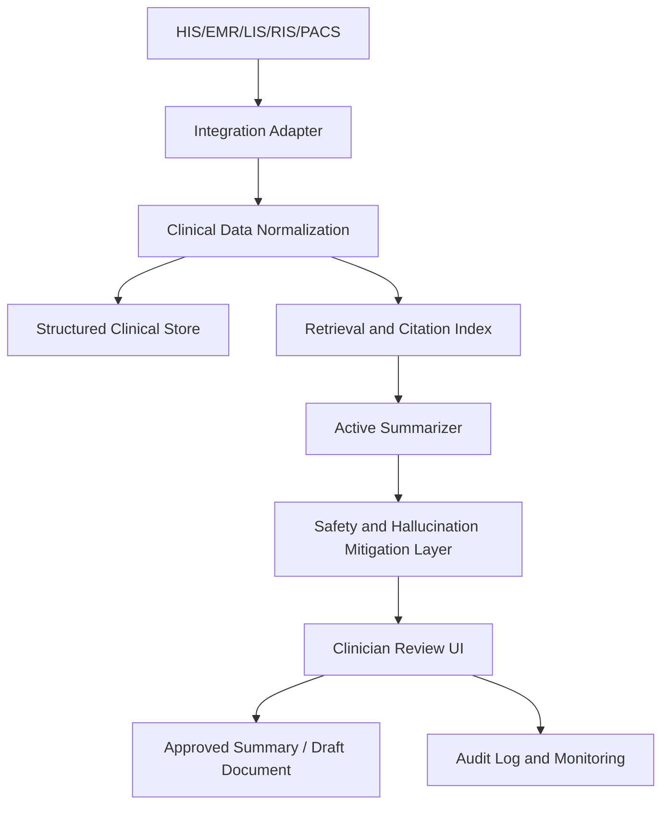

# Project Brief: Hệ thống Tóm tắt Bệnh án Tích hợp HIS/EMR

**Tên dự án:** Trợ lý Tóm tắt Hồ sơ Lâm sàng có Dẫn nguồn, Tích hợp HIS/EMR  
**Loại tài liệu:** Project Brief  
**Phiên bản:** v1.0  
**Ngày:** 27/05/2026  
**Người dùng chính:** Bác sĩ, điều dưỡng, nhân sự hỗ trợ ra viện, quản trị bệnh viện, đội ngũ IT HIS/EMR  
**Chiến lược khuyến nghị:** **PARTNER + BUILD**, kết hợp **BUY có chọn lọc** cho các module phổ thông như ASR/OCR hoặc hạ tầng quản trị nếu điều kiện pháp lý và triển khai cho phép.

---

## 1. Tóm tắt điều hành

Dự án này đề xuất xây dựng một **hệ thống tóm tắt bệnh án** được tích hợp với các nền tảng HIS/EMR của bệnh viện. Hệ thống hỗ trợ bác sĩ và nhân sự lâm sàng nhanh chóng nắm bắt tình trạng bệnh nhân bằng cách tạo ra các bản tóm tắt có cấu trúc, có dẫn nguồn rõ ràng từ hồ sơ y tế hiện có, bao gồm ghi chú lâm sàng, chẩn đoán, thuốc, kết quả xét nghiệm, sinh hiệu, báo cáo chẩn đoán hình ảnh, tóm tắt ra viện và lịch sử các lần khám/điều trị.

Hệ thống **không được thiết kế để thay thế đánh giá chuyên môn của bác sĩ** hoặc tự động đưa ra quyết định chẩn đoán/điều trị. Vai trò chính của hệ thống là một **trợ lý tài liệu lâm sàng**, giúp giảm quá tải thông tin, hỗ trợ bác sĩ rà soát hồ sơ trước khi khám, hỗ trợ soạn thảo tóm tắt ra viện và tăng khả năng truy vết nguồn gốc thông tin trong hồ sơ bệnh án.

Điểm khác biệt cốt lõi của hệ thống không chỉ nằm ở khả năng tóm tắt văn bản. Hệ thống cần cung cấp:

- **Active Summarizer:** tự động cập nhật bản tóm tắt khi có dữ liệu EMR mới.
- **Citation-based Summary:** mọi nhận định lâm sàng quan trọng đều phải liên kết về nguồn dữ liệu gốc.
- **Hallucination Mitigation:** giảm thiểu thông tin bịa đặt thông qua RAG, kiểm tra claim không có bằng chứng, kiểm tra mâu thuẫn và cơ chế người duyệt.
- **EMR Integration:** ưu tiên kiến trúc FHIR-first, đồng thời hỗ trợ HL7 v2, CDA, XML, database view hoặc API của nhà cung cấp HIS/EMR.
- **Human-in-the-loop approval:** bác sĩ hoặc nhân sự được phân quyền phải duyệt trước khi bản tóm tắt được sử dụng chính thức.

Chiến lược triển khai khuyến nghị là **PARTNER + BUILD**. Nhóm dự án nên hợp tác với bệnh viện hoặc nhà cung cấp HIS/EMR để có quyền tiếp cận workflow thực tế, dữ liệu sandbox và xác thực tích hợp; đồng thời tự xây dựng các lớp tóm tắt, dẫn nguồn, kiểm soát an toàn, review và monitoring. Cách tiếp cận **BUY hoàn toàn** có thể phụ thuộc quá nhiều vào hệ sinh thái vendor, trong khi **BUILD hoàn toàn** sẽ rủi ro nếu thiếu dữ liệu y tế thực và hỗ trợ tích hợp.

---

## 2. Bối cảnh dự án

Các bệnh viện ngày càng sử dụng hồ sơ bệnh án điện tử, tuy nhiên bác sĩ vẫn thường phải đọc và rà soát lượng lớn thông tin phân tán trên nhiều hệ thống. Một bệnh nhân có thể có nhiều lần khám, ghi chú tiến triển bệnh, kết quả xét nghiệm, đơn thuốc, ghi chú điều dưỡng, báo cáo chẩn đoán hình ảnh và tài liệu ra viện. Điều này khiến quá trình đọc bệnh án thủ công mất nhiều thời gian và dễ bỏ sót thông tin quan trọng.

Tóm tắt bệnh án là một use case GenAI thực tế vì trọng tâm của nó là **tóm tắt thông tin đã tồn tại trong hồ sơ**, thay vì tạo ra quyết định y khoa mới. Tuy nhiên, mức độ rủi ro vẫn cao vì một bản tóm tắt sai có thể làm bác sĩ hiểu sai tình trạng bệnh nhân, lịch sử dùng thuốc hoặc kế hoạch chăm sóc. Vì vậy, hệ thống phải được thiết kế xoay quanh nguyên tắc: **có nguồn dẫn, có người duyệt, có kiểm soát truy cập và có audit log ngay từ đầu**.

Đối với bối cảnh triển khai tại Việt Nam, yếu tố pháp lý và quản trị dữ liệu đặc biệt quan trọng. Thông tư 13/2025/TT-BYT hướng dẫn triển khai hồ sơ bệnh án điện tử và thay thế Thông tư 46/2018/TT-BYT. Bệnh án điện tử được hiểu là bệnh án được lập, cập nhật, hiển thị, ký, lưu trữ, quản lý, sử dụng và truy cập bằng phương tiện điện tử. Do đó, bản tóm tắt bệnh án do AI tạo ra cần được xem là **bản nháp tài liệu lâm sàng có kiểm soát**, không phải output chatbot thông thường.

---

## 3. Vấn đề cần giải quyết

Bác sĩ và nhân sự lâm sàng đang gặp ba nhóm vấn đề chính khi rà soát hồ sơ bệnh nhân.

### 3.1 Quá tải thông tin

Dữ liệu bệnh nhân được phân tán ở nhiều loại hồ sơ khác nhau: ghi chú lâm sàng, kết quả xét nghiệm, đơn thuốc, tóm tắt ra viện, báo cáo chẩn đoán, thông tin lần khám trước và ghi chú điều dưỡng. Bác sĩ phải tự ghép nối các mảnh thông tin này để hiểu câu chuyện bệnh lý của bệnh nhân.

### 3.2 Thiếu bối cảnh bệnh nhân nhanh và đáng tin cậy

Trước khi khám, đi buồng, chuyển khoa hoặc cho bệnh nhân ra viện, bác sĩ cần nhanh chóng nắm được:

- vấn đề bệnh lý đang hoạt động;
- tiền sử liên quan;
- kết quả xét nghiệm/sinh hiệu bất thường gần đây;
- thuốc hiện tại và các thay đổi thuốc;
- sự kiện chính trong quá trình điều trị;
- xét nghiệm đang chờ hoặc kế hoạch theo dõi.

Các màn hình HIS/EMR hiện tại thường hiển thị dữ liệu gốc, nhưng chưa tự động tổng hợp thành một bản tóm tắt lâm sàng ngắn gọn, có thể sử dụng ngay trong workflow.

### 3.3 Rủi ro từ tóm tắt AI không an toàn

Các mô hình ngôn ngữ tổng quát có thể bịa thông tin, bỏ sót dữ kiện quan trọng, đọc sai chi tiết thuốc hoặc tạo ra nhận định không có bằng chứng trong hồ sơ. Trong môi trường y tế, điều này không thể chấp nhận nếu không có cơ chế kiểm soát nghiêm ngặt.

Vì vậy, bài toán không chỉ là:

> “Làm thế nào để tóm tắt bệnh án?”

Bài toán thực tế là:

> “Làm thế nào để tạo ra bản tóm tắt bệnh án hữu ích về mặt lâm sàng, có thể truy vết nguồn, có thể audit, có thể review và không tạo ra nhận định y khoa thiếu bằng chứng?”

---

## 4. Mục tiêu dự án

Dự án hướng tới việc thiết kế và triển khai một MVP thực tế, có khả năng phát triển thành giải pháp bệnh viện ở giai đoạn sau.

### 4.1 Mục tiêu nghiệp vụ

- Giảm thời gian bác sĩ phải đọc bệnh án thủ công.
- Cải thiện khả năng tiếp cận nhanh bối cảnh bệnh nhân.
- Hỗ trợ soạn thảo bản tóm tắt ra viện nhanh hơn.
- Tăng tính nhất quán trong tài liệu lâm sàng.
- Tăng khả năng truy vết và kiểm soát chất lượng hồ sơ.
- Tạo một use case AI thực tế có khả năng tích hợp với HIS/EMR.

### 4.2 Mục tiêu sản phẩm

- Tạo bản tóm tắt bệnh nhân có cấu trúc từ hồ sơ y tế.
- Cung cấp citation/dẫn nguồn cho các nhận định lâm sàng quan trọng.
- Phát hiện và đánh dấu các claim không có bằng chứng hoặc có khả năng mâu thuẫn.
- Cho phép bác sĩ review, chỉnh sửa, phê duyệt hoặc từ chối bản tóm tắt AI.
- Lưu audit log và lịch sử phiên bản tóm tắt.
- Hỗ trợ tích hợp HIS/EMR theo hướng FHIR-first.

### 4.3 Mục tiêu kỹ thuật

- Xây dựng pipeline tóm tắt dựa trên RAG, sử dụng dữ liệu y tế có cấu trúc và phi cấu trúc.
- Chuẩn hóa dữ liệu EMR theo các resource gần với FHIR khi có thể.
- Duy trì mapping giữa từng claim trong summary và nguồn dữ liệu gốc.
- Hỗ trợ theo dõi thí nghiệm, model version và đánh giá thông qua MLflow.
- Thiết kế triển khai on-premise/private cloud bằng Docker/Kubernetes.
- Giữ kiến trúc đủ linh hoạt để mở rộng sang PyTorch, ONNX Runtime, local LLM, ASR và xử lý tài liệu/hình ảnh ở các giai đoạn sau.

---

## 5. Người dùng mục tiêu và persona

### 5.1 Persona chính: Bác sĩ

**Vai trò:** Rà soát hồ sơ bệnh nhân, đưa ra quyết định lâm sàng, viết ghi chú và tóm tắt ra viện.  
**Pain points:** Quá nhiều thông tin, thời gian hạn chế, khó tìm nhanh các chi tiết quan trọng trong lịch sử bệnh.  
**Nhu cầu:** Tổng quan bệnh nhân nhanh, nguồn thông tin đáng tin cậy, có thể kiểm tra citation, có thể chỉnh sửa bản nháp.  
**Kết quả mong muốn:** Hiểu bối cảnh bệnh nhân nhanh hơn mà vẫn tin tưởng được dữ liệu nguồn.

### 5.2 Persona phụ: Điều dưỡng

**Vai trò:** Theo dõi bệnh nhân, bàn giao ca và phối hợp chăm sóc.  
**Pain points:** Cần nắm thay đổi mới nhất của bệnh nhân trong thời gian ngắn.  
**Nhu cầu:** Tình trạng hiện tại, thuốc, việc đang chờ xử lý, sinh hiệu/xét nghiệm bất thường.  
**Kết quả mong muốn:** Bàn giao ca nhanh hơn và giảm nguy cơ bỏ sót việc chăm sóc.

### 5.3 Persona phụ: Nhân sự hỗ trợ ra viện

**Vai trò:** Hỗ trợ chuẩn bị tài liệu ra viện và điều phối theo dõi sau ra viện.  
**Pain points:** Tóm tắt ra viện thường dài, cần tổng hợp từ nhiều ghi chú khác nhau.  
**Nhu cầu:** Diễn biến điều trị, can thiệp đã thực hiện, tình trạng khi ra viện, hướng dẫn theo dõi.  
**Kết quả mong muốn:** Chuẩn bị bản nháp tóm tắt ra viện nhanh hơn để bác sĩ review.

### 5.4 Persona phụ: Đội ngũ quản trị/chất lượng bệnh viện

**Vai trò:** Theo dõi chất lượng tài liệu lâm sàng và tuân thủ quy trình.  
**Pain points:** Khó audit tài liệu tạo bởi AI và khó đánh giá chất lượng tài liệu ở quy mô lớn.  
**Nhu cầu:** Audit log, trạng thái summary, lịch sử phê duyệt, chỉ số chất lượng.  
**Kết quả mong muốn:** Quản trị tốt hơn đối với quy trình tài liệu lâm sàng có hỗ trợ AI.

### 5.5 Persona phụ: Đội IT/HIS Integration

**Vai trò:** Duy trì tích hợp HIS/EMR, bảo mật, phân quyền và triển khai hệ thống.  
**Pain points:** Tích hợp phức tạp, rủi ro dữ liệu cá nhân, yêu cầu ổn định hệ thống.  
**Nhu cầu:** API contract rõ ràng, mapping FHIR, triển khai an toàn, monitoring.  
**Kết quả mong muốn:** Module AI có thể triển khai mà không làm gián đoạn hệ thống bệnh viện hiện hữu.

---

## 6. Giải pháp đề xuất

Giải pháp đề xuất là một **trợ lý tóm tắt hồ sơ lâm sàng có dẫn nguồn**, kết nối với các nguồn dữ liệu HIS/EMR, truy xuất dữ liệu bệnh nhân liên quan, tạo bản tóm tắt có cấu trúc, gắn citation, chạy kiểm tra an toàn và chuyển output cho bác sĩ review.

### 6.1 Core workflow



### 6.2 Định vị hệ thống

Hệ thống nên được định vị là:

> Một trợ lý tài liệu lâm sàng có dẫn nguồn, giúp bác sĩ rà soát hồ sơ bệnh nhân nhanh hơn trong khi vẫn giữ cơ chế phê duyệt bởi con người, auditability và truy vết dữ liệu EMR.

Hệ thống không nên được định vị là:

- bác sĩ tự động;
- công cụ chẩn đoán;
- hệ thống khuyến nghị điều trị;
- công cụ tự động kê đơn;
- hệ thống tự ghi trực tiếp vào bệnh án chính thức mà không có review.

---

## 7. Thành phần chính

## 7.1 Active Summarizer

**Active Summarizer** tự động cập nhật bản tóm tắt khi có dữ liệu lâm sàng mới.

### Sự kiện kích hoạt

- Có progress note mới.
- Có kết quả xét nghiệm mới.
- Có báo cáo chẩn đoán hình ảnh mới.
- Có thay đổi đơn thuốc.
- Có cập nhật danh sách chẩn đoán/vấn đề bệnh lý.
- Có y lệnh ra viện.
- Có encounter mới được mở hoặc đóng.

### Hành vi chức năng

- Phát hiện dữ liệu bệnh nhân mới hoặc đã thay đổi.
- Truy xuất đúng nhóm hồ sơ liên quan đến loại summary được chọn.
- Tạo phiên bản summary mới thay vì ghi đè bản cũ.
- Hiển thị điểm thay đổi so với bản tóm tắt trước đó.
- Cho phép bác sĩ so sánh các phiên bản summary.
- Yêu cầu bác sĩ review trước khi sử dụng chính thức.

### Ví dụ luồng phiên bản

```text
summary_v1: tạo sau admission note
summary_v2: cập nhật sau kết quả xét nghiệm
summary_v3: cập nhật sau thay đổi thuốc
summary_v4: được bác sĩ review và phê duyệt
```

---

## 7.2 Citation-based Summary

Tóm tắt có dẫn nguồn là yêu cầu bắt buộc để đảm bảo độ tin cậy và an toàn trong lâm sàng. Mỗi claim quan trọng phải truy vết được về bản ghi EMR gốc.

### Ví dụ citation

| Claim trong summary | Bằng chứng nguồn |
|---|---|
| Bệnh nhân có đái tháo đường type 2. | Condition resource / problem list / physician note |
| Creatinine tăng từ 1.1 lên 1.8 mg/dL. | Observation resource / kết quả xét nghiệm có timestamp |
| Metformin đã được dừng trong đợt nhập viện. | MedicationRequest / medication note |
| CT ngực ghi nhận thâm nhiễm hai bên. | DiagnosticReport / báo cáo chẩn đoán hình ảnh |

### Metadata citation tối thiểu

```json
{
  "claim_id": "claim_001",
  "summary_text": "Creatinine increased from 1.1 to 1.8 mg/dL during admission.",
  "source_type": "Observation",
  "source_id": "observation_123",
  "source_timestamp": "2026-05-20T10:30:00+07:00",
  "source_text_span": "Creatinine 1.8 mg/dL...",
  "support_status": "supported",
  "confidence": 0.93
}
```

### Quy tắc sản phẩm

> Nếu một claim lâm sàng không có citation hỗ trợ, claim đó phải bị loại bỏ, bị chặn hoặc chuyển sang mục “Cần review / Chưa đủ bằng chứng”.

---

## 7.3 Hallucination Mitigation

Lớp an toàn giúp giảm output AI không có bằng chứng, mâu thuẫn hoặc không an toàn về mặt lâm sàng.

### Các lớp kiểm soát bắt buộc

| Lớp kiểm soát | Mục đích |
|---|---|
| Retrieval grounding | Giới hạn context của model trong hồ sơ bệnh nhân cụ thể. |
| Citation enforcement | Yêu cầu bằng chứng nguồn cho các claim lâm sàng. |
| Unsupported-claim detection | Phát hiện claim không được hỗ trợ bởi context đã truy xuất. |
| Contradiction checking | Xác định mâu thuẫn giữa summary và hồ sơ nguồn. |
| Clinical entity validation | Kiểm tra thuốc, liều, chỉ số xét nghiệm, ngày tháng và chẩn đoán. |
| Human review | Bác sĩ phải phê duyệt trước khi sử dụng chính thức. |
| Audit trail | Lưu model version, prompt, context hash, reviewer và timestamp. |

### Nguyên tắc safety prompt

```text
Chỉ sử dụng context hồ sơ bệnh nhân được cung cấp.
Không suy luận chẩn đoán, thuốc, dị ứng, xu hướng xét nghiệm hoặc kế hoạch điều trị nếu hồ sơ không thể hiện rõ.
Mọi claim lâm sàng phải có citation ID.
Nếu bằng chứng thiếu hoặc mâu thuẫn, hãy ghi rõ rằng chưa đủ bằng chứng.
```

---

## 7.4 EMR Integration

Thiết kế tích hợp nên theo hướng **FHIR-first**, đồng thời hỗ trợ adapter dự phòng vì nhiều bệnh viện chưa cung cấp API FHIR đầy đủ.

### FHIR resources cốt lõi

| Loại dữ liệu | FHIR resource |
|---|---|
| Thông tin bệnh nhân | Patient |
| Lần khám/nhập viện | Encounter |
| Chẩn đoán/vấn đề bệnh lý | Condition |
| Kết quả xét nghiệm/sinh hiệu | Observation |
| Y lệnh thuốc | MedicationRequest |
| Ghi nhận dùng thuốc | MedicationAdministration |
| Báo cáo xét nghiệm/chẩn đoán hình ảnh | DiagnosticReport |
| Ghi chú/tài liệu lâm sàng | DocumentReference / Composition |
| Sự kiện audit | AuditEvent |
| Thông tin đồng ý/chấp thuận | Consent |

### Phương án tích hợp dự phòng

- HL7 v2 messages.
- CDA documents.
- XML/JSON export.
- API của vendor HIS/EMR.
- Database view hoặc reporting replica.
- Batch import cho dữ liệu hồi cứu.

---

## 8. Phạm vi MVP

MVP nên tập trung vào tóm tắt hồ sơ y tế dạng văn bản, có citation và có bác sĩ review.

### 8.1 Trong phạm vi MVP

- Import clinical notes đã khử định danh hoặc dữ liệu EMR sandbox.
- Tạo patient summary có cấu trúc.
- Tạo bản nháp discharge summary.
- Truy xuất nguồn bằng RAG.
- Gắn citation cho claim lâm sàng.
- Đánh dấu claim thiếu bằng chứng hoặc có khả năng mâu thuẫn.
- Cho phép bác sĩ review, chỉnh sửa, phê duyệt và từ chối.
- Lưu audit log và version summary.
- Có dashboard cơ bản để theo dõi các chỉ số chất lượng.

### 8.2 Ngoài phạm vi MVP

- Chẩn đoán tự động.
- Khuyến nghị điều trị.
- Khuyến nghị kê đơn.
- Tự động ghi chính thức vào bệnh án mà không có phê duyệt.
- Ambient clinical scribing đầy đủ.
- Chẩn đoán ảnh y tế từ X-ray/CT/MRI.
- Triển khai production trực tiếp trên dữ liệu bệnh nhân định danh khi chưa có phê duyệt pháp lý và governance của bệnh viện.

---

## 9. Functional Requirements

| ID | Yêu cầu | Ưu tiên |
|---|---|---|
| FR-01 | Tạo patient snapshot từ dữ liệu EMR hiện có. | Must |
| FR-02 | Tóm tắt active problems và tiền sử liên quan. | Must |
| FR-03 | Tóm tắt thuốc hiện tại và các thay đổi thuốc. | Must |
| FR-04 | Tóm tắt xu hướng xét nghiệm/sinh hiệu gần đây. | Must |
| FR-05 | Tạo bản nháp discharge summary. | Must |
| FR-06 | Gắn citation cho mọi claim lâm sàng quan trọng. | Must |
| FR-07 | Cho phép người dùng click citation để xem bằng chứng nguồn. | Must |
| FR-08 | Phát hiện claim không có bằng chứng. | Must |
| FR-09 | Phát hiện mâu thuẫn tiềm ẩn giữa summary và nguồn. | Should |
| FR-10 | Cho phép bác sĩ chỉnh sửa summary do AI tạo. | Must |
| FR-11 | Cho phép bác sĩ phê duyệt hoặc từ chối summary. | Must |
| FR-12 | Lưu lịch sử phiên bản summary. | Must |
| FR-13 | Lưu reviewer, thời điểm phê duyệt và audit metadata. | Must |
| FR-14 | Hỗ trợ mapping dữ liệu theo FHIR khi có thể. | Must |
| FR-15 | Hỗ trợ import dự phòng từ file/API/database view. | Should |
| FR-16 | Export summary đã duyệt thành PDF, draft note hoặc EMR attachment. | Should |
| FR-17 | Hỗ trợ ghi chú tiếng Việt và tiếng Anh. | Should |

---

## 10. Non-functional Requirements

| Nhóm yêu cầu | Mô tả |
|---|---|
| Security | Mã hóa dữ liệu khi truyền và khi lưu trữ. |
| Privacy | Không gửi dữ liệu bệnh nhân định danh lên public API nếu chưa được phê duyệt rõ ràng. |
| Access control | Áp dụng RBAC cho bác sĩ, điều dưỡng, admin, auditor và IT. |
| Auditability | Ghi log mọi thao tác tạo, xem, sửa, phê duyệt, từ chối và export. |
| Latency | Patient summary nên được tạo trong dưới 10 giây ở trường hợp thông thường. |
| Reliability | Hệ thống phải fail safely và hiển thị trạng thái unavailable thay vì trả summary không đầy đủ. |
| Explainability | UI phải hiển thị citation nguồn rõ ràng. |
| Traceability | Lưu source ID, model version, prompt version và context hash. |
| Deployment | Ưu tiên on-premise hoặc private cloud cho dữ liệu bệnh viện nhạy cảm. |
| Monitoring | Theo dõi citation coverage, unsupported claim rate, edit rate và approval rate. |
| Maintainability | Kiến trúc module hóa, tách ingestion, retrieval, generation, safety và UI layer. |

---

## 11. Technical Stack đề xuất

| Layer | Công nghệ đề xuất | Vai trò |
|---|---|---|
| Backend API | FastAPI / Java Spring Boot | Điều phối API và tích hợp enterprise. |
| ML framework | PyTorch | Thử nghiệm model, fine-tuning và evaluation. |
| Inference optimization | ONNX Runtime | Tối ưu inference và triển khai edge/on-prem. |
| LLM/RAG | Local LLM + RAG pipeline | Tóm tắt lâm sàng có grounding. |
| Retrieval | BM25 + vector search | Hybrid search cho clinical notes và structured facts. |
| Vector database | Qdrant / Milvus / pgvector | Lưu embedding và source chunks. |
| Data standard | HL7 FHIR | Tương tác dữ liệu với HIS/EMR. |
| ASR | Whisper hoặc medical ASR vendor | Tùy chọn cho ingest ghi chú giọng nói ở giai đoạn sau. |
| Document/image processing | OCR + ViT/document models | Tùy chọn cho xử lý tài liệu scan. |
| MLOps | MLflow | Theo dõi experiment, model registry và evaluation. |
| Containerization | Docker | Triển khai tái lập được. |
| Orchestration | Kubernetes | Scaling, monitoring và production deployment. |
| Edge AI | NVIDIA / Intel OpenVINO | Tùy chọn local inference cho bệnh viện nhạy cảm về dữ liệu. |
| Monitoring | Prometheus/Grafana + application logs | Theo dõi vận hành và chất lượng. |

### Khuyến nghị stack cho MVP

Ở MVP đầu tiên, nên giữ stack đơn giản:

```text
FastAPI + PostgreSQL + pgvector + local/open-source LLM hoặc controlled cloud LLM + RAG + MLflow + Docker
```

FHIR integration có thể bắt đầu bằng mock FHIR resources trước khi kết nối với HIS/EMR sandbox thật.

---

## 12. Chiến lược dữ liệu

### 12.1 Dữ liệu phát triển

Cách tiếp cận an toàn ở giai đoạn đầu là sử dụng:

- public dataset đã khử định danh;
- synthetic clinical notes;
- mock FHIR records;
- hồ sơ hồi cứu đã khử định danh nếu bệnh viện đối tác phê duyệt.

MIMIC-IV-Note là một ứng viên mạnh cho nghiên cứu và prototype vì chứa clinical notes dạng free-text đã khử định danh, bao gồm discharge summaries và radiology reports. Tuy nhiên, việc truy cập cần tuân thủ quy trình credentialing và data-use requirements của PhysioNet.

### 12.2 Dữ liệu production

Dữ liệu production nên đến từ HIS/EMR của bệnh viện theo cơ chế governance chính thức:

- thỏa thuận chia sẻ dữ liệu;
- kiểm soát truy cập theo vai trò;
- audit logging;
- chính sách bảo vệ dữ liệu bệnh nhân;
- khử định danh cho phát triển model khi có thể;
- tách biệt nghiêm ngặt giữa training, testing và production data.

---

## 13. High-level Data Model

```sql
patients (
  patient_id,
  external_patient_id,
  name_hash,
  date_of_birth,
  gender,
  created_at
)

clinical_documents (
  document_id,
  patient_id,
  encounter_id,
  source_system,
  document_type,
  document_datetime,
  raw_text_encrypted,
  fhir_resource_type,
  fhir_resource_id,
  created_at
)

document_chunks (
  chunk_id,
  document_id,
  chunk_text,
  section_name,
  token_count,
  embedding_id,
  source_span_start,
  source_span_end
)

summaries (
  summary_id,
  patient_id,
  encounter_id,
  summary_type,
  summary_text,
  status,
  model_name,
  model_version,
  prompt_version,
  context_hash,
  created_by,
  reviewed_by,
  approved_at,
  created_at
)

summary_claims (
  claim_id,
  summary_id,
  claim_text,
  claim_type,
  support_status,
  confidence
)

claim_citations (
  citation_id,
  claim_id,
  source_document_id,
  source_chunk_id,
  source_resource_type,
  source_resource_id,
  source_span_start,
  source_span_end
)

audit_logs (
  audit_id,
  user_id,
  action,
  patient_id,
  resource_type,
  resource_id,
  timestamp,
  ip_address
)
```

---

## 14. Chiến lược BUY / PARTNER / BUILD

### 14.1 So sánh chiến lược

| Chiến lược | Khi nào phù hợp | Ưu điểm | Hạn chế | Mức độ phù hợp với dự án |
|---|---|---|---|---|
| BUY | Bệnh viện đã sử dụng hệ sinh thái vendor trưởng thành. | Triển khai nhanh, sản phẩm chín muồi, có hỗ trợ vendor. | Chi phí cao, khó tùy biến, có thể không phù hợp HIS/EMR nội địa hoặc workflow tiếng Việt. | Trung bình |
| PARTNER | Cần workflow thật, quyền truy cập EMR và đánh giá bởi bác sĩ. | Tích hợp thực tế, có feedback lâm sàng, pilot đáng tin cậy. | Phụ thuộc vào hợp tác bệnh viện/vendor. | Cao |
| BUILD | Cần kiểm soát toàn bộ citation, safety và triển khai. | Tùy biến cao, phù hợp mục tiêu học thuật/sản phẩm. | Khó nếu thiếu dữ liệu thật và xác thực lâm sàng. | Trung bình - Cao |
| PARTNER + BUILD | Cần MVP thực tế và kiến trúc sản phẩm có thể kiểm soát. | Cân bằng tốt nhất giữa feasibility và ownership. | Cần coordination và governance. | Cao nhất |

### 14.2 Chiến lược khuyến nghị

Chiến lược khuyến nghị là:

```text
PARTNER để có quyền truy cập HIS/EMR, workflow lâm sàng và validation.
BUILD lớp tóm tắt, citation, safety, HITL và monitoring.
BUY có chọn lọc các capability phổ thông như ASR, OCR hoặc managed infrastructure khi cần.
```

### 14.3 Lý do lựa chọn

- BUY hoàn toàn có thể không phù hợp workflow bệnh viện nội địa, yêu cầu tiếng Việt hoặc ràng buộc triển khai tại chỗ.
- BUILD hoàn toàn rủi ro vì tóm tắt lâm sàng phụ thuộc mạnh vào cấu trúc EMR thật, feedback từ bác sĩ và governance của bệnh viện.
- PARTNER + BUILD là con đường hợp lý nhất để tạo MVP đáng tin cậy và có khả năng pilot production.

---

## 15. Chỉ số thành công

### 15.1 Product metrics

| Metric | Target cho MVP |
|---|---|
| Tỷ lệ bác sĩ phê duyệt summary | >= 70% sau pilot tuning |
| Citation coverage cho clinical claims | >= 95% |
| Unsupported claim rate sau safety filter | < 2% |
| Median patient-summary generation latency | < 10 giây |
| Discharge-summary draft latency | < 60 giây |
| Clinician usefulness rating | >= 4/5 |
| Giảm thời gian chart-review trung bình | Mục tiêu 20-40% trong pilot |

### 15.2 Technical metrics

| Metric | Mục đích |
|---|---|
| Retrieval precision | Đo mức độ bằng chứng truy xuất có liên quan. |
| Retrieval recall | Đo khả năng truy xuất đủ bằng chứng quan trọng. |
| Citation precision | Đo việc citation có thật sự hỗ trợ claim hay không. |
| Entity accuracy | Đo độ đúng của thuốc, xét nghiệm, ngày tháng và chẩn đoán. |
| Edit distance | Đo mức độ bác sĩ phải chỉnh sửa output AI. |
| Rejection reason distribution | Xác định các failure mode lặp lại. |

---

## 16. Risk Register

| Rủi ro | Mức độ | Biện pháp giảm thiểu |
|---|---:|---|
| AI bịa chẩn đoán hoặc tình trạng bệnh. | Critical | Bắt buộc citation, chặn unsupported claim, bác sĩ review. |
| AI diễn giải sai thuốc, liều hoặc thời điểm dùng. | Critical | Medication entity validation và extraction từ nguồn thuốc chuyên biệt. |
| AI bỏ sót thông tin lâm sàng quan trọng. | High | Checklist section bắt buộc và đánh giá retrieval recall. |
| Citation không thực sự hỗ trợ claim. | High | Đánh giá citation precision và validation source-span. |
| Rò rỉ dữ liệu bệnh nhân định danh. | Critical | On-prem/private cloud, encryption, RBAC và data governance nghiêm ngặt. |
| Tích hợp HIS/EMR kém ổn định. | High | Kiến trúc FHIR-first với fallback adapters. |
| Bác sĩ không tin hệ thống. | High | Citation minh bạch, summary có thể chỉnh sửa và giới hạn AI rõ ràng. |
| Bị phân loại thành CDS/SaMD có ràng buộc pháp lý cao. | High | Giữ MVP là documentation assistant; tránh khuyến nghị chẩn đoán/điều trị. |
| Hiệu năng tiếng Việt y khoa kém. | Medium | Glossary nội địa, template song ngữ và domain adaptation ở giai đoạn sau. |
| Không có dataset phù hợp. | Medium | Dùng MIMIC-IV-Note, synthetic notes và sandbox từ bệnh viện đối tác. |

---

## 17. MVP Roadmap

### Phase 0: Research and Design

- Xác định clinical summary templates.
- Xác định giả định pháp lý và data governance.
- Chọn development dataset.
- Xây dựng mock FHIR data model.
- Xác định evaluation rubric.
- Thiết kế citation schema.

### Phase 1: Prototype

- Xây note ingestion pipeline.
- Xây document chunking và indexing.
- Triển khai RAG summarization.
- Tạo structured patient summary.
- Tạo discharge-summary draft.
- Thêm citation mapping.
- Thêm clinician review UI.

### Phase 2: Safety and Evaluation

- Thêm unsupported-claim detector.
- Thêm contradiction checker.
- Thêm clinical entity validator cho thuốc, xét nghiệm và ngày tháng.
- Theo dõi chất lượng summary bằng MLflow.
- Xây evaluation dashboard.

### Phase 3: HIS/EMR Sandbox Integration

- Triển khai FHIR adapter.
- Map Patient, Encounter, Condition, Observation, MedicationRequest, DiagnosticReport và DocumentReference.
- Thêm access control.
- Thêm audit log.
- Test với sandbox hoặc hồ sơ hồi cứu đã khử định danh.

### Phase 4: Pilot Readiness

- Chạy đánh giá với bác sĩ.
- Đo thời gian tiết kiệm và correction rate.
- Tinh chỉnh prompt, retrieval và summary templates.
- Chuẩn bị deployment checklist.
- Chuẩn bị tài liệu compliance và risk.

---

## 18. Giả định chính

- MVP sẽ sử dụng hồ sơ đã khử định danh hoặc synthetic records nếu chưa có sandbox data được bệnh viện phê duyệt.
- Hệ thống sẽ không đưa ra chẩn đoán hoặc khuyến nghị điều trị.
- Tất cả summary do AI tạo ra là bản nháp cho đến khi được bác sĩ có thẩm quyền review và phê duyệt.
- Sản phẩm ban đầu tập trung vào bệnh án dạng văn bản, không tập trung vào chẩn đoán ảnh y tế.
- FHIR sẽ là mô hình tích hợp ưu tiên, nhưng trong thực tế vẫn cần fallback adapters.
- On-premise hoặc private cloud được ưu tiên cho production khi có dữ liệu bệnh nhân định danh.

---

## 19. Câu hỏi mở

1. Môi trường triển khai đầu tiên là hospital on-premise, private cloud hay academic demo?
2. Ngôn ngữ ưu tiên là tiếng Việt, tiếng Anh hay song ngữ?
3. Loại summary ưu tiên cho MVP là patient snapshot, discharge summary hay shift handover summary?
4. Có HIS/EMR sandbox thật không, hay prototype đầu tiên dùng mock FHIR data?
5. Ai là người phê duyệt trong workflow: chỉ bác sĩ, hay bác sĩ kết hợp phòng hồ sơ bệnh án?
6. MVP có ghi ngược vào EMR không, hay chỉ export bản nháp?
7. Mức độ khử định danh nào là bắt buộc cho development và testing?

---

## 20. Khuyến nghị cuối cùng

Dự án này có tính thực tiễn cao và có thể triển khai được nếu kiểm soát phạm vi tốt. Hướng MVP mạnh nhất là:

```text
Một trợ lý tóm tắt bệnh án dạng văn bản, có dẫn nguồn,
tích hợp với dữ liệu EMR giả lập hoặc FHIR-aligned,
có bác sĩ review, audit log và pipeline giảm hallucination.
```

Dự án nên tránh tự động hóa quyết định lâm sàng và tập trung vào hỗ trợ tài liệu. Chiến lược triển khai tốt nhất là **PARTNER + BUILD**: hợp tác để có workflow lâm sàng và tích hợp EMR, tự xây dựng core summarization, citation, safety và monitoring layer, chỉ mua các module hỗ trợ khi thật sự cần thiết.

---

## References

FDA. (2026). *Clinical Decision Support Software: Guidance for Industry and Food and Drug Administration Staff*. U.S. Food and Drug Administration. Available at: https://www.fda.gov/regulatory-information/search-fda-guidance-documents/clinical-decision-support-software

HL7. (2026). *FHIR DocumentReference Resource*. HL7 FHIR Continuous Integration Build. Available at: https://build.fhir.org/documentreference.html

HL7. (2026). *SMART App Launch Framework*. HL7 FHIR Implementation Guide. Available at: https://build.fhir.org/ig/HL7/smart-app-launch/app-launch.html

Johnson, A. et al. (2023). *MIMIC-IV-Note: Deidentified free-text clinical notes*. PhysioNet. Available at: https://physionet.org/content/mimic-iv-note/

MIMIC. (2026). *MIMIC-IV Note Module Documentation*. MIT Laboratory for Computational Physiology. Available at: https://mimic.mit.edu/docs/IV/modules/note/

Ministry of Health of Vietnam. (2025). *Thông tư 13/2025/TT-BYT hướng dẫn triển khai hồ sơ bệnh án điện tử*. Available at: https://thuvienphapluat.vn/van-ban/The-thao-Y-te/Thong-tu-13-2025-TT-BYT-huong-dan-trien-khai-ho-so-benh-an-dien-tu-660113.aspx

National Assembly of Vietnam. (2025). *Law on Personal Data Protection, No. 91/2025/QH15*. Available at: https://english.luatvietnam.vn/dan-su/law-on-personal-data-protection-law-no-91-2025-qh15-405135-d1.html

NIST. (2024). *Artificial Intelligence Risk Management Framework: Generative AI Profile*. National Institute of Standards and Technology. Available at: https://www.nist.gov/itl/ai-risk-management-framework

ONNX Runtime. (2026). *ONNX Runtime Documentation*. Available at: https://onnxruntime.ai/

MLflow. (2026). *MLflow Documentation*. Available at: https://mlflow.org/
