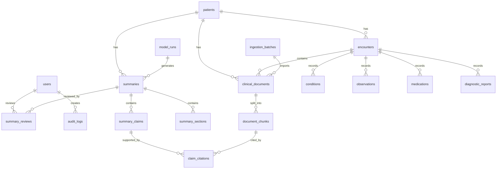

# Database Schema — Medical Record Summarization System

## 1. Mục tiêu thiết kế database

Database schema này được thiết kế cho hệ thống **Medical Record Summarization tích hợp HIS/EMR**, tập trung vào các mục tiêu sau:

- Lưu trữ dữ liệu bệnh án đã được chuẩn hóa từ HIS/EMR.
- Hỗ trợ mô hình dữ liệu tương thích với FHIR ở mức MVP.
- Lưu trữ clinical notes, chunks, embeddings reference và source span.
- Tạo bản tóm tắt bệnh án có dẫn nguồn.
- Mapping từng claim trong summary về nguồn dữ liệu gốc.
- Hỗ trợ quy trình bác sĩ review, chỉnh sửa, approve hoặc reject.
- Ghi lại audit log phục vụ truy vết.
- Theo dõi model run, hallucination risk, citation coverage và feedback.

Schema này phù hợp cho MVP dùng **PostgreSQL + pgvector/Qdrant/Milvus**. Trong MVP, PostgreSQL có thể lưu metadata và text; vector embeddings có thể lưu trong pgvector hoặc external vector database.

---

## 2. Design Assumptions

### 2.1 Deployment assumption

MVP nên triển khai theo hướng:

```text
HIS/EMR Data Export or API
→ Ingestion Layer
→ Normalized Clinical Data Store
→ Retrieval Index
→ Summarization Engine
→ Citation + Safety Layer
→ Doctor Review UI
→ Audit & Monitoring
```

### 2.2 Data assumption

Ở giai đoạn MVP, hệ thống không cần kết nối trực tiếp với EMR thật. Có thể hỗ trợ:

- FHIR-like JSON.
- CSV export.
- Clinical notes dạng text.
- De-identified public dataset.
- Mock EMR sandbox.

Tuy nhiên, database nên được thiết kế theo hướng sẵn sàng mapping với FHIR resources như:

| Clinical concept | FHIR resource mapping |
|---|---|
| Patient | Patient |
| Encounter / Visit | Encounter |
| Diagnosis / Problem | Condition |
| Lab / Vital | Observation |
| Medication | MedicationRequest / MedicationStatement |
| Imaging report | DiagnosticReport |
| Clinical note | DocumentReference / Composition |
| Summary output | DocumentReference / Composition |

---

## 3. High-level Entity Relationship



---

# 4. Core Schema Groups

## 4.1 User, Role and Permission Schema

Nhóm bảng này dùng để quản lý tài khoản, vai trò và phân quyền truy cập.

### 4.1.1 `users`

Lưu thông tin người dùng hệ thống.

```sql
CREATE TABLE users (
    user_id UUID PRIMARY KEY DEFAULT gen_random_uuid(),
    external_user_id VARCHAR(100),
    full_name VARCHAR(255) NOT NULL,
    email VARCHAR(255) UNIQUE NOT NULL,
    department VARCHAR(255),
    role_code VARCHAR(50) NOT NULL,
    status VARCHAR(30) NOT NULL DEFAULT 'active',
    created_at TIMESTAMP NOT NULL DEFAULT NOW(),
    updated_at TIMESTAMP NOT NULL DEFAULT NOW()
);
```

### Field notes

| Field | Meaning |
|---|---|
| `user_id` | ID nội bộ của user |
| `external_user_id` | ID mapping từ HIS/SSO nếu có |
| `role_code` | Ví dụ: doctor, nurse, clinical_admin, it_admin, auditor |
| `status` | active, inactive, suspended |

---

### 4.1.2 `roles`

```sql
CREATE TABLE roles (
    role_code VARCHAR(50) PRIMARY KEY,
    role_name VARCHAR(100) NOT NULL,
    description TEXT,
    created_at TIMESTAMP NOT NULL DEFAULT NOW()
);
```

### Suggested roles

| Role code | Description |
|---|---|
| `doctor` | Xem, tạo, chỉnh sửa, approve/reject summary |
| `nurse` | Xem summary, thêm ghi chú nếu được cấp quyền |
| `clinical_admin` | Xem dashboard chất lượng, review logs |
| `it_admin` | Quản trị hệ thống, integration, user |
| `ai_safety_reviewer` | Kiểm tra lỗi AI, unsupported claims |
| `auditor` | Xem audit log, không chỉnh sửa dữ liệu |

---

## 4.2 Patient and Encounter Schema

## 4.2.1 `patients`

Bảng lưu thông tin bệnh nhân đã được chuẩn hóa hoặc ẩn danh.

```sql
CREATE TABLE patients (
    patient_id UUID PRIMARY KEY DEFAULT gen_random_uuid(),
    external_patient_id VARCHAR(100),
    patient_hash VARCHAR(255) UNIQUE,
    full_name_encrypted TEXT,
    date_of_birth DATE,
    gender VARCHAR(30),
    phone_encrypted TEXT,
    address_encrypted TEXT,
    source_system VARCHAR(100),
    fhir_patient_id VARCHAR(100),
    is_deidentified BOOLEAN NOT NULL DEFAULT TRUE,
    created_at TIMESTAMP NOT NULL DEFAULT NOW(),
    updated_at TIMESTAMP NOT NULL DEFAULT NOW()
);
```

### Field notes

| Field | Meaning |
|---|---|
| `external_patient_id` | ID bệnh nhân từ HIS/EMR |
| `patient_hash` | Hash dùng trong môi trường de-identified |
| `full_name_encrypted` | Tên bệnh nhân nếu production; nên mã hóa |
| `fhir_patient_id` | ID mapping với FHIR Patient |
| `is_deidentified` | True nếu dữ liệu đã được ẩn danh |

---

## 4.2.2 `encounters`

Bảng lưu mỗi lần khám, nhập viện hoặc đợt điều trị.

```sql
CREATE TABLE encounters (
    encounter_id UUID PRIMARY KEY DEFAULT gen_random_uuid(),
    patient_id UUID NOT NULL REFERENCES patients(patient_id),
    external_encounter_id VARCHAR(100),
    fhir_encounter_id VARCHAR(100),
    encounter_type VARCHAR(50),
    department VARCHAR(255),
    attending_doctor_id UUID REFERENCES users(user_id),
    start_time TIMESTAMP,
    end_time TIMESTAMP,
    status VARCHAR(50),
    reason_for_visit TEXT,
    source_system VARCHAR(100),
    created_at TIMESTAMP NOT NULL DEFAULT NOW(),
    updated_at TIMESTAMP NOT NULL DEFAULT NOW()
);
```

### Suggested `encounter_type`

| Value | Meaning |
|---|---|
| `outpatient` | Khám ngoại trú |
| `inpatient` | Nội trú |
| `emergency` | Cấp cứu |
| `follow_up` | Tái khám |
| `telemedicine` | Khám từ xa |

---

## 4.3 Clinical Data Schema

Nhóm bảng này lưu dữ liệu lâm sàng đã được chuẩn hóa.

---

## 4.3.1 `conditions`

Lưu diagnosis, problem list, bệnh nền hoặc vấn đề đang theo dõi.

```sql
CREATE TABLE conditions (
    condition_id UUID PRIMARY KEY DEFAULT gen_random_uuid(),
    patient_id UUID NOT NULL REFERENCES patients(patient_id),
    encounter_id UUID REFERENCES encounters(encounter_id),
    external_condition_id VARCHAR(100),
    fhir_condition_id VARCHAR(100),
    condition_code VARCHAR(100),
    coding_system VARCHAR(100),
    condition_name TEXT NOT NULL,
    clinical_status VARCHAR(50),
    verification_status VARCHAR(50),
    onset_date DATE,
    recorded_date TIMESTAMP,
    source_document_id UUID,
    source_system VARCHAR(100),
    created_at TIMESTAMP NOT NULL DEFAULT NOW(),
    updated_at TIMESTAMP NOT NULL DEFAULT NOW()
);
```

### Example values

| Field | Example |
|---|---|
| `condition_name` | Type 2 diabetes mellitus |
| `clinical_status` | active, inactive, resolved |
| `verification_status` | confirmed, provisional, refuted |

---

## 4.3.2 `observations`

Lưu xét nghiệm, dấu hiệu sinh tồn và các chỉ số quan sát được.

```sql
CREATE TABLE observations (
    observation_id UUID PRIMARY KEY DEFAULT gen_random_uuid(),
    patient_id UUID NOT NULL REFERENCES patients(patient_id),
    encounter_id UUID REFERENCES encounters(encounter_id),
    external_observation_id VARCHAR(100),
    fhir_observation_id VARCHAR(100),
    observation_type VARCHAR(50),
    observation_code VARCHAR(100),
    coding_system VARCHAR(100),
    observation_name TEXT NOT NULL,
    value_text TEXT,
    value_numeric NUMERIC,
    unit VARCHAR(50),
    reference_range_low NUMERIC,
    reference_range_high NUMERIC,
    interpretation VARCHAR(50),
    observed_at TIMESTAMP,
    source_document_id UUID,
    source_system VARCHAR(100),
    created_at TIMESTAMP NOT NULL DEFAULT NOW()
);
```

### Suggested `observation_type`

| Value | Meaning |
|---|---|
| `lab` | Xét nghiệm |
| `vital` | Dấu hiệu sinh tồn |
| `score` | Thang điểm lâm sàng |
| `measurement` | Đo lường khác |

---

## 4.3.3 `medications`

Lưu thuốc đang dùng, thuốc đã ngưng hoặc thuốc thay đổi trong encounter.

```sql
CREATE TABLE medications (
    medication_id UUID PRIMARY KEY DEFAULT gen_random_uuid(),
    patient_id UUID NOT NULL REFERENCES patients(patient_id),
    encounter_id UUID REFERENCES encounters(encounter_id),
    external_medication_id VARCHAR(100),
    fhir_medication_request_id VARCHAR(100),
    medication_name TEXT NOT NULL,
    medication_code VARCHAR(100),
    coding_system VARCHAR(100),
    dosage_text TEXT,
    route VARCHAR(100),
    frequency VARCHAR(100),
    start_date DATE,
    end_date DATE,
    status VARCHAR(50),
    medication_action VARCHAR(50),
    prescribed_by UUID REFERENCES users(user_id),
    source_document_id UUID,
    source_system VARCHAR(100),
    created_at TIMESTAMP NOT NULL DEFAULT NOW(),
    updated_at TIMESTAMP NOT NULL DEFAULT NOW()
);
```

### Suggested `medication_action`

| Value | Meaning |
|---|---|
| `started` | Bắt đầu dùng thuốc |
| `continued` | Tiếp tục dùng |
| `changed` | Thay đổi liều/cách dùng |
| `stopped` | Ngưng thuốc |
| `unknown` | Không xác định |

---

## 4.3.4 `diagnostic_reports`

Lưu kết quả cận lâm sàng dạng văn bản, ví dụ radiology report, ECG report.

```sql
CREATE TABLE diagnostic_reports (
    report_id UUID PRIMARY KEY DEFAULT gen_random_uuid(),
    patient_id UUID NOT NULL REFERENCES patients(patient_id),
    encounter_id UUID REFERENCES encounters(encounter_id),
    external_report_id VARCHAR(100),
    fhir_diagnostic_report_id VARCHAR(100),
    report_type VARCHAR(100),
    report_title TEXT,
    report_text TEXT NOT NULL,
    conclusion_text TEXT,
    report_status VARCHAR(50),
    performed_at TIMESTAMP,
    reported_at TIMESTAMP,
    source_document_id UUID,
    source_system VARCHAR(100),
    created_at TIMESTAMP NOT NULL DEFAULT NOW()
);
```

### MVP note

MVP chỉ xử lý **report text**, không phân tích trực tiếp ảnh X-ray, CT, MRI.

---

## 4.4 Clinical Document and Chunking Schema

Đây là phần rất quan trọng cho RAG và citation-based summary.

---

## 4.4.1 `clinical_documents`

Lưu clinical note hoặc document gốc.

```sql
CREATE TABLE clinical_documents (
    document_id UUID PRIMARY KEY DEFAULT gen_random_uuid(),
    patient_id UUID NOT NULL REFERENCES patients(patient_id),
    encounter_id UUID REFERENCES encounters(encounter_id),
    ingestion_batch_id UUID,
    external_document_id VARCHAR(100),
    fhir_document_reference_id VARCHAR(100),
    fhir_composition_id VARCHAR(100),
    document_type VARCHAR(100) NOT NULL,
    document_title TEXT,
    document_datetime TIMESTAMP,
    author_id UUID REFERENCES users(user_id),
    department VARCHAR(255),
    raw_text TEXT,
    raw_text_hash VARCHAR(255),
    source_file_uri TEXT,
    source_system VARCHAR(100),
    confidentiality_level VARCHAR(50),
    created_at TIMESTAMP NOT NULL DEFAULT NOW(),
    updated_at TIMESTAMP NOT NULL DEFAULT NOW()
);
```

### Suggested `document_type`

| Value | Meaning |
|---|---|
| `admission_note` | Ghi chú nhập viện |
| `progress_note` | Ghi chú diễn biến |
| `discharge_note` | Ghi chú ra viện |
| `consult_note` | Ghi chú hội chẩn |
| `nursing_note` | Ghi chú điều dưỡng |
| `lab_report` | Báo cáo xét nghiệm |
| `radiology_report` | Báo cáo hình ảnh |
| `other` | Khác |

---

## 4.4.2 `document_chunks`

Lưu các đoạn text đã chunk từ clinical document để phục vụ retrieval.

```sql
CREATE TABLE document_chunks (
    chunk_id UUID PRIMARY KEY DEFAULT gen_random_uuid(),
    document_id UUID NOT NULL REFERENCES clinical_documents(document_id),
    patient_id UUID NOT NULL REFERENCES patients(patient_id),
    encounter_id UUID REFERENCES encounters(encounter_id),
    chunk_index INT NOT NULL,
    section_name VARCHAR(255),
    chunk_text TEXT NOT NULL,
    token_count INT,
    char_start INT,
    char_end INT,
    embedding_id VARCHAR(255),
    vector_store VARCHAR(100),
    chunk_hash VARCHAR(255),
    created_at TIMESTAMP NOT NULL DEFAULT NOW()
);
```

### Field notes

| Field | Meaning |
|---|---|
| `char_start`, `char_end` | Vị trí text trong document gốc |
| `embedding_id` | ID embedding trong pgvector/Qdrant/Milvus |
| `chunk_hash` | Dùng để check chunk có thay đổi không |

---

## 4.5 Summary Schema

Nhóm bảng này lưu output của AI summarization.

---

## 4.5.1 `summaries`

Lưu bản tóm tắt tổng thể.

```sql
CREATE TABLE summaries (
    summary_id UUID PRIMARY KEY DEFAULT gen_random_uuid(),
    patient_id UUID NOT NULL REFERENCES patients(patient_id),
    encounter_id UUID REFERENCES encounters(encounter_id),
    model_run_id UUID,
    summary_type VARCHAR(100) NOT NULL,
    summary_text TEXT NOT NULL,
    summary_language VARCHAR(20) DEFAULT 'vi',
    status VARCHAR(50) NOT NULL DEFAULT 'draft',
    citation_coverage NUMERIC(5,2),
    unsupported_claim_count INT DEFAULT 0,
    conflict_count INT DEFAULT 0,
    generated_by UUID REFERENCES users(user_id),
    reviewed_by UUID REFERENCES users(user_id),
    approved_by UUID REFERENCES users(user_id),
    generated_at TIMESTAMP NOT NULL DEFAULT NOW(),
    reviewed_at TIMESTAMP,
    approved_at TIMESTAMP,
    rejected_at TIMESTAMP,
    rejection_reason TEXT,
    version_number INT NOT NULL DEFAULT 1,
    parent_summary_id UUID REFERENCES summaries(summary_id),
    context_hash VARCHAR(255),
    created_at TIMESTAMP NOT NULL DEFAULT NOW(),
    updated_at TIMESTAMP NOT NULL DEFAULT NOW()
);
```

### Suggested `summary_type`

| Value | Meaning |
|---|---|
| `patient_snapshot` | Tóm tắt nhanh bệnh nhân |
| `active_problem_summary` | Tóm tắt vấn đề đang theo dõi |
| `clinical_timeline` | Timeline diễn biến |
| `medication_summary` | Tóm tắt thuốc |
| `lab_highlight_summary` | Tóm tắt xét nghiệm |
| `discharge_summary_draft` | Bản nháp tóm tắt ra viện |
| `handover_summary` | Tóm tắt bàn giao ca |

### Suggested `status`

| Value | Meaning |
|---|---|
| `draft` | AI tạo, chưa được duyệt |
| `under_review` | Bác sĩ đang review |
| `approved` | Đã duyệt |
| `rejected` | Bị từ chối |
| `archived` | Phiên bản cũ |

---

## 4.5.2 `summary_sections`

Lưu từng section trong bản summary.

```sql
CREATE TABLE summary_sections (
    section_id UUID PRIMARY KEY DEFAULT gen_random_uuid(),
    summary_id UUID NOT NULL REFERENCES summaries(summary_id),
    section_order INT NOT NULL,
    section_title VARCHAR(255) NOT NULL,
    section_text TEXT NOT NULL,
    section_type VARCHAR(100),
    created_at TIMESTAMP NOT NULL DEFAULT NOW()
);
```

### Example sections

| Section | Meaning |
|---|---|
| Patient Snapshot | Tình trạng tổng quan |
| Active Problems | Vấn đề/chẩn đoán đang theo dõi |
| Recent Clinical Course | Diễn biến gần đây |
| Medications | Thuốc |
| Labs and Imaging | Xét nghiệm và cận lâm sàng |
| Pending Issues | Việc cần theo dõi |

---

## 4.5.3 `summary_claims`

Lưu từng claim trong summary. Đây là bảng cốt lõi cho hallucination mitigation.

```sql
CREATE TABLE summary_claims (
    claim_id UUID PRIMARY KEY DEFAULT gen_random_uuid(),
    summary_id UUID NOT NULL REFERENCES summaries(summary_id),
    section_id UUID REFERENCES summary_sections(section_id),
    claim_order INT NOT NULL,
    claim_text TEXT NOT NULL,
    claim_type VARCHAR(100),
    support_status VARCHAR(50) NOT NULL DEFAULT 'unchecked',
    confidence_score NUMERIC(5,4),
    clinical_risk_level VARCHAR(50),
    created_at TIMESTAMP NOT NULL DEFAULT NOW(),
    updated_at TIMESTAMP NOT NULL DEFAULT NOW()
);
```

### Suggested `support_status`

| Value | Meaning |
|---|---|
| `supported` | Có bằng chứng rõ |
| `unsupported` | Không tìm thấy bằng chứng |
| `conflicting` | Nguồn dữ liệu mâu thuẫn |
| `insufficient_evidence` | Không đủ bằng chứng |
| `unchecked` | Chưa kiểm tra |

### Suggested `claim_type`

| Value | Meaning |
|---|---|
| `diagnosis` | Chẩn đoán |
| `medication` | Thuốc |
| `lab_result` | Xét nghiệm |
| `vital_sign` | Dấu hiệu sinh tồn |
| `procedure` | Thủ thuật |
| `timeline_event` | Sự kiện theo thời gian |
| `follow_up` | Kế hoạch theo dõi |
| `general` | Thông tin chung |

---

## 4.5.4 `claim_citations`

Mapping từng claim về nguồn dữ liệu gốc.

```sql
CREATE TABLE claim_citations (
    citation_id UUID PRIMARY KEY DEFAULT gen_random_uuid(),
    claim_id UUID NOT NULL REFERENCES summary_claims(claim_id),
    source_type VARCHAR(100) NOT NULL,
    source_document_id UUID REFERENCES clinical_documents(document_id),
    source_chunk_id UUID REFERENCES document_chunks(chunk_id),
    source_condition_id UUID REFERENCES conditions(condition_id),
    source_observation_id UUID REFERENCES observations(observation_id),
    source_medication_id UUID REFERENCES medications(medication_id),
    source_report_id UUID REFERENCES diagnostic_reports(report_id),
    source_text_span TEXT,
    source_char_start INT,
    source_char_end INT,
    citation_confidence NUMERIC(5,4),
    created_at TIMESTAMP NOT NULL DEFAULT NOW()
);
```

### Suggested `source_type`

| Value | Meaning |
|---|---|
| `clinical_document` | Clinical note/report |
| `document_chunk` | Chunk trong note |
| `condition` | Diagnosis/problem |
| `observation` | Lab/vital |
| `medication` | Medication |
| `diagnostic_report` | Cận lâm sàng |
| `mixed` | Nhiều nguồn |

---

## 4.6 Review and HITL Schema

## 4.6.1 `summary_reviews`

Lưu lịch sử bác sĩ review, approve hoặc reject.

```sql
CREATE TABLE summary_reviews (
    review_id UUID PRIMARY KEY DEFAULT gen_random_uuid(),
    summary_id UUID NOT NULL REFERENCES summaries(summary_id),
    reviewer_id UUID NOT NULL REFERENCES users(user_id),
    review_action VARCHAR(50) NOT NULL,
    review_comment TEXT,
    edited_summary_text TEXT,
    edit_distance_score NUMERIC(8,4),
    reviewed_at TIMESTAMP NOT NULL DEFAULT NOW()
);
```

### Suggested `review_action`

| Value | Meaning |
|---|---|
| `viewed` | Đã xem |
| `edited` | Đã chỉnh sửa |
| `approved` | Đã phê duyệt |
| `rejected` | Từ chối |
| `needs_revision` | Cần tạo lại/chỉnh lại |

---

## 4.6.2 `review_comments`

Lưu comment chi tiết theo từng claim hoặc section.

```sql
CREATE TABLE review_comments (
    comment_id UUID PRIMARY KEY DEFAULT gen_random_uuid(),
    summary_id UUID NOT NULL REFERENCES summaries(summary_id),
    section_id UUID REFERENCES summary_sections(section_id),
    claim_id UUID REFERENCES summary_claims(claim_id),
    reviewer_id UUID NOT NULL REFERENCES users(user_id),
    comment_type VARCHAR(100),
    comment_text TEXT NOT NULL,
    created_at TIMESTAMP NOT NULL DEFAULT NOW()
);
```

### Suggested `comment_type`

| Value | Meaning |
|---|---|
| `incorrect` | Thông tin sai |
| `missing_info` | Thiếu thông tin |
| `unclear` | Diễn đạt không rõ |
| `citation_issue` | Nguồn dẫn không đúng |
| `safety_concern` | Rủi ro an toàn |
| `other` | Khác |

---

## 4.7 Model, Prompt and Monitoring Schema

## 4.7.1 `model_runs`

Lưu thông tin mỗi lần AI model được gọi.

```sql
CREATE TABLE model_runs (
    model_run_id UUID PRIMARY KEY DEFAULT gen_random_uuid(),
    model_name VARCHAR(255) NOT NULL,
    model_version VARCHAR(100),
    provider VARCHAR(100),
    prompt_template_id UUID,
    input_token_count INT,
    output_token_count INT,
    retrieval_top_k INT,
    latency_ms INT,
    temperature NUMERIC(4,3),
    context_hash VARCHAR(255),
    output_hash VARCHAR(255),
    run_status VARCHAR(50),
    error_message TEXT,
    created_at TIMESTAMP NOT NULL DEFAULT NOW()
);
```

### Field notes

| Field | Meaning |
|---|---|
| `provider` | openai, azure, local, vllm, onnx, etc. |
| `context_hash` | Hash của context đưa vào model |
| `output_hash` | Hash của output để audit |
| `run_status` | success, failed, timeout |

---

## 4.7.2 `prompt_templates`

Lưu template prompt đã dùng.

```sql
CREATE TABLE prompt_templates (
    prompt_template_id UUID PRIMARY KEY DEFAULT gen_random_uuid(),
    template_name VARCHAR(255) NOT NULL,
    template_version VARCHAR(50) NOT NULL,
    task_type VARCHAR(100) NOT NULL,
    prompt_text TEXT NOT NULL,
    system_instruction TEXT,
    output_schema JSONB,
    is_active BOOLEAN NOT NULL DEFAULT TRUE,
    created_by UUID REFERENCES users(user_id),
    created_at TIMESTAMP NOT NULL DEFAULT NOW()
);
```

---

## 4.7.3 `summary_quality_metrics`

Lưu các chỉ số chất lượng của summary.

```sql
CREATE TABLE summary_quality_metrics (
    metric_id UUID PRIMARY KEY DEFAULT gen_random_uuid(),
    summary_id UUID NOT NULL REFERENCES summaries(summary_id),
    citation_coverage NUMERIC(5,2),
    supported_claim_count INT,
    unsupported_claim_count INT,
    conflicting_claim_count INT,
    total_claim_count INT,
    average_citation_confidence NUMERIC(5,4),
    clinician_rating NUMERIC(3,2),
    usefulness_rating NUMERIC(3,2),
    readability_rating NUMERIC(3,2),
    safety_rating NUMERIC(3,2),
    calculated_at TIMESTAMP NOT NULL DEFAULT NOW()
);
```

---

## 4.8 Ingestion and Integration Schema

## 4.8.1 `ingestion_batches`

Lưu mỗi lần import dữ liệu từ HIS/EMR hoặc file.

```sql
CREATE TABLE ingestion_batches (
    ingestion_batch_id UUID PRIMARY KEY DEFAULT gen_random_uuid(),
    source_system VARCHAR(100) NOT NULL,
    ingestion_type VARCHAR(100) NOT NULL,
    file_name VARCHAR(255),
    file_uri TEXT,
    total_records INT,
    successful_records INT,
    failed_records INT,
    status VARCHAR(50) NOT NULL DEFAULT 'pending',
    started_at TIMESTAMP,
    completed_at TIMESTAMP,
    created_by UUID REFERENCES users(user_id),
    created_at TIMESTAMP NOT NULL DEFAULT NOW()
);
```

### Suggested `ingestion_type`

| Value | Meaning |
|---|---|
| `fhir_json` | Import FHIR JSON |
| `csv` | Import CSV |
| `txt_notes` | Import clinical notes dạng text |
| `api_sync` | Đồng bộ qua API |
| `manual_upload` | Upload thủ công |

---

## 4.8.2 `source_systems`

Lưu metadata các hệ thống nguồn.

```sql
CREATE TABLE source_systems (
    source_system_id UUID PRIMARY KEY DEFAULT gen_random_uuid(),
    source_system_name VARCHAR(255) NOT NULL,
    source_system_type VARCHAR(100),
    base_url TEXT,
    api_type VARCHAR(100),
    auth_type VARCHAR(100),
    is_active BOOLEAN NOT NULL DEFAULT TRUE,
    created_at TIMESTAMP NOT NULL DEFAULT NOW()
);
```

### Suggested `source_system_type`

| Value | Meaning |
|---|---|
| `his` | Hospital Information System |
| `emr` | Electronic Medical Record |
| `lis` | Laboratory Information System |
| `ris` | Radiology Information System |
| `pacs` | Picture Archiving and Communication System |
| `sandbox` | Demo/test source |

---

## 4.9 Audit and Security Schema

## 4.9.1 `audit_logs`

Bảng bắt buộc cho hệ thống y tế.

```sql
CREATE TABLE audit_logs (
    audit_id UUID PRIMARY KEY DEFAULT gen_random_uuid(),
    user_id UUID REFERENCES users(user_id),
    patient_id UUID REFERENCES patients(patient_id),
    action VARCHAR(100) NOT NULL,
    resource_type VARCHAR(100),
    resource_id UUID,
    ip_address VARCHAR(100),
    user_agent TEXT,
    request_id VARCHAR(255),
    action_metadata JSONB,
    created_at TIMESTAMP NOT NULL DEFAULT NOW()
);
```

### Suggested `action`

| Value | Meaning |
|---|---|
| `view_patient` | Xem hồ sơ bệnh nhân |
| `generate_summary` | Tạo summary |
| `view_summary` | Xem summary |
| `edit_summary` | Chỉnh summary |
| `approve_summary` | Duyệt summary |
| `reject_summary` | Từ chối summary |
| `export_summary` | Export summary |
| `view_citation` | Xem nguồn citation |
| `admin_config_change` | Thay đổi cấu hình |

---

## 4.9.2 `data_access_policies`

Lưu policy truy cập dữ liệu.

```sql
CREATE TABLE data_access_policies (
    policy_id UUID PRIMARY KEY DEFAULT gen_random_uuid(),
    policy_name VARCHAR(255) NOT NULL,
    role_code VARCHAR(50) REFERENCES roles(role_code),
    resource_type VARCHAR(100) NOT NULL,
    allowed_action VARCHAR(100) NOT NULL,
    condition_expression TEXT,
    is_active BOOLEAN NOT NULL DEFAULT TRUE,
    created_at TIMESTAMP NOT NULL DEFAULT NOW()
);
```

---

# 5. Indexing Recommendations

## 5.1 Primary indexes

```sql
CREATE INDEX idx_patients_external_patient_id 
ON patients(external_patient_id);

CREATE INDEX idx_encounters_patient_id 
ON encounters(patient_id);

CREATE INDEX idx_clinical_documents_patient_id 
ON clinical_documents(patient_id);

CREATE INDEX idx_clinical_documents_encounter_id 
ON clinical_documents(encounter_id);

CREATE INDEX idx_document_chunks_document_id 
ON document_chunks(document_id);

CREATE INDEX idx_summaries_patient_id 
ON summaries(patient_id);

CREATE INDEX idx_summaries_encounter_id 
ON summaries(encounter_id);

CREATE INDEX idx_summary_claims_summary_id 
ON summary_claims(summary_id);

CREATE INDEX idx_claim_citations_claim_id 
ON claim_citations(claim_id);

CREATE INDEX idx_audit_logs_user_id 
ON audit_logs(user_id);

CREATE INDEX idx_audit_logs_patient_id 
ON audit_logs(patient_id);

CREATE INDEX idx_audit_logs_created_at 
ON audit_logs(created_at);
```

---

## 5.2 Search indexes

Nếu dùng PostgreSQL full-text search:

```sql
CREATE INDEX idx_clinical_documents_raw_text_fts
ON clinical_documents
USING GIN (to_tsvector('english', raw_text));

CREATE INDEX idx_document_chunks_chunk_text_fts
ON document_chunks
USING GIN (to_tsvector('english', chunk_text));
```

Nếu hệ thống xử lý tiếng Việt nhiều, nên cân nhắc external search engine như Elasticsearch/OpenSearch hoặc embedding-based retrieval thay vì phụ thuộc hoàn toàn vào PostgreSQL full-text search.

---

## 5.3 Vector index option with pgvector

Nếu dùng pgvector:

```sql
CREATE EXTENSION IF NOT EXISTS vector;

ALTER TABLE document_chunks 
ADD COLUMN embedding vector(1536);

CREATE INDEX idx_document_chunks_embedding 
ON document_chunks
USING ivfflat (embedding vector_cosine_ops);
```

Lưu ý: dimension `1536` chỉ là ví dụ. Dimension thực tế phụ thuộc embedding model.

---

# 6. Example End-to-End Data Flow

## 6.1 Import clinical document

```text
1. Import discharge note from FHIR-like JSON
2. Store raw note in clinical_documents
3. Split note into chunks
4. Store chunks in document_chunks
5. Generate embeddings
6. Save embedding_id or vector
```

## 6.2 Generate summary

```text
1. User opens patient profile
2. System retrieves relevant chunks and structured clinical data
3. Model generates structured summary
4. System splits summary into claims
5. Each claim is checked against evidence
6. Valid citations are saved in claim_citations
7. Summary is stored with status = draft
```

## 6.3 Doctor review

```text
1. Doctor opens draft summary
2. Doctor clicks citations to verify source
3. Doctor edits incorrect or unclear sections
4. Doctor approves or rejects
5. System stores review action in summary_reviews
6. Audit log records the full action
```

---

# 7. Minimal MVP Tables

Nếu cần build rất nhanh, MVP tối thiểu chỉ cần các bảng sau:

| Table | Purpose |
|---|---|
| `users` | Quản lý người dùng |
| `patients` | Quản lý bệnh nhân |
| `encounters` | Quản lý lượt khám/đợt điều trị |
| `clinical_documents` | Lưu note/report gốc |
| `document_chunks` | Lưu chunk phục vụ RAG |
| `summaries` | Lưu summary output |
| `summary_claims` | Lưu claim trong summary |
| `claim_citations` | Mapping claim với source |
| `summary_reviews` | HITL review |
| `model_runs` | Tracking model call |
| `audit_logs` | Truy vết hệ thống |

Các bảng như `conditions`, `observations`, `medications`, `diagnostic_reports` có thể thêm ở MVP nâng cao hoặc Phase 2.

---

# 8. Recommended Development Sequence

```text
Step 1: Build users, patients, encounters
Step 2: Build clinical_documents and document_chunks
Step 3: Build summaries and summary_sections
Step 4: Build summary_claims and claim_citations
Step 5: Build summary_reviews
Step 6: Build audit_logs
Step 7: Add model_runs and quality_metrics
Step 8: Add structured tables: conditions, observations, medications, diagnostic_reports
Step 9: Add vector index
Step 10: Add FHIR resource mapping fields
```

---

# 9. Practical Notes for Implementation

## 9.1 Do not store raw PHI in plain text in production

For production, sensitive fields should be encrypted:

- Patient full name.
- Phone.
- Address.
- Raw clinical text.
- Source files.

For MVP/demo, use de-identified data.

---

## 9.2 Use soft delete for clinical data

Do not physically delete clinical data immediately. Add fields if needed:

```sql
is_deleted BOOLEAN DEFAULT FALSE,
deleted_at TIMESTAMP,
deleted_by UUID
```

---

## 9.3 Keep AI output separate from official medical record

AI-generated summary should remain in `draft` status until approved by clinician. It should not be treated as official clinical documentation before review.

---

## 9.4 Version every summary

Every regeneration should create a new row in `summaries` with:

- `version_number`
- `parent_summary_id`
- `context_hash`
- `model_run_id`

This makes the system auditable and safer.

---

# 10. Final Recommended Schema for MVP

For a strong MVP, use this schema set:

```text
Access layer:
- users
- roles
- data_access_policies

Clinical data layer:
- patients
- encounters
- clinical_documents
- document_chunks
- conditions
- observations
- medications
- diagnostic_reports

AI summary layer:
- summaries
- summary_sections
- summary_claims
- claim_citations

Human review layer:
- summary_reviews
- review_comments

MLOps and monitoring layer:
- model_runs
- prompt_templates
- summary_quality_metrics

Integration and audit layer:
- ingestion_batches
- source_systems
- audit_logs
```

This schema is production-oriented but still feasible for an MVP. The most important design principle is:

> The system must not only store generated summaries. It must store how each summary was generated, which data sources supported each claim, who reviewed it, and what changed before approval.

