# System Architecture — Hệ thống tóm tắt bệnh án tích hợp HIS/EMR

## 1. Mục tiêu kiến trúc hệ thống

Tài liệu này mô tả kiến trúc hệ thống cho dự án **Medical Record Summarization System tích hợp HIS/EMR**.

Mục tiêu của kiến trúc là xây dựng một hệ thống có khả năng:

- Nhận dữ liệu bệnh án từ HIS/EMR hoặc nguồn dữ liệu mô phỏng.
- Chuẩn hóa dữ liệu theo mô hình gần với FHIR.
- Tách, lập chỉ mục và truy xuất clinical notes phục vụ RAG.
- Tạo bản tóm tắt bệnh án có cấu trúc.
- Gắn citation cho các claim y khoa quan trọng.
- Phát hiện claim không có bằng chứng hoặc có nguồn dữ liệu mâu thuẫn.
- Cho phép bác sĩ review, chỉnh sửa, approve hoặc reject.
- Lưu audit log và model run để phục vụ truy vết.
- Sẵn sàng mở rộng sang deployment on-premise/private cloud trong môi trường bệnh viện.

Hệ thống không được thiết kế như một công cụ chẩn đoán tự động. Kiến trúc phải giữ nguyên nguyên tắc:

> AI chỉ hỗ trợ tóm tắt thông tin có sẵn trong bệnh án. Bác sĩ là người kiểm tra, chỉnh sửa và phê duyệt trước khi nội dung được sử dụng chính thức.

---

## 2. Architecture Principles

| Principle | Ý nghĩa |
|---|---|
| FHIR-compatible by design | Dữ liệu nội bộ nên mapping được với FHIR resources như Patient, Encounter, Condition, Observation, MedicationRequest, DiagnosticReport, DocumentReference |
| Citation-first | Mọi claim y khoa quan trọng phải có nguồn dẫn về dữ liệu gốc |
| Human-in-the-loop | AI output luôn là draft cho đến khi bác sĩ approve |
| Safety-by-design | Có lớp kiểm tra hallucination, unsupported claim và conflicting evidence |
| Auditability | Lưu lại prompt, model version, context hash, citations, người review và toàn bộ hành động quan trọng |
| Deployment flexibility | MVP có thể chạy local/sandbox, production nên hỗ trợ private cloud/on-premise |
| Privacy-first | Không gửi dữ liệu bệnh nhân định danh lên public API nếu chưa có phê duyệt dữ liệu rõ ràng |
| Modular architecture | Các module ingestion, retrieval, generation, safety và review có thể thay thế độc lập |

---

# 3. High-level System Architecture

## 3.1 Tổng quan kiến trúc

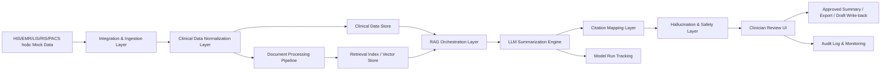

## 3.2 Giải thích luồng chính

1. **HIS/EMR hoặc mock data** cung cấp dữ liệu bệnh nhân, encounter, notes, diagnosis, medication, lab và report.
2. **Integration & Ingestion Layer** nhận dữ liệu qua API, file upload, FHIR-like JSON, CSV hoặc batch import.
3. **Clinical Data Normalization Layer** chuyển dữ liệu nguồn về schema nội bộ tương thích FHIR.
4. **Document Processing Pipeline** xử lý clinical notes, chunking, metadata tagging và embedding.
5. **Retrieval Index / Vector Store** lưu index phục vụ semantic search và citation retrieval.
6. **RAG Orchestration Layer** lấy dữ liệu có liên quan theo patient, encounter và summary type.
7. **LLM Summarization Engine** tạo bản tóm tắt có cấu trúc.
8. **Citation Mapping Layer** mapping từng claim trong summary về source document/chunk/structured data.
9. **Hallucination & Safety Layer** phát hiện unsupported claim, conflict và missing citation.
10. **Clinician Review UI** cho phép bác sĩ kiểm tra citation, chỉnh sửa, approve hoặc reject.
11. **Audit & Monitoring** lưu toàn bộ hành động, version, chất lượng summary và model run.

---

# 4. MVP Architecture

## 4.1 MVP architecture goal

Ở MVP, hệ thống chưa cần tích hợp trực tiếp với bệnh viện thật. Mục tiêu là chứng minh flow end-to-end:

```text
Mock/FHIR-like EMR Data
→ Data Ingestion
→ Clinical Document Processing
→ RAG Retrieval
→ Citation-grounded Summary
→ Hallucination Check
→ Doctor Review
→ Audit Log
```

## 4.2 MVP component diagram

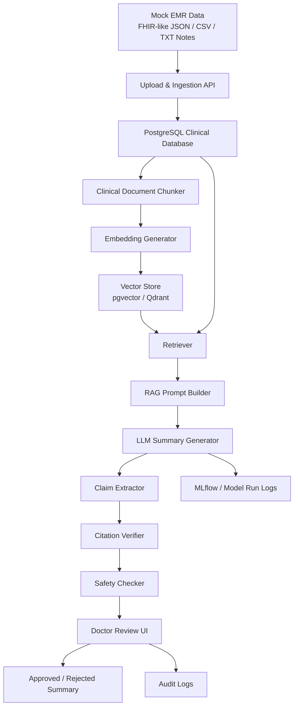

## 4.3 MVP technology recommendation

| Layer | MVP technology |
|---|---|
| Frontend | React / Next.js hoặc Streamlit cho demo nhanh |
| Backend | FastAPI |
| Database | PostgreSQL |
| Vector store | pgvector hoặc Qdrant |
| Document processing | Python pipeline |
| Embedding | Clinical/domain embedding nếu có; nếu chưa có thì dùng multilingual/general embedding |
| LLM | Local model hoặc API model với de-identified data |
| Model tracking | MLflow |
| Container | Docker |
| Auth MVP | Simple role-based login |
| Audit | PostgreSQL audit_logs table |

## 4.4 MVP boundary

MVP chỉ cần:

- Import dữ liệu bệnh án mô phỏng hoặc de-identified.
- Tạo summary có cấu trúc.
- Gắn citation.
- Check unsupported claim.
- Cho bác sĩ review.
- Lưu audit log.

MVP chưa cần:

- Full HIS production integration.
- Real-time HL7/FHIR sync.
- PACS image diagnosis.
- Automatic treatment recommendation.
- Automatic prescription.
- Autonomous EMR write-back.

---

# 5. Production Target Architecture

## 5.1 Production architecture overview

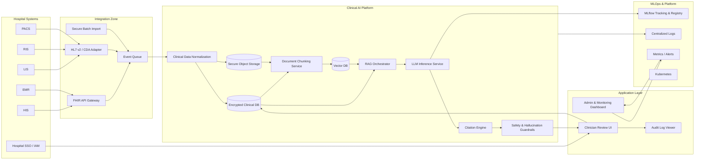

## 5.2 Production architecture notes

Production nên tách thành 4 zone:

| Zone | Vai trò |
|---|---|
| Hospital Systems Zone | Các hệ thống nguồn như HIS, EMR, LIS, RIS, PACS, IAM |
| Integration Zone | Adapter, FHIR gateway, batch import, event queue |
| Clinical AI Platform Zone | Database, document processing, retrieval, LLM, citation, safety |
| Application & Monitoring Zone | UI, admin dashboard, audit log, monitoring, MLOps |

---

# 6. Component Architecture

## 6.1 Integration & Ingestion Layer

### Purpose

Nhận dữ liệu từ HIS/EMR hoặc nguồn mô phỏng, sau đó đưa vào pipeline chuẩn hóa.

### Supported input channels

| Input channel | MVP | Production |
|---|---:|---:|
| Manual upload TXT/CSV/JSON | Yes | Limited |
| FHIR-like JSON | Yes | Yes |
| FHIR API | Optional | Yes |
| HL7 v2 message | No | Yes |
| CDA/XML document | Optional | Yes |
| Database view/export | Optional | Yes |
| Secure batch import | Yes | Yes |

### Main functions

- Validate file/API payload.
- Map external IDs với internal IDs.
- Detect duplicate records.
- Save ingestion batch logs.
- Mark failed records.
- Trigger document processing pipeline.

### Ingestion flow

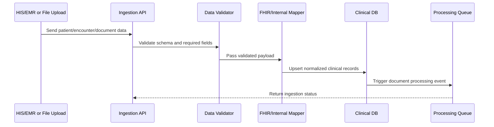

---

## 6.2 Clinical Data Normalization Layer

### Purpose

Chuyển dữ liệu từ format nguồn sang schema nội bộ tương thích FHIR.

### Core mapping

| Internal entity | FHIR resource mapping | Use in summarization |
|---|---|---|
| patients | Patient | Patient demographics |
| encounters | Encounter | Visit/admission context |
| conditions | Condition | Diagnosis/problem list |
| observations | Observation | Lab results/vitals |
| medications | MedicationRequest / MedicationStatement | Medication summary |
| diagnostic_reports | DiagnosticReport | Imaging/lab report text |
| clinical_documents | DocumentReference / Composition | Notes and clinical documents |

### Normalization logic

```text
External source data
→ Validate required fields
→ Map patient and encounter
→ Normalize timestamps
→ Normalize document type
→ Normalize clinical concepts
→ Save raw + normalized version
→ Create traceability metadata
```

---

## 6.3 Clinical Data Store

### Purpose

Lưu dữ liệu lâm sàng đã chuẩn hóa, document gốc, summary, citation, review và audit log.

### Recommended database split

| Data type | Storage |
|---|---|
| Structured clinical data | PostgreSQL |
| Raw clinical notes | PostgreSQL encrypted field or secure object storage |
| Document chunks | PostgreSQL |
| Embeddings | pgvector / Qdrant / Milvus |
| Source files | Secure object storage |
| Audit logs | PostgreSQL or append-only log store |
| Model metrics | MLflow + metrics DB |

### Key tables

```text
patients
encounters
conditions
observations
medications
diagnostic_reports
clinical_documents
document_chunks
summaries
summary_sections
summary_claims
claim_citations
summary_reviews
model_runs
audit_logs
```

---

## 6.4 Document Processing Pipeline

### Purpose

Xử lý clinical notes và report text để phục vụ retrieval và citation.

### Pipeline

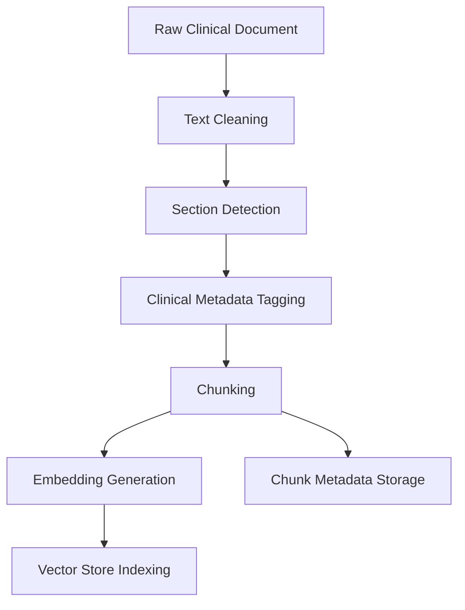

### Processing steps

| Step | Description |
|---|---|
| Text cleaning | Loại bỏ ký tự lỗi, header/footer không cần thiết |
| Section detection | Nhận diện sections như diagnosis, medication, hospital course, labs |
| Metadata tagging | Gắn patient_id, encounter_id, document_type, date, author |
| Chunking | Tách document thành đoạn nhỏ đủ ngữ cảnh |
| Embedding | Tạo vector embedding cho từng chunk |
| Indexing | Lưu vector và metadata vào vector store |
| Source span storage | Lưu char_start, char_end để citation chính xác |

### Chunking principle

Chunking không nên chỉ chia theo số token. Với clinical notes, nên ưu tiên:

```text
Section-aware chunking
→ Preserve clinical section
→ Keep timestamp/source metadata
→ Keep sentence boundaries
→ Store original source span
```

---

## 6.5 Retrieval Layer

### Purpose

Truy xuất đúng phần bệnh án liên quan đến loại summary cần tạo.

### Retrieval strategy

Nên dùng **hybrid retrieval**:

```text
Structured filtering + keyword retrieval + semantic retrieval + reranking
```

### Retrieval flow

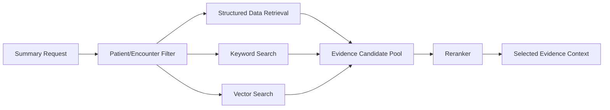

### Retrieval inputs

| Input | Example |
|---|---|
| patient_id | Patient cần tóm tắt |
| encounter_id | Đợt khám/điều trị cụ thể |
| summary_type | patient_snapshot, discharge_summary_draft |
| date range | last 7 days, current admission |
| clinical section | medication, labs, diagnosis |
| user role | doctor, nurse, admin |

### Retrieval outputs

```json
{
  "evidence_items": [
    {
      "source_id": "doc_001_chunk_004",
      "source_type": "document_chunk",
      "document_type": "progress_note",
      "timestamp": "2026-05-20T10:30:00",
      "text": "Patient has history of type 2 diabetes...",
      "score": 0.91
    }
  ]
}
```

---

## 6.6 RAG Orchestration Layer

### Purpose

Điều phối retrieval context, prompt template, output schema và model call.

### RAG flow

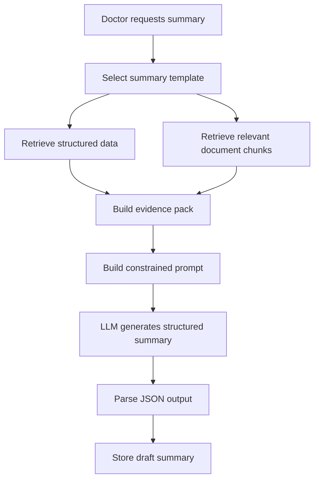

### RAG prompt constraints

Prompt phải ép model:

- Chỉ dùng context được cung cấp.
- Không suy luận diagnosis/treatment nếu không có nguồn.
- Mỗi claim y khoa cần citation ID.
- Nếu thiếu bằng chứng, ghi rõ “Không đủ bằng chứng trong hồ sơ hiện có”.
- Output theo JSON schema cố định.

### Evidence pack format

```json
{
  "patient_context": {
    "patient_id": "patient_001",
    "encounter_id": "encounter_001",
    "summary_type": "patient_snapshot"
  },
  "structured_data": {
    "conditions": [],
    "medications": [],
    "observations": []
  },
  "document_evidence": [
    {
      "source_id": "chunk_001",
      "document_type": "progress_note",
      "date": "2026-05-20",
      "text": "..."
    }
  ]
}
```

---

## 6.7 LLM Summarization Engine

### Purpose

Sinh bản tóm tắt có cấu trúc từ evidence pack.

### Recommended LLM deployment options

| Option | Use case | Notes |
|---|---|---|
| Cloud LLM | Demo với de-identified data | Nhanh nhưng cần kiểm soát dữ liệu |
| Local open-source LLM | Private data pilot | Cần GPU và tuning |
| Hybrid | Production nâng cao | PHI xử lý local, non-PHI có thể xử lý cloud |
| ONNX/vLLM optimized inference | Scale hoặc edge/private deployment | Tối ưu latency/cost |

### Output structure

Output nên ở dạng JSON trước, sau đó frontend render thành UI.

```json
{
  "summary_type": "patient_snapshot",
  "sections": [
    {
      "section_title": "Active Problems",
      "claims": [
        {
          "claim_text": "Bệnh nhân có tiền sử đái tháo đường type 2.",
          "claim_type": "diagnosis",
          "citation_ids": ["chunk_001"],
          "support_status": "supported"
        }
      ]
    }
  ],
  "unsupported_claims": [],
  "requires_clinician_review": true
}
```

---

## 6.8 Citation Mapping Layer

### Purpose

Mapping từng claim trong summary về nguồn dữ liệu gốc.

### Citation architecture

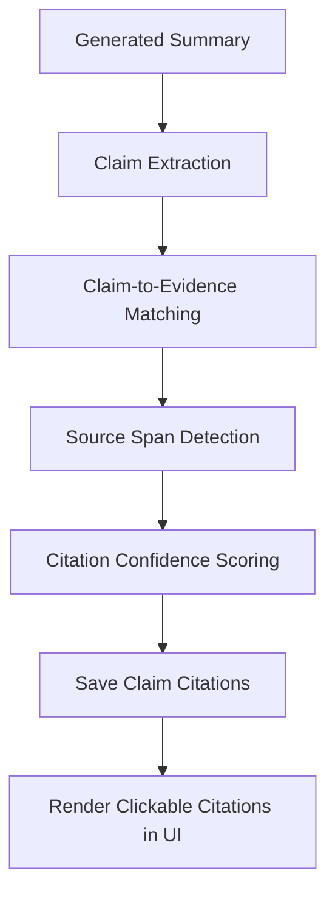

### Citation requirement

Mỗi citation nên lưu:

| Field | Meaning |
|---|---|
| claim_id | Claim trong summary |
| source_type | document_chunk, observation, medication, condition, report |
| source_id | ID nguồn |
| source_text_span | Đoạn text hỗ trợ claim |
| source_timestamp | Ngày giờ nguồn |
| citation_confidence | Điểm tin cậy |
| document_type | progress note, discharge note, lab report |

### Citation rule

```text
Nếu claim thuộc loại diagnosis, medication, lab_result, vital_sign, procedure hoặc follow_up
→ phải có citation.
Nếu không có citation
→ claim bị flag unsupported hoặc đưa vào Needs Clinician Review.
```

---

## 6.9 Hallucination & Safety Layer

### Purpose

Giảm rủi ro AI tạo thông tin không có trong bệnh án.

### Safety architecture

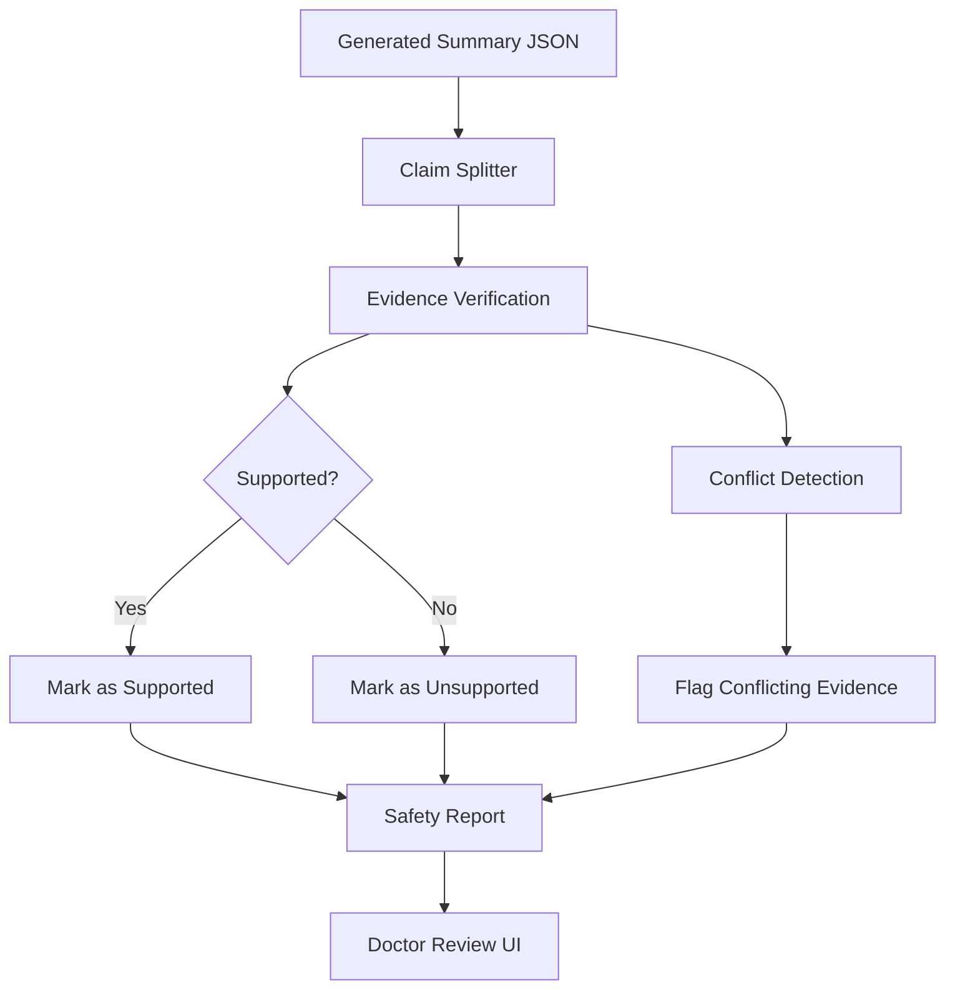

### Safety checks

| Check | Purpose |
|---|---|
| Required citation check | Đảm bảo claim y khoa có nguồn |
| Evidence support check | Kiểm tra claim có được nguồn hỗ trợ không |
| Contradiction check | Phát hiện nguồn dữ liệu mâu thuẫn |
| Entity consistency check | Check thuốc, lab value, date, diagnosis |
| Missing data check | Ghi rõ nếu thông tin không có trong hồ sơ |
| Review requirement check | Bắt buộc clinician review trước khi approve |

### Safety output

```json
{
  "summary_id": "summary_001",
  "citation_coverage": 0.96,
  "unsupported_claims": [
    {
      "claim_text": "Bệnh nhân có bệnh thận mạn giai đoạn 3.",
      "reason": "No supporting evidence found in retrieved context."
    }
  ],
  "conflicting_claims": [],
  "requires_review": true
}
```

---

## 6.10 Human-in-the-loop Review Layer

### Purpose

Đưa bác sĩ vào quy trình xác nhận, chỉnh sửa và phê duyệt summary.

### Review workflow

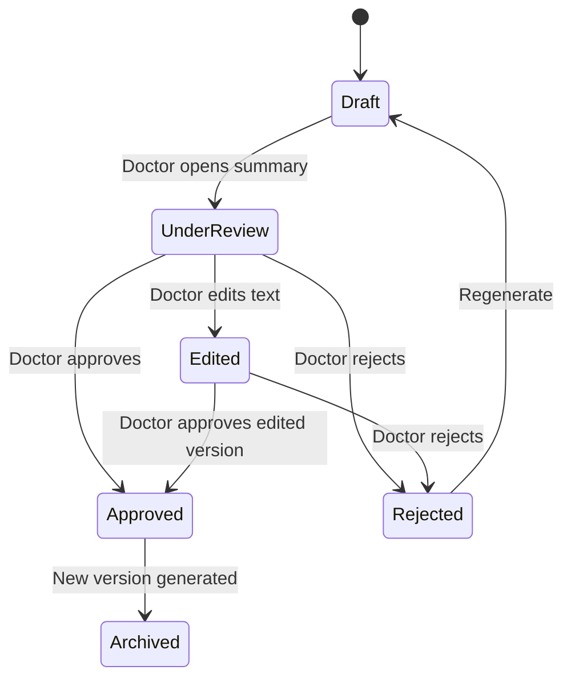

### Doctor review UI requirements

| UI component | Purpose |
|---|---|
| Summary panel | Hiển thị bản tóm tắt có cấu trúc |
| Citation panel | Hiển thị nguồn dẫn khi click claim |
| Source viewer | Xem document/note/lab/report gốc |
| Safety warning panel | Hiển thị unsupported/conflicting claims |
| Edit mode | Cho phép bác sĩ chỉnh sửa |
| Approve/Reject action | Chốt trạng thái summary |
| Version history | So sánh các lần tạo summary |

### Review rule

- AI summary mặc định ở trạng thái `draft`.
- Bác sĩ phải review trước khi summary được xem là usable.
- Nếu reject, nên bắt buộc nhập reason.
- Nếu approve, hệ thống lưu `approved_by`, `approved_at`, final text và version.
- Mọi edit/approve/reject đều ghi audit log.

---

# 7. Frontend Architecture

## 7.1 Main screens

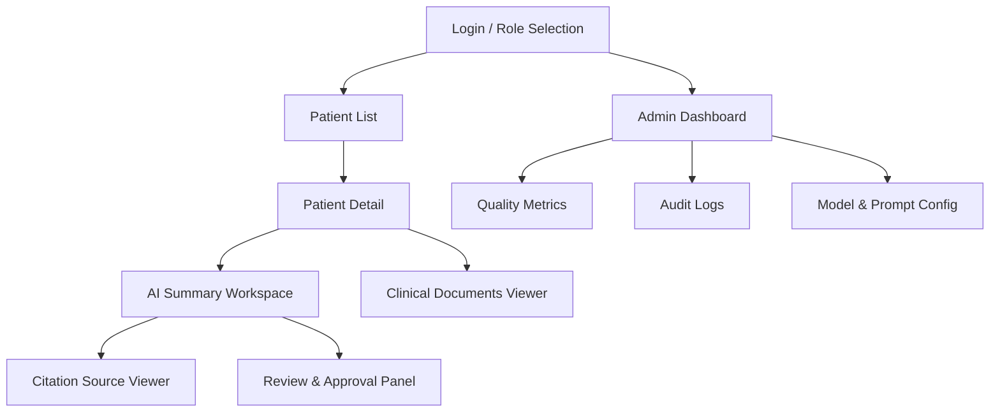

## 7.2 Most important screen: AI Summary Workspace

Recommended layout:

```text
------------------------------------------------------------
| Patient Header: Name/ID, Encounter, Department, Status     |
------------------------------------------------------------
| Left Panel: AI Summary           | Right Panel: Evidence   |
| - Patient Snapshot               | - Source document       |
| - Active Problems                | - Highlighted span      |
| - Recent Timeline                | - Metadata              |
| - Medications                    | - Timestamp             |
| - Labs/Imaging                   |                         |
------------------------------------------------------------
| Safety Panel: Unsupported claims / Conflicts / Missing data |
------------------------------------------------------------
| Actions: Edit | Regenerate | Approve | Reject | Export     |
------------------------------------------------------------
```

## 7.3 Frontend principles

- Citation phải clickable.
- Claim không có citation phải được đánh dấu rõ.
- Không để UI làm người dùng hiểu nhầm rằng AI output là kết luận chính thức.
- Doctor edit phải lưu version.
- Approved summary và AI draft phải phân biệt rõ.

---

# 8. Backend Service Architecture

## 8.1 Backend services

| Service | Responsibility |
|---|---|
| Auth Service | Login, role, permission |
| Patient Service | Patient/encounter query |
| Ingestion Service | Import data từ file/API |
| Clinical Data Service | Query clinical data |
| Document Processing Service | Clean/chunk/embed notes |
| Retrieval Service | Search evidence |
| Summary Service | Generate and store summaries |
| Citation Service | Claim-source mapping |
| Safety Service | Hallucination and conflict checks |
| Review Service | Edit/approve/reject workflow |
| Audit Service | Log system actions |
| Monitoring Service | Metrics and dashboard |

## 8.2 Backend modular architecture

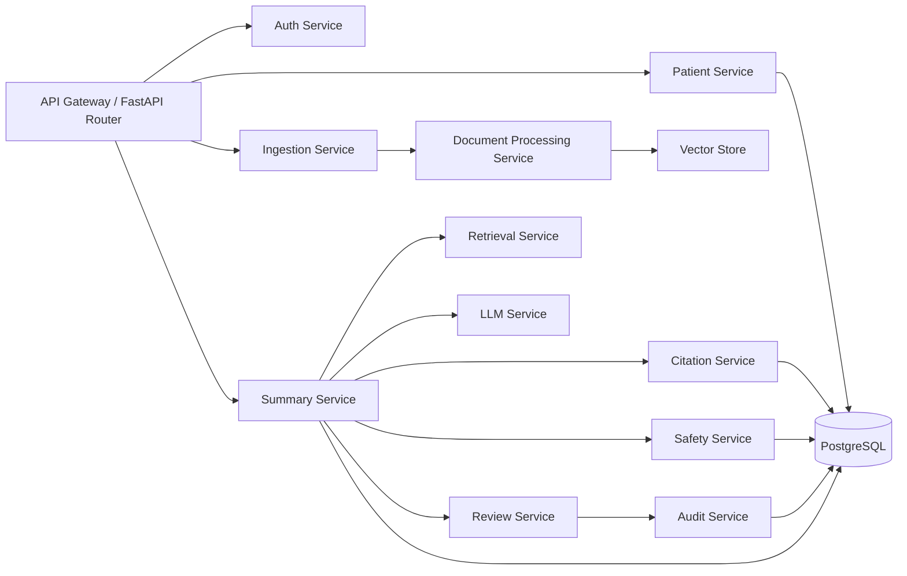

---

# 9. API Architecture Overview

## 9.1 API groups

| API group | Purpose |
|---|---|
| `/auth` | Login, role, user session |
| `/patients` | Patient list/detail |
| `/encounters` | Encounter detail |
| `/documents` | Upload/import/view clinical documents |
| `/summaries` | Generate/get/regenerate summary |
| `/claims` | Claim detail and support status |
| `/citations` | Citation detail and source view |
| `/reviews` | Approve/reject/edit summary |
| `/audit` | Audit log |
| `/admin` | Model, prompt, integration config |

## 9.2 Example endpoints

```text
GET    /api/v1/patients
GET    /api/v1/patients/{patient_id}
GET    /api/v1/patients/{patient_id}/encounters
POST   /api/v1/documents/import
GET    /api/v1/documents/{document_id}
POST   /api/v1/patients/{patient_id}/summaries/generate
GET    /api/v1/summaries/{summary_id}
POST   /api/v1/summaries/{summary_id}/regenerate
POST   /api/v1/summaries/{summary_id}/approve
POST   /api/v1/summaries/{summary_id}/reject
GET    /api/v1/claims/{claim_id}/citations
GET    /api/v1/audit/patients/{patient_id}
```

---

# 10. Security Architecture

## 10.1 Security layers

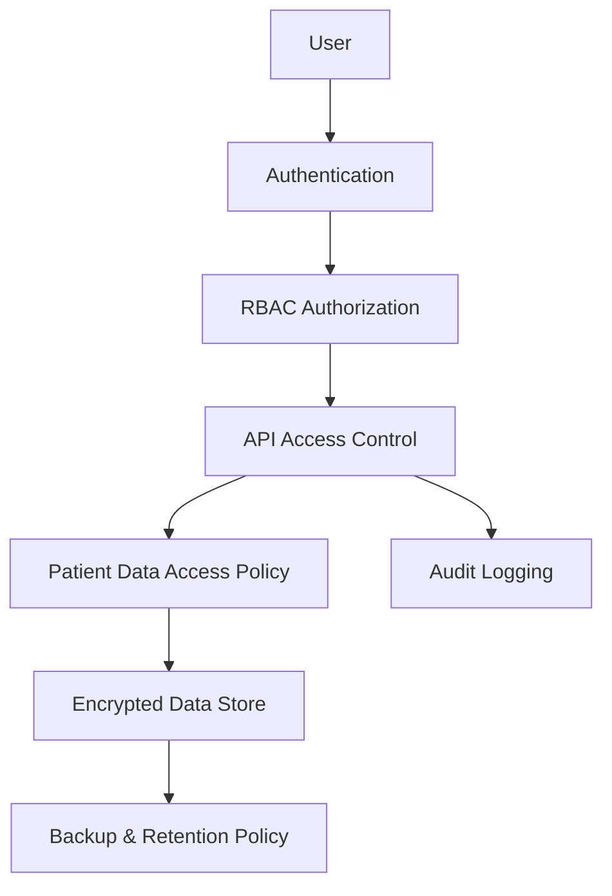

## 10.2 Security requirements

| Area | Requirement |
|---|---|
| Authentication | SSO/OAuth2 in production; simple login acceptable for MVP |
| Authorization | Role-based access control |
| PHI protection | Encrypt sensitive fields and documents |
| Transport security | HTTPS/TLS |
| Data access | Restrict by role, department, patient assignment if available |
| Audit | Log view/generate/edit/approve/export actions |
| AI API | Do not send identifiable PHI to public LLM without approval |
| De-identification | Use de-identified data for demo and model testing |
| Secrets | Store API keys in secret manager or environment variables |
| Backup | Encrypted backup and restore plan |

## 10.3 Recommended role permissions

| Action | Doctor | Nurse | Clinical Admin | IT Admin | Auditor |
|---|---:|---:|---:|---:|---:|
| View patient | Yes | Limited | Yes | No/limited | Read-only |
| Generate summary | Yes | No/limited | Yes | No | No |
| Edit summary | Yes | No | No | No | No |
| Approve summary | Yes | No | No | No | No |
| Reject summary | Yes | No | No | No | No |
| View dashboard | Limited | No | Yes | Yes | Yes |
| Manage integration | No | No | No | Yes | No |
| View audit log | Limited | No | Yes | Yes | Yes |

---

# 11. Deployment Architecture

## 11.1 Local demo deployment

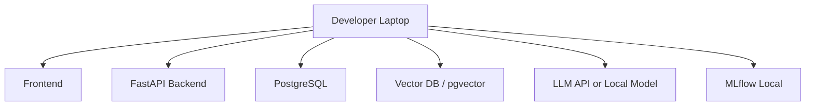

### Suitable for

- Thesis/demo.
- MVP validation.
- No real patient data.
- Mock/de-identified data only.

---

## 11.2 Private cloud pilot deployment

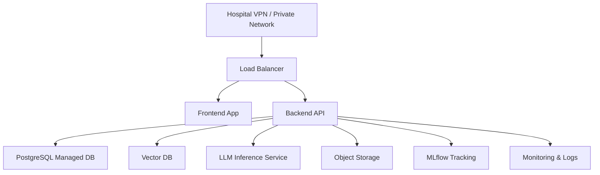

### Suitable for

- De-identified retrospective pilot.
- Hospital sandbox.
- Controlled clinician testing.
- Limited user group.

---

## 11.3 On-premise production deployment

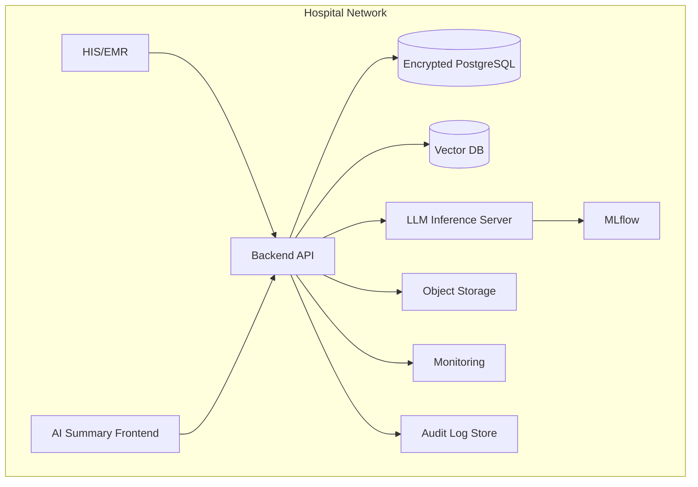

### Suitable for

- Real patient data.
- Strict data residency requirements.
- Hospital-controlled infrastructure.
- GPU server available.

---

# 12. MLOps and Monitoring Architecture

## 12.1 MLOps architecture

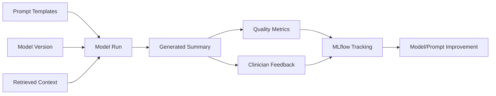

## 12.2 Metrics to monitor

| Metric | Purpose |
|---|---|
| Summary generation latency | Performance |
| Citation coverage | Safety/traceability |
| Unsupported claim count | Hallucination risk |
| Conflict count | Evidence quality |
| Doctor approval rate | Practical usefulness |
| Rejection rate | Quality issue |
| Average edit distance | Amount of correction needed |
| Retrieval hit rate | Retrieval quality |
| Token usage/cost | Cost management |
| Model error rate | Reliability |
| User activity | Adoption |

## 12.3 Model governance

Every generated summary should store:

```text
model_name
model_version
prompt_template_version
retrieval_top_k
context_hash
output_hash
generated_at
reviewed_by
approved_by
```

This is necessary because clinical summarization must be traceable. If model or prompt changes, the system must be able to explain which version generated which summary.

---

# 13. Data Flow Scenarios

## 13.1 Scenario 1 — Generate patient snapshot

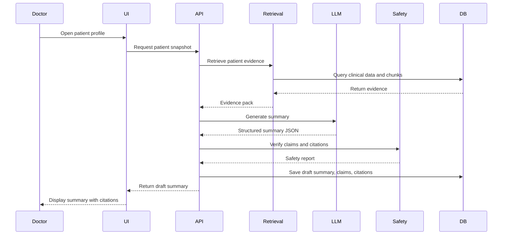

## 13.2 Scenario 2 — Doctor approves summary

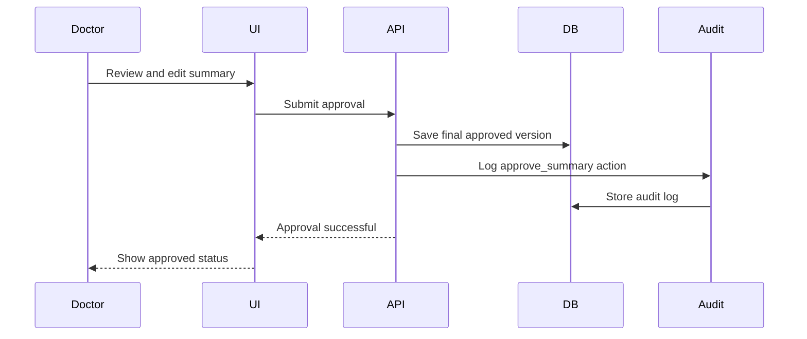

## 13.3 Scenario 3 — Unsupported claim detected

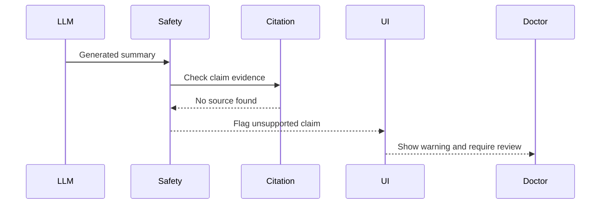

---

# 14. Architecture Decision Records

## ADR-001 — Use FHIR-compatible internal model

| Item | Decision |
|---|---|
| Context | HIS/EMR systems differ by vendor and maturity |
| Decision | Use internal schema that maps to FHIR resources |
| Reason | Easier integration later, better healthcare interoperability |
| Consequence | More upfront mapping work, but cleaner long-term architecture |

---

## ADR-002 — Use citation-first summarization

| Item | Decision |
|---|---|
| Context | LLMs can hallucinate or over-summarize |
| Decision | Every clinical claim should have citation |
| Reason | Clinician trust, auditability and safety |
| Consequence | Summary generation is more complex but safer |

---

## ADR-003 — Keep AI output as draft until clinician approval

| Item | Decision |
|---|---|
| Context | Clinical documentation affects patient care |
| Decision | AI output cannot become official without review |
| Reason | Risk mitigation and clinical accountability |
| Consequence | Workflow requires doctor review UI and audit log |

---

## ADR-004 — Start with mock/de-identified data

| Item | Decision |
|---|---|
| Context | Real medical data is sensitive and hard to access |
| Decision | MVP uses mock/de-identified data first |
| Reason | Faster development, safer demo |
| Consequence | Real-world validation still requires hospital partnership |

---

## ADR-005 — Use hybrid retrieval

| Item | Decision |
|---|---|
| Context | Clinical documents include abbreviations, exact values and semantic concepts |
| Decision | Combine structured filtering, keyword search and vector retrieval |
| Reason | Better retrieval quality than vector-only search |
| Consequence | More components to tune |

---

# 15. Recommended Implementation Sequence

## Phase 1 — Architecture-ready MVP

```text
1. Set up PostgreSQL schema
2. Build data ingestion for FHIR-like JSON / TXT / CSV
3. Store patient, encounter, clinical document
4. Build document chunking pipeline
5. Add vector indexing
6. Build retrieval service
7. Build RAG summary generation
8. Build citation mapping
9. Build safety checker
10. Build doctor review screen
11. Add audit log
12. Add quality metrics dashboard
```

## Phase 2 — Integration-ready system

```text
1. Add structured data tables: conditions, observations, medications
2. Add FHIR API adapter
3. Add HL7/CDA import option if needed
4. Add SSO/RBAC
5. Add deployment hardening
6. Add monitoring and alerting
7. Add prompt/model version control
```

## Phase 3 — Pilot-ready system

```text
1. Use de-identified hospital dataset
2. Run retrospective evaluation
3. Collect clinician feedback
4. Measure time saved and edit distance
5. Improve prompt/retrieval/citation
6. Prepare governance and deployment checklist
```

---

# 16. Architecture Risks and Mitigation

| Risk | Impact | Mitigation |
|---|---:|---|
| HIS/EMR does not support FHIR API | High | Support batch import, CSV, HL7/CDA adapter |
| AI creates unsupported clinical claim | Critical | Citation enforcement, safety checker, doctor review |
| Citation points to weak or wrong evidence | High | Citation confidence score, source viewer, reviewer feedback |
| Sensitive data sent to external LLM | Critical | Use de-identified data, local inference, private deployment |
| Retrieval misses key clinical evidence | High | Hybrid retrieval, section-aware chunking, reranking |
| Doctor distrusts AI summary | High | Transparent citation UI and easy source verification |
| Latency too high | Medium | Caching, async job queue, smaller model, optimized inference |
| Model update changes behavior | High | Model registry, prompt versioning, regression tests |
| Audit log incomplete | High | Centralized audit middleware |
| Dataset too small for validation | Medium | Use mock + public de-identified + partner data later |

---

# 17. Recommended File/Folder Structure

```text
medical-record-summarization/
├── backend/
│   ├── app/
│   │   ├── api/
│   │   ├── services/
│   │   │   ├── ingestion_service.py
│   │   │   ├── retrieval_service.py
│   │   │   ├── summary_service.py
│   │   │   ├── citation_service.py
│   │   │   ├── safety_service.py
│   │   │   └── audit_service.py
│   │   ├── models/
│   │   ├── schemas/
│   │   └── db/
│   └── tests/
├── frontend/
│   ├── pages/
│   ├── components/
│   │   ├── SummaryPanel.tsx
│   │   ├── CitationPanel.tsx
│   │   ├── SourceViewer.tsx
│   │   └── SafetyWarningPanel.tsx
│   └── services/
├── pipelines/
│   ├── document_chunking.py
│   ├── embedding_generation.py
│   └── evaluation.py
├── prompts/
│   ├── patient_snapshot_prompt.md
│   ├── discharge_summary_prompt.md
│   ├── claim_extraction_prompt.md
│   └── citation_verification_prompt.md
├── data/
│   ├── mock_fhir/
│   ├── sample_notes/
│   └── deidentified/
├── docs/
│   ├── 01_project_brief.md
│   ├── 02_prd.md
│   ├── 03_mvp_scope.md
│   ├── 04_database_schema.md
│   ├── 05_system_architecture.md
│   ├── 06_user_workflow.md
│   ├── 07_api_specification.md
│   ├── 08_fhir_data_mapping.md
│   ├── 09_prompt_design.md
│   ├── 10_hallucination_mitigation.md
│   └── 11_evaluation_plan.md
├── docker-compose.yml
└── README.md
```

---

# 18. References

- HL7 FHIR — DocumentReference: https://build.fhir.org/documentreference.html  
- HL7 SMART App Launch Implementation Guide: https://build.fhir.org/ig/HL7/smart-app-launch/app-launch.html  
- SMART on FHIR Documentation: https://docs.smarthealthit.org/  
- NIST AI Risk Management Framework — Generative AI Profile: https://www.nist.gov/publications/artificial-intelligence-risk-management-framework-generative-artificial-intelligence  
- Vietnam Circular 13/2025/TT-BYT on electronic medical records: https://english.luatvietnam.vn/y-te/circular-13-2025-tt-byt-electronic-medical-records-402396-d1.html  

---

# 19. Final Architecture Summary

Kiến trúc đề xuất cho hệ thống này không nên chỉ là chatbot + database. Hệ thống cần được thiết kế như một **clinical AI documentation platform** gồm các lớp rõ ràng:

```text
Integration Layer
→ Clinical Data Normalization
→ Clinical Data Store
→ Document Processing
→ Retrieval Index
→ RAG Summarization
→ Citation Mapping
→ Hallucination Safety
→ Doctor Review
→ Audit & Monitoring
```

Điểm khác biệt quan trọng nhất của kiến trúc là:

> Hệ thống không chỉ tạo summary, mà còn lưu được summary đó được tạo từ dữ liệu nào, claim nào được hỗ trợ bởi nguồn nào, bác sĩ nào đã review, và phiên bản model/prompt nào đã tạo ra output đó.

Đây là kiến trúc phù hợp cho MVP, đồng thời vẫn có đường mở rộng sang hospital pilot và production deployment.
