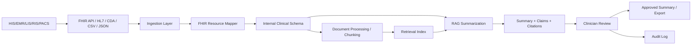

# FHIR Data Mapping — Medical Record Summarization System

## 1. Mục tiêu tài liệu

Tài liệu này mô tả cách mapping dữ liệu từ **HIS/EMR/LIS/RIS/PACS hoặc mock EMR data** vào schema nội bộ của hệ thống **Medical Record Summarization** theo hướng tương thích với **HL7 FHIR**.

Mục tiêu của FHIR Data Mapping là:

- Chuẩn hóa dữ liệu bệnh án từ nhiều nguồn khác nhau.
- Thiết kế schema nội bộ có thể mở rộng sang tích hợp FHIR thật.
- Giúp hệ thống tóm tắt bệnh án hiểu được patient, encounter, diagnosis, medication, lab, report và clinical note.
- Bảo đảm mỗi claim trong summary có thể truy ngược về nguồn dữ liệu gốc.
- Tạo nền tảng cho citation, audit, provenance và hallucination mitigation.

---

# 2. Mapping Scope

## 2.1 In scope for MVP

| Clinical data | FHIR resource | Internal table |
|---|---|---|
| Patient information | Patient | `patients` |
| Encounter / admission / visit | Encounter | `encounters` |
| Diagnosis / problem list | Condition | `conditions` |
| Lab results / vital signs | Observation | `observations` |
| Medication orders/statements | MedicationRequest / MedicationStatement | `medications` |
| Imaging/lab report text | DiagnosticReport | `diagnostic_reports` |
| Clinical notes/documents | DocumentReference / Composition | `clinical_documents` |
| Document chunks | Not direct FHIR resource | `document_chunks` |
| AI-generated summary | DocumentReference / Composition-like output | `summaries`, `summary_sections` |
| Claim-level citation | Provenance-like / internal mapping | `summary_claims`, `claim_citations` |
| Audit events | AuditEvent | `audit_logs` |

## 2.2 Out of scope for MVP

| FHIR area | Reason |
|---|---|
| Procedure | Can be added in Phase 2 |
| AllergyIntolerance | Important but not required for first MVP unless allergy summary is in scope |
| CarePlan | Treatment planning is outside MVP |
| ServiceRequest | Can be added when order workflow is needed |
| ImagingStudy | MVP handles report text, not image interpretation |
| Practitioner / Organization full sync | Can be simplified using author/department fields |
| FHIR write-back | MVP should avoid official EMR write-back before governance approval |

---

# 3. FHIR-compatible Data Flow



---

# 4. Patient Mapping

## 4.1 FHIR Resource

```text
FHIR Patient
```

FHIR Patient represents demographic and administrative information about a person receiving care.

## 4.2 Internal table

```text
patients
```

## 4.3 Field mapping

| FHIR Patient field | Internal field | Required | Notes |
|---|---|---:|---|
| `Patient.id` | `patients.fhir_patient_id` | Should | FHIR resource ID |
| `Patient.identifier.value` | `patients.external_patient_id` | Must | HIS/EMR patient ID |
| `Patient.identifier.system` | `patients.source_system` | Should | Source namespace |
| `Patient.name.text` | `patients.full_name_encrypted` | Optional | Encrypt in production |
| `Patient.birthDate` | `patients.date_of_birth` | Should | Used to calculate age |
| `Patient.gender` | `patients.gender` | Should | male, female, other, unknown |
| `Patient.telecom.value` | `patients.phone_encrypted` | Optional | Sensitive |
| `Patient.address.text` | `patients.address_encrypted` | Optional | Sensitive |
| N/A | `patients.patient_hash` | Must for demo | Used for de-identified data |
| N/A | `patients.is_deidentified` | Must | True for demo data |

## 4.4 Example FHIR Patient input

```json
{
  "resourceType": "Patient",
  "id": "patient-001",
  "identifier": [
    {
      "system": "https://hospital.vn/his/patient-id",
      "value": "HIS-000001"
    }
  ],
  "gender": "male",
  "birthDate": "1964-03-15"
}
```

## 4.5 Example normalized record

```json
{
  "patient_id": "pat_001",
  "external_patient_id": "HIS-000001",
  "fhir_patient_id": "patient-001",
  "patient_hash": "hash_abc123",
  "date_of_birth": "1964-03-15",
  "gender": "male",
  "source_system": "hospital_his",
  "is_deidentified": true
}
```

---

# 5. Encounter Mapping

## 5.1 FHIR Resource

```text
FHIR Encounter
```

Encounter represents an interaction between a patient and healthcare provider, including outpatient visits, inpatient admissions, emergency visits and virtual care.

## 5.2 Internal table

```text
encounters
```

## 5.3 Field mapping

| FHIR Encounter field | Internal field | Required | Notes |
|---|---|---:|---|
| `Encounter.id` | `encounters.fhir_encounter_id` | Should | FHIR encounter ID |
| `Encounter.identifier.value` | `encounters.external_encounter_id` | Must | HIS visit/admission ID |
| `Encounter.subject.reference` | `encounters.patient_id` | Must | Reference to patient |
| `Encounter.class.code` | `encounters.encounter_type` | Should | inpatient, outpatient, emergency |
| `Encounter.period.start` | `encounters.start_time` | Should | Encounter start |
| `Encounter.period.end` | `encounters.end_time` | Optional | Encounter end |
| `Encounter.status` | `encounters.status` | Should | active, finished, cancelled |
| `Encounter.reasonCode.text` | `encounters.reason_for_visit` | Optional | Reason for visit |
| `Encounter.serviceProvider.display` | `encounters.department` | Optional | Department |
| `Encounter.participant.individual.reference` | `encounters.attending_doctor_id` | Optional | Map to users if available |

## 5.4 Encounter type normalization

| FHIR class/code | Internal `encounter_type` |
|---|---|
| `IMP` | inpatient |
| `AMB` | outpatient |
| `EMER` | emergency |
| `VR` | telemedicine |
| unknown | other |

## 5.5 Example FHIR Encounter input

```json
{
  "resourceType": "Encounter",
  "id": "encounter-001",
  "identifier": [
    {
      "value": "VISIT-000001"
    }
  ],
  "status": "in-progress",
  "class": {
    "code": "IMP",
    "display": "inpatient encounter"
  },
  "subject": {
    "reference": "Patient/patient-001"
  },
  "period": {
    "start": "2026-05-20T08:00:00+07:00"
  },
  "reasonCode": [
    {
      "text": "Shortness of breath"
    }
  ]
}
```

---

# 6. Condition Mapping

## 6.1 FHIR Resource

```text
FHIR Condition
```

Condition is used for diagnosis, problem list items, health concerns and clinical conditions.

## 6.2 Internal table

```text
conditions
```

## 6.3 Field mapping

| FHIR Condition field | Internal field | Required | Notes |
|---|---|---:|---|
| `Condition.id` | `conditions.fhir_condition_id` | Should | FHIR condition ID |
| `Condition.identifier.value` | `conditions.external_condition_id` | Optional | Source condition ID |
| `Condition.subject.reference` | `conditions.patient_id` | Must | Patient reference |
| `Condition.encounter.reference` | `conditions.encounter_id` | Optional | Encounter reference |
| `Condition.code.coding.code` | `conditions.condition_code` | Optional | ICD-10/SNOMED code |
| `Condition.code.coding.system` | `conditions.coding_system` | Optional | ICD-10/SNOMED system |
| `Condition.code.text` | `conditions.condition_name` | Must | Diagnosis/problem text |
| `Condition.clinicalStatus.coding.code` | `conditions.clinical_status` | Optional | active, inactive, resolved |
| `Condition.verificationStatus.coding.code` | `conditions.verification_status` | Optional | confirmed, provisional |
| `Condition.onsetDateTime` | `conditions.onset_date` | Optional | Onset date |
| `Condition.recordedDate` | `conditions.recorded_date` | Should | Recorded date |

## 6.4 Example FHIR Condition input

```json
{
  "resourceType": "Condition",
  "id": "condition-001",
  "subject": {
    "reference": "Patient/patient-001"
  },
  "encounter": {
    "reference": "Encounter/encounter-001"
  },
  "code": {
    "coding": [
      {
        "system": "http://hl7.org/fhir/sid/icd-10",
        "code": "E11",
        "display": "Type 2 diabetes mellitus"
      }
    ],
    "text": "Type 2 diabetes mellitus"
  },
  "clinicalStatus": {
    "coding": [
      {
        "code": "active"
      }
    ]
  },
  "recordedDate": "2026-05-20T10:00:00+07:00"
}
```

---

# 7. Observation Mapping

## 7.1 FHIR Resource

```text
FHIR Observation
```

Observation is used for measurements and assertions such as laboratory results, vital signs and clinical scores.

## 7.2 Internal table

```text
observations
```

## 7.3 Field mapping

| FHIR Observation field | Internal field | Required | Notes |
|---|---|---:|---|
| `Observation.id` | `observations.fhir_observation_id` | Should | FHIR observation ID |
| `Observation.identifier.value` | `observations.external_observation_id` | Optional | Source ID |
| `Observation.subject.reference` | `observations.patient_id` | Must | Patient |
| `Observation.encounter.reference` | `observations.encounter_id` | Optional | Encounter |
| `Observation.category.coding.code` | `observations.observation_type` | Should | lab, vital, score |
| `Observation.code.coding.code` | `observations.observation_code` | Optional | LOINC/local code |
| `Observation.code.coding.system` | `observations.coding_system` | Optional | LOINC/local |
| `Observation.code.text` | `observations.observation_name` | Must | Test/vital name |
| `Observation.valueQuantity.value` | `observations.value_numeric` | Optional | Numeric result |
| `Observation.valueQuantity.unit` | `observations.unit` | Optional | Unit |
| `Observation.valueString` | `observations.value_text` | Optional | Text result |
| `Observation.referenceRange.low.value` | `observations.reference_range_low` | Optional | Low range |
| `Observation.referenceRange.high.value` | `observations.reference_range_high` | Optional | High range |
| `Observation.interpretation.coding.code` | `observations.interpretation` | Optional | high, low, abnormal |
| `Observation.effectiveDateTime` | `observations.observed_at` | Should | Time observed |

## 7.4 Observation type normalization

| FHIR category | Internal `observation_type` |
|---|---|
| `laboratory` | lab |
| `vital-signs` | vital |
| `survey` | score |
| `exam` | measurement |
| unknown | other |

## 7.5 Example FHIR Observation input

```json
{
  "resourceType": "Observation",
  "id": "observation-001",
  "status": "final",
  "category": [
    {
      "coding": [
        {
          "code": "laboratory",
          "display": "Laboratory"
        }
      ]
    }
  ],
  "code": {
    "text": "Creatinine"
  },
  "subject": {
    "reference": "Patient/patient-001"
  },
  "encounter": {
    "reference": "Encounter/encounter-001"
  },
  "effectiveDateTime": "2026-05-21T08:00:00+07:00",
  "valueQuantity": {
    "value": 1.8,
    "unit": "mg/dL"
  },
  "interpretation": [
    {
      "coding": [
        {
          "code": "H",
          "display": "High"
        }
      ]
    }
  ]
}
```

---

# 8. Medication Mapping

## 8.1 FHIR Resources

```text
FHIR MedicationRequest
FHIR MedicationStatement
```

For MVP, medication data can be simplified into one internal table:

```text
medications
```

## 8.2 Mapping logic

| Use case | FHIR resource | Internal meaning |
|---|---|---|
| Doctor orders medication | MedicationRequest | prescribed/requested medication |
| Medication reported as being taken | MedicationStatement | medication history/current use |
| Medication administered in hospital | MedicationAdministration | Phase 2 optional |

## 8.3 Field mapping

| FHIR MedicationRequest field | Internal field | Required | Notes |
|---|---|---:|---|
| `MedicationRequest.id` | `medications.fhir_medication_request_id` | Should | FHIR ID |
| `MedicationRequest.identifier.value` | `medications.external_medication_id` | Optional | Source ID |
| `MedicationRequest.subject.reference` | `medications.patient_id` | Must | Patient |
| `MedicationRequest.encounter.reference` | `medications.encounter_id` | Optional | Encounter |
| `MedicationRequest.medicationCodeableConcept.text` | `medications.medication_name` | Must | Medication name |
| `MedicationRequest.medicationCodeableConcept.coding.code` | `medications.medication_code` | Optional | RxNorm/local code |
| `MedicationRequest.medicationCodeableConcept.coding.system` | `medications.coding_system` | Optional | Code system |
| `MedicationRequest.dosageInstruction.text` | `medications.dosage_text` | Should | Human-readable dosage |
| `MedicationRequest.dosageInstruction.route.text` | `medications.route` | Optional | Route |
| `MedicationRequest.dosageInstruction.timing.code.text` | `medications.frequency` | Optional | Frequency |
| `MedicationRequest.authoredOn` | `medications.start_date` | Optional | Start/prescribed date |
| `MedicationRequest.status` | `medications.status` | Should | active, stopped, completed |
| N/A | `medications.medication_action` | Should | started, continued, changed, stopped |

## 8.4 Medication action inference

| Input signal | Internal `medication_action` |
|---|---|
| New MedicationRequest with active status | started |
| Same medication appears across notes | continued |
| Dose/frequency changed | changed |
| Status stopped/cancelled/completed | stopped |
| No clear signal | unknown |

## 8.5 Example FHIR MedicationRequest input

```json
{
  "resourceType": "MedicationRequest",
  "id": "medreq-001",
  "status": "active",
  "intent": "order",
  "medicationCodeableConcept": {
    "text": "Metformin 500 mg"
  },
  "subject": {
    "reference": "Patient/patient-001"
  },
  "encounter": {
    "reference": "Encounter/encounter-001"
  },
  "authoredOn": "2026-05-20",
  "dosageInstruction": [
    {
      "text": "500 mg twice daily"
    }
  ]
}
```

---

# 9. DiagnosticReport Mapping

## 9.1 FHIR Resource

```text
FHIR DiagnosticReport
```

DiagnosticReport can represent lab, radiology, pathology and other diagnostic reports. For the summarization MVP, the most useful field is the report conclusion/text.

## 9.2 Internal table

```text
diagnostic_reports
```

## 9.3 Field mapping

| FHIR DiagnosticReport field | Internal field | Required | Notes |
|---|---|---:|---|
| `DiagnosticReport.id` | `diagnostic_reports.fhir_diagnostic_report_id` | Should | FHIR ID |
| `DiagnosticReport.identifier.value` | `diagnostic_reports.external_report_id` | Optional | Source report ID |
| `DiagnosticReport.subject.reference` | `diagnostic_reports.patient_id` | Must | Patient |
| `DiagnosticReport.encounter.reference` | `diagnostic_reports.encounter_id` | Optional | Encounter |
| `DiagnosticReport.category.coding.display` | `diagnostic_reports.report_type` | Should | lab, radiology, pathology |
| `DiagnosticReport.code.text` | `diagnostic_reports.report_title` | Should | Report title |
| `DiagnosticReport.conclusion` | `diagnostic_reports.conclusion_text` | Optional | Conclusion |
| `DiagnosticReport.presentedForm.data/url` | `diagnostic_reports.report_text` | Optional | Full text if available |
| `DiagnosticReport.status` | `diagnostic_reports.report_status` | Should | final, partial |
| `DiagnosticReport.effectiveDateTime` | `diagnostic_reports.performed_at` | Optional | Performed time |
| `DiagnosticReport.issued` | `diagnostic_reports.reported_at` | Optional | Report issued time |

## 9.4 Example FHIR DiagnosticReport input

```json
{
  "resourceType": "DiagnosticReport",
  "id": "report-001",
  "status": "final",
  "category": [
    {
      "coding": [
        {
          "display": "Radiology"
        }
      ]
    }
  ],
  "code": {
    "text": "Chest X-ray report"
  },
  "subject": {
    "reference": "Patient/patient-001"
  },
  "encounter": {
    "reference": "Encounter/encounter-001"
  },
  "effectiveDateTime": "2026-05-21T09:30:00+07:00",
  "issued": "2026-05-21T10:00:00+07:00",
  "conclusion": "Bilateral lower zone infiltrates."
}
```

---

# 10. Clinical Document Mapping

## 10.1 FHIR Resources

```text
FHIR DocumentReference
FHIR Composition
```

FHIR DocumentReference indexes clinical notes, reports and other documents. FHIR Composition represents a structured clinical document with sections. For MVP, both can map into:

```text
clinical_documents
document_chunks
```

## 10.2 DocumentReference to clinical_documents

| FHIR DocumentReference field | Internal field | Required | Notes |
|---|---|---:|---|
| `DocumentReference.id` | `clinical_documents.fhir_document_reference_id` | Should | FHIR document ID |
| `DocumentReference.identifier.value` | `clinical_documents.external_document_id` | Optional | Source document ID |
| `DocumentReference.subject.reference` | `clinical_documents.patient_id` | Must | Patient |
| `DocumentReference.context.encounter.reference` | `clinical_documents.encounter_id` | Optional | Encounter |
| `DocumentReference.type.text` | `clinical_documents.document_type` | Must | progress_note, discharge_note |
| `DocumentReference.description` | `clinical_documents.document_title` | Optional | Title |
| `DocumentReference.date` | `clinical_documents.document_datetime` | Should | Document date |
| `DocumentReference.author.reference/display` | `clinical_documents.author_id` / metadata | Optional | Author |
| `DocumentReference.securityLabel` | `clinical_documents.confidentiality_level` | Optional | Confidentiality |
| `DocumentReference.content.attachment.url` | `clinical_documents.source_file_uri` | Optional | File/source URI |
| `DocumentReference.content.attachment.data` | `clinical_documents.raw_text` or object storage | Optional | Base64 content; extract text first |

## 10.3 Composition to clinical_documents / summary_sections

| FHIR Composition field | Internal field | Notes |
|---|---|---|
| `Composition.id` | `clinical_documents.fhir_composition_id` | For structured notes |
| `Composition.subject.reference` | `clinical_documents.patient_id` | Patient |
| `Composition.encounter.reference` | `clinical_documents.encounter_id` | Encounter |
| `Composition.type.text` | `clinical_documents.document_type` | Document type |
| `Composition.title` | `clinical_documents.document_title` | Title |
| `Composition.date` | `clinical_documents.document_datetime` | Date |
| `Composition.section.title` | `document_chunks.section_name` or `summary_sections.section_title` | Section heading |
| `Composition.section.text.div` | `document_chunks.chunk_text` | Narrative text |
| `Composition.section.entry.reference` | Structured source reference | Link to Condition/Observation/etc. |

## 10.4 Example FHIR DocumentReference input

```json
{
  "resourceType": "DocumentReference",
  "id": "docref-001",
  "status": "current",
  "type": {
    "text": "Progress Note"
  },
  "subject": {
    "reference": "Patient/patient-001"
  },
  "context": {
    "encounter": [
      {
        "reference": "Encounter/encounter-001"
      }
    ]
  },
  "date": "2026-05-21T09:00:00+07:00",
  "description": "Progress Note - Day 2",
  "content": [
    {
      "attachment": {
        "contentType": "text/plain",
        "url": "Binary/progress-note-001"
      }
    }
  ]
}
```

---

# 11. Document Chunk Mapping

FHIR does not have a direct resource for RAG chunks. This is an internal AI processing artifact.

## 11.1 Internal table

```text
document_chunks
```

## 11.2 Mapping from clinical_documents to chunks

| Source field | Internal chunk field | Notes |
|---|---|---|
| `clinical_documents.document_id` | `document_chunks.document_id` | Parent document |
| `clinical_documents.patient_id` | `document_chunks.patient_id` | Patient filter |
| `clinical_documents.encounter_id` | `document_chunks.encounter_id` | Encounter filter |
| Detected section | `document_chunks.section_name` | Assessment, Plan, Labs |
| Text segment | `document_chunks.chunk_text` | Chunk content |
| Character start | `document_chunks.char_start` | Source span |
| Character end | `document_chunks.char_end` | Source span |
| Embedding ID | `document_chunks.embedding_id` | Vector store reference |
| Vector store name | `document_chunks.vector_store` | pgvector/Qdrant/Milvus |

## 11.3 Chunk metadata

Every chunk should preserve:

```json
{
  "chunk_id": "chunk_001",
  "document_id": "doc_001",
  "patient_id": "pat_001",
  "encounter_id": "enc_001",
  "document_type": "progress_note",
  "section_name": "Assessment",
  "document_datetime": "2026-05-21T09:00:00Z",
  "char_start": 120,
  "char_end": 450
}
```

---

# 12. AI Summary Mapping

## 12.1 Internal output

AI-generated summary is not a native FHIR clinical record until approved and governed. Internally it maps to:

```text
summaries
summary_sections
summary_claims
claim_citations
```

## 12.2 Potential FHIR representation

| Internal object | Possible FHIR representation |
|---|---|
| Approved summary | DocumentReference |
| Structured approved summary | Composition |
| Summary section | Composition.section |
| Claim source trace | Provenance / internal citation |
| Review/audit event | AuditEvent |
| Author/reviewer | Practitioner / PractitionerRole |

## 12.3 Summary mapping

| Internal field | Possible FHIR field | Notes |
|---|---|---|
| `summaries.summary_id` | `DocumentReference.id` or `Composition.id` | If exported to FHIR |
| `summaries.patient_id` | `subject.reference` | Patient |
| `summaries.encounter_id` | `context.encounter.reference` or `encounter.reference` | Encounter |
| `summaries.summary_type` | `type.text` | patient_snapshot, discharge_draft |
| `summaries.summary_text` | `content.attachment` or `Composition.section.text` | Output text |
| `summaries.status` | `status` | draft/approved mapping needs governance |
| `summaries.approved_by` | `author` or Provenance.agent | Reviewer/approver |
| `summaries.approved_at` | `date` or Provenance.recorded | Approval time |
| `summaries.version_number` | `meta.versionId` or extension | Versioning |

## 12.4 Important rule

MVP should not write AI summary directly as an official FHIR DocumentReference/Composition unless:

- It has been approved by a clinician.
- It is clearly labeled as AI-assisted.
- Hospital governance allows write-back.
- Audit and provenance are stored.

---

# 13. Claim and Citation Mapping

## 13.1 Internal tables

```text
summary_claims
claim_citations
```

FHIR does not directly model every generated sentence as a claim. Claim-level mapping is internal but can be conceptually aligned with Provenance.

## 13.2 Claim mapping

| Summary claim field | Meaning |
|---|---|
| `claim_id` | Unique claim ID |
| `summary_id` | Parent summary |
| `claim_text` | Statement generated by AI |
| `claim_type` | diagnosis, medication, lab_result, vital_sign |
| `support_status` | supported, unsupported, conflicting |
| `confidence_score` | Confidence from verifier |
| `clinical_risk_level` | low, medium, high, critical |

## 13.3 Citation mapping

| Citation field | Possible source |
|---|---|
| `source_document_id` | DocumentReference / clinical_documents |
| `source_chunk_id` | Internal document chunk |
| `source_condition_id` | FHIR Condition |
| `source_observation_id` | FHIR Observation |
| `source_medication_id` | FHIR MedicationRequest |
| `source_report_id` | FHIR DiagnosticReport |
| `source_text_span` | Exact supporting text |
| `source_char_start` / `source_char_end` | Source position |
| `citation_confidence` | Verifier confidence |

## 13.4 Example claim-citation mapping

```json
{
  "claim": {
    "claim_id": "claim_001",
    "claim_text": "Bệnh nhân có tiền sử đái tháo đường type 2.",
    "claim_type": "diagnosis",
    "support_status": "supported"
  },
  "citation": {
    "citation_id": "cit_001",
    "source_type": "condition",
    "source_condition_id": "cond_001",
    "source_text_span": "Type 2 diabetes mellitus",
    "citation_confidence": 0.96
  }
}
```

---

# 14. Provenance Mapping

## 14.1 FHIR Resource

```text
FHIR Provenance
```

Provenance records entities and processes involved in producing or influencing a resource. For this system, Provenance-like information is important because every AI summary should be traceable.

## 14.2 Internal mapping

| Provenance concept | Internal field/table |
|---|---|
| Target resource | `summaries.summary_id` |
| Recorded time | `summaries.generated_at`, `summary_reviews.reviewed_at` |
| Agent | `generated_by`, `reviewed_by`, `approved_by` |
| Activity | generate, edit, approve, reject |
| Entity/source | `claim_citations` |
| Software/model | `model_runs.model_name`, `model_runs.model_version` |
| Prompt/template | `prompt_templates.template_name`, `template_version` |

## 14.3 Recommended internal provenance record

```json
{
  "summary_id": "sum_001",
  "generated_by": "ai_system",
  "model_name": "clinical-summary-llm",
  "model_version": "1.0.0",
  "prompt_template_version": "patient_snapshot_vi@1.0.0",
  "context_hash": "ctx_hash_001",
  "output_hash": "out_hash_001",
  "generated_at": "2026-05-27T09:00:00Z",
  "approved_by": "doctor_001",
  "approved_at": "2026-05-27T09:25:00Z"
}
```

---

# 15. AuditEvent Mapping

## 15.1 FHIR Resource

```text
FHIR AuditEvent
```

AuditEvent records events relevant for security, privacy, operations and system monitoring.

## 15.2 Internal table

```text
audit_logs
```

## 15.3 Field mapping

| FHIR AuditEvent field | Internal field | Notes |
|---|---|---|
| `AuditEvent.id` | `audit_logs.audit_id` | Audit record ID |
| `AuditEvent.recorded` | `audit_logs.created_at` | Event time |
| `AuditEvent.agent.who` | `audit_logs.user_id` | Actor |
| `AuditEvent.entity.what` | `audit_logs.resource_id` | Resource accessed |
| `AuditEvent.action` | `audit_logs.action` | view, create, update, delete |
| `AuditEvent.outcome` | `action_metadata.outcome` | Success/failure |
| `AuditEvent.source.site` | source system / app | App/site |
| `AuditEvent.agent.network.address` | `audit_logs.ip_address` | IP address |
| `AuditEvent.entity.detail` | `audit_logs.action_metadata` | Extra metadata |

## 15.4 Required audit events

| User action | Internal audit action |
|---|---|
| View patient | `view_patient` |
| View clinical document | `view_document` |
| Generate summary | `generate_summary` |
| View summary | `view_summary` |
| View citation | `view_citation` |
| Edit summary | `edit_summary` |
| Approve summary | `approve_summary` |
| Reject summary | `reject_summary` |
| Export summary | `export_summary` |
| Import data | `import_data` |
| Change configuration | `config_change` |

---

# 16. FHIR Data Mapping Summary Table

| Data object | FHIR resource | Internal table | Used for summary? | Used for citation? |
|---|---|---|---:|---:|
| Patient demographics | Patient | patients | Yes | No |
| Visit/admission | Encounter | encounters | Yes | Yes |
| Diagnosis/problem | Condition | conditions | Yes | Yes |
| Lab/vital | Observation | observations | Yes | Yes |
| Medication | MedicationRequest/Statement | medications | Yes | Yes |
| Radiology/lab report | DiagnosticReport | diagnostic_reports | Yes | Yes |
| Clinical note | DocumentReference/Composition | clinical_documents | Yes | Yes |
| Chunk | Internal artifact | document_chunks | Yes | Yes |
| AI summary | DocumentReference/Composition-like | summaries | Output | No |
| Summary section | Composition.section-like | summary_sections | Output | No |
| Summary claim | Internal artifact | summary_claims | Output | Yes |
| Citation | Provenance-like | claim_citations | No | Yes |
| Review action | Provenance/AuditEvent-like | summary_reviews | No | Yes |
| Audit event | AuditEvent | audit_logs | No | Yes |

---

# 17. FHIR-like JSON Input Format for MVP

If full FHIR integration is not available, the MVP can accept a simplified FHIR-like JSON format.

## 17.1 Example payload

```json
{
  "source_system": "mock_emr",
  "patients": [
    {
      "resourceType": "Patient",
      "id": "patient-001",
      "identifier": [
        {
          "value": "HIS-000001"
        }
      ],
      "gender": "male",
      "birthDate": "1964-03-15"
    }
  ],
  "encounters": [
    {
      "resourceType": "Encounter",
      "id": "encounter-001",
      "status": "in-progress",
      "class": {
        "code": "IMP"
      },
      "subject": {
        "reference": "Patient/patient-001"
      },
      "period": {
        "start": "2026-05-20T08:00:00+07:00"
      }
    }
  ],
  "conditions": [],
  "observations": [],
  "medications": [],
  "diagnostic_reports": [],
  "documents": []
}
```

---

# 18. Data Validation Rules

## 18.1 Required minimum data for patient

| Field | Required | Rule |
|---|---:|---|
| Patient identifier | Yes | Must be unique within source system |
| Gender | Should | Use FHIR values if available |
| Birth date or age | Should | Needed for patient snapshot |
| Source system | Yes | Needed for traceability |

## 18.2 Required minimum data for encounter

| Field | Required | Rule |
|---|---:|---|
| Encounter identifier | Yes | Unique within source system |
| Patient reference | Yes | Must map to existing patient |
| Encounter status | Should | active, finished, cancelled |
| Start time | Should | Needed for timeline |
| Encounter type | Should | inpatient/outpatient/emergency |

## 18.3 Required minimum data for clinical document

| Field | Required | Rule |
|---|---:|---|
| Patient reference | Yes | Must map to patient |
| Raw text or content URI | Yes | Needed for summarization |
| Document type | Yes | progress_note, discharge_note, etc. |
| Document date | Should | Needed for timeline |
| Source system | Yes | Traceability |

## 18.4 Required minimum data for citation

| Field | Required | Rule |
|---|---:|---|
| Claim ID | Yes | Citation must support a claim |
| Source type | Yes | document_chunk, observation, medication, condition |
| Source ID | Yes | Must point to existing source |
| Source text span | Should | Required for UI highlight |
| Citation confidence | Should | Needed for weak citation flag |

---

# 19. Data Quality and Normalization Rules

## 19.1 Timestamp normalization

All timestamps should be stored in UTC internally.

```text
Input: 2026-05-21T08:00:00+07:00
Stored: 2026-05-21T01:00:00Z
Displayed: local hospital timezone
```

## 19.2 Code system normalization

| Source | Preferred mapping |
|---|---|
| Diagnosis | ICD-10 / SNOMED CT if available |
| Lab | LOINC if available |
| Medication | RxNorm/local drug code |
| Procedure | ICD-10-PCS/SNOMED if available |
| Local hospital code | Store original code and system |

## 19.3 Missing data rule

If data is missing, the summary should not infer it.

Example:

```text
If allergy information is not available:
"Không tìm thấy thông tin dị ứng trong dữ liệu hiện có."
```

Do not generate:

```text
"Bệnh nhân không có dị ứng."
```

unless explicitly supported by source data.

## 19.4 Conflicting data rule

If two sources conflict, the system should flag it.

Example:

```text
Admission note: No known drug allergy.
Nursing note: Family reports penicillin allergy.
```

System output:

```text
Thông tin dị ứng thuốc có mâu thuẫn giữa các nguồn và cần bác sĩ kiểm tra.
```

---

# 20. Mapping to Summary Sections

## 20.1 Patient Snapshot

| Summary section | Source resources |
|---|---|
| Age/gender | Patient |
| Current encounter | Encounter |
| Reason for visit | Encounter |
| Key active problems | Condition |
| Recent abnormal labs | Observation |
| Important recent events | DocumentReference/Composition |

## 20.2 Active Problems

| Summary section | Source resources |
|---|---|
| Current diagnoses | Condition |
| Problem status | Condition.clinicalStatus |
| Supporting note | DocumentReference/Composition |
| Relevant lab evidence | Observation |

## 20.3 Medication Summary

| Summary section | Source resources |
|---|---|
| Current medication | MedicationRequest/Statement |
| Medication change | MedicationRequest + clinical notes |
| Stopped medication | MedicationRequest.status or clinical note |
| Dosage/frequency | MedicationRequest.dosageInstruction |

## 20.4 Lab Highlight Summary

| Summary section | Source resources |
|---|---|
| Lab name | Observation.code |
| Value/unit | Observation.valueQuantity |
| Reference range | Observation.referenceRange |
| Abnormal interpretation | Observation.interpretation |
| Trend | Multiple Observations over time |

## 20.5 Clinical Timeline

| Summary section | Source resources |
|---|---|
| Admission date | Encounter.period.start |
| Major event | DocumentReference/Composition |
| Lab/report event | Observation / DiagnosticReport |
| Medication event | MedicationRequest |
| Discharge event | Encounter.period.end / discharge note |

## 20.6 Discharge Summary Draft

| Summary section | Source resources |
|---|---|
| Admission reason | Encounter.reasonCode |
| Diagnoses | Condition |
| Hospital course | Clinical notes / Composition sections |
| Significant results | Observation / DiagnosticReport |
| Medications on discharge | MedicationRequest |
| Follow-up | Clinical notes / discharge note |

---

# 21. Example End-to-End Mapping

## 21.1 Input sources

```text
Patient → Patient/patient-001
Encounter → Encounter/encounter-001
Condition → Condition/condition-001
Observation → Observation/observation-001
Clinical note → DocumentReference/docref-001
```

## 21.2 Internal records

```text
patients.patient_id = pat_001
encounters.encounter_id = enc_001
conditions.condition_id = cond_001
observations.observation_id = obs_001
clinical_documents.document_id = doc_001
document_chunks.chunk_id = chunk_001
```

## 21.3 Generated claim

```text
Bệnh nhân có tiền sử đái tháo đường type 2.
```

## 21.4 Citation mapping

```json
{
  "claim_id": "claim_001",
  "source_type": "condition",
  "source_condition_id": "cond_001",
  "source_text_span": "Type 2 diabetes mellitus",
  "citation_confidence": 0.96
}
```

## 21.5 Audit/provenance

```json
{
  "action": "generate_summary",
  "patient_id": "pat_001",
  "resource_type": "summary",
  "resource_id": "sum_001",
  "model_version": "clinical-summary-1.0.0",
  "prompt_template_version": "patient_snapshot_vi@1.0.0",
  "context_hash": "ctx_hash_001"
}
```

---

# 22. Mapping Risks and Mitigation

| Risk | Impact | Mitigation |
|---|---:|---|
| HIS data does not follow FHIR | High | Build adapter for CSV/HL7/CDA/manual import |
| Missing patient/encounter link | High | Enforce required patient reference validation |
| Clinical notes have inconsistent structure | Medium | Section-aware chunking + fallback chunking |
| Lab units inconsistent | High | Normalize units and preserve original value |
| Medication names inconsistent | High | Preserve raw medication text + optional code mapping |
| Report text unavailable | Medium | Store DiagnosticReport conclusion if available |
| Wrong citation source | High | Source span verification + clinician review |
| Conflicting data not detected | High | Conflict checker across resource timestamps |
| Sensitive fields exposed | Critical | Encryption, masking, RBAC, audit |

---

# 23. Recommended Implementation Order

```text
1. Build Patient mapping
2. Build Encounter mapping
3. Build Clinical Document mapping
4. Build Document Chunk mapping
5. Build Condition mapping
6. Build Observation mapping
7. Build Medication mapping
8. Build DiagnosticReport mapping
9. Build Summary/Claim/Citation mapping
10. Build Provenance-like metadata
11. Build AuditEvent-like logging
12. Add FHIR API adapter
13. Add SMART App Launch integration if needed
```

For MVP, priority should be:

```text
Patient
Encounter
Clinical Document
Document Chunk
Summary
Claim
Citation
Audit
```

---

# 24. References

- HL7 FHIR R4 Specification: https://hl7.org/fhir/R4/
- HL7 FHIR Patient: https://hl7.org/fhir/R4/patient.html
- HL7 FHIR Encounter: https://hl7.org/fhir/R4/encounter.html
- HL7 FHIR Condition: https://hl7.org/fhir/R4/condition.html
- HL7 FHIR Observation: https://hl7.org/fhir/R4/observation.html
- HL7 FHIR MedicationRequest: https://hl7.org/fhir/R4/medicationrequest.html
- HL7 FHIR MedicationStatement: https://hl7.org/fhir/R4/medicationstatement.html
- HL7 FHIR DiagnosticReport: https://hl7.org/fhir/R4/diagnosticreport.html
- HL7 FHIR DocumentReference: https://hl7.org/fhir/R4/documentreference.html
- HL7 FHIR Composition: https://hl7.org/fhir/R4/composition.html
- HL7 FHIR Provenance: https://hl7.org/fhir/R4/provenance.html
- HL7 FHIR AuditEvent: https://hl7.org/fhir/R4/auditevent.html
- SMART App Launch: https://hl7.org/fhir/smart-app-launch/
