# User Flow — Hệ thống tóm tắt bệnh án tích hợp HIS/EMR

## 1. Mục tiêu tài liệu

Tài liệu này mô tả **user flow / workflow** cho hệ thống **Medical Record Summarization System tích hợp HIS/EMR**.

Mục tiêu là làm rõ:

- Ai là người sử dụng hệ thống.
- Mỗi role có quyền gì và thao tác gì.
- Luồng người dùng từ lúc mở hồ sơ bệnh nhân đến khi tạo, kiểm tra, chỉnh sửa và phê duyệt summary.
- Luồng xử lý citation, unsupported claim và hallucination warning.
- Luồng admin theo dõi chất lượng hệ thống.
- Luồng audit và monitoring để đảm bảo truy vết.

Nguyên tắc thiết kế quan trọng:

> AI-generated summary luôn là bản nháp. Bác sĩ phải kiểm tra, chỉnh sửa và phê duyệt trước khi nội dung được xem là usable trong workflow lâm sàng.

---

# 2. User Roles Overview

## 2.1 Danh sách role chính

| Role | Mục tiêu sử dụng hệ thống | Quyền chính |
|---|---|---|
| Doctor | Xem nhanh bệnh án, tạo summary, kiểm tra citation, approve/reject | Generate, view, edit, approve, reject summary |
| Nurse | Xem summary được phép, hỗ trợ bàn giao ca hoặc theo dõi bệnh nhân | View summary, view limited patient context |
| Clinical Admin | Theo dõi chất lượng summary, approval rate, lỗi AI | View dashboard, quality metrics, review reports |
| IT Admin | Quản lý người dùng, cấu hình nguồn dữ liệu, import dữ liệu | Manage users, source systems, ingestion, logs |
| AI Safety Reviewer | Kiểm tra unsupported claims, citation issues, hallucination trends | View safety dashboard, review flagged claims |
| Auditor | Kiểm tra audit log và lịch sử truy cập | Read-only access to logs and approved summaries |

---

## 2.2 Role-permission matrix

| Action | Doctor | Nurse | Clinical Admin | IT Admin | AI Safety Reviewer | Auditor |
|---|---:|---:|---:|---:|---:|---:|
| Login | Yes | Yes | Yes | Yes | Yes | Yes |
| View patient list | Yes | Limited | Yes | No/Limited | Limited | Read-only |
| View patient detail | Yes | Limited | Yes | No/Limited | Limited | Read-only |
| Generate AI summary | Yes | No/Limited | Yes | No | No | No |
| View draft summary | Yes | Limited | Yes | No | Yes | Read-only |
| Edit summary | Yes | No | No | No | No | No |
| Approve summary | Yes | No | No | No | No | No |
| Reject summary | Yes | No | No | No | No | No |
| View citations | Yes | Yes/Limited | Yes | No | Yes | Read-only |
| View unsupported claims | Yes | No/Limited | Yes | No | Yes | Read-only |
| Import data | No | No | No | Yes | No | No |
| Configure integration | No | No | No | Yes | No | No |
| View quality dashboard | Limited | No | Yes | Yes | Yes | Read-only |
| View audit log | Limited | No | Yes | Yes | Yes | Yes |
| Manage users | No | No | No | Yes | No | No |

---

# 3. End-to-End User Flow Overview

## 3.1 Main product flow

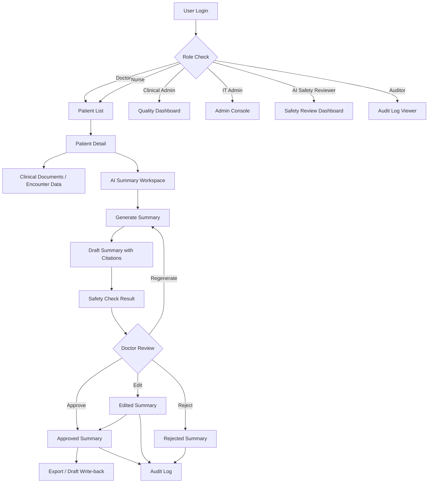
```mermaid
flowchart TD
    A[User Login] --> B{Role Check}
    B -->|Doctor| C[Patient List]
    B -->|Nurse| C
    B -->|Clinical Admin| D[Quality Dashboard]
    B -->|IT Admin| E[Admin Console]
    B -->|AI Safety Reviewer| F[Safety Review Dashboard]
    B -->|Auditor| G[Audit Log Viewer]

    C --> H[Patient Detail]
    H --> I[Clinical Documents / Encounter Data]
    H --> J[AI Summary Workspace]
    J --> K[Generate Summary]
    K --> L[Draft Summary with Citations]
    L --> M[Safety Check Result]
    M --> N{Doctor Review}
    N -->|Approve| O[Approved Summary]
    N -->|Edit| P[Edited Summary]
    P --> O
    N -->|Reject| Q[Rejected Summary]
    N -->|Regenerate| K

    O --> R[Export / Draft Write-back]
    O --> S[Audit Log]
    Q --> S
    P --> S
```

## 3.2 Core flow statement

```text
User logs in
→ Opens patient profile
→ Reviews clinical data
→ Generates AI summary
→ Checks citations and safety warnings
→ Edits if needed
→ Approves or rejects
→ System stores version, review action and audit log
```

---

# 4. Doctor User Flow

Doctor là role quan trọng nhất trong MVP vì bác sĩ là người trực tiếp đánh giá tính hữu ích và an toàn của AI summary.

---

## 4.1 Doctor happy path — Generate and approve summary

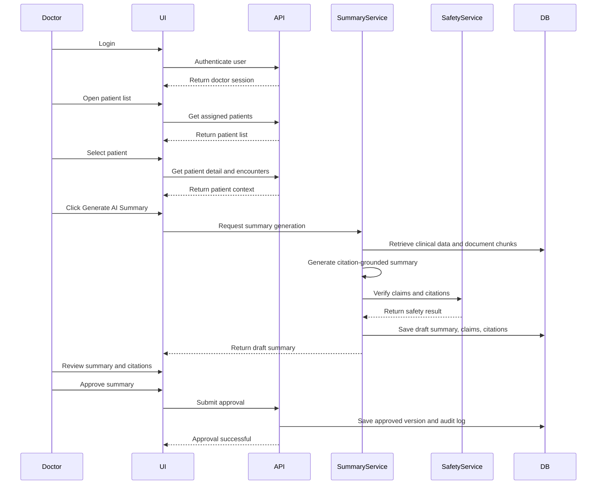
```mermaid
sequenceDiagram
    participant Doctor
    participant UI
    participant API
    participant SummaryService
    participant SafetyService
    participant DB

    Doctor->>UI: Login
    UI->>API: Authenticate user
    API-->>UI: Return doctor session

    Doctor->>UI: Open patient list
    UI->>API: Get assigned patients
    API-->>UI: Return patient list

    Doctor->>UI: Select patient
    UI->>API: Get patient detail and encounters
    API-->>UI: Return patient context

    Doctor->>UI: Click Generate AI Summary
    UI->>SummaryService: Request summary generation
    SummaryService->>DB: Retrieve clinical data and document chunks
    SummaryService->>SummaryService: Generate citation-grounded summary
    SummaryService->>SafetyService: Verify claims and citations
    SafetyService-->>SummaryService: Return safety result
    SummaryService->>DB: Save draft summary, claims, citations
    SummaryService-->>UI: Return draft summary

    Doctor->>UI: Review summary and citations
    Doctor->>UI: Approve summary
    UI->>API: Submit approval
    API->>DB: Save approved version and audit log
    API-->>UI: Approval successful
```

---

## 4.2 Doctor detailed steps

| Step | Doctor action | System response |
|---|---|---|
| 1 | Login | Xác thực user và role |
| 2 | Mở danh sách bệnh nhân | Hiển thị bệnh nhân được phân quyền |
| 3 | Chọn bệnh nhân | Hiển thị patient detail, encounters, documents |
| 4 | Chọn loại summary | Patient Snapshot / Clinical Timeline / Discharge Draft |
| 5 | Click Generate | Hệ thống tạo draft summary |
| 6 | Xem bản summary | Hiển thị summary theo section |
| 7 | Click citation | Mở source note/lab/report gốc |
| 8 | Kiểm tra safety warning | Hiển thị unsupported/conflicting claims nếu có |
| 9 | Chỉnh sửa nếu cần | Lưu edited version |
| 10 | Approve hoặc Reject | Cập nhật trạng thái summary và audit log |

---

## 4.3 Doctor flow — Edit summary before approval

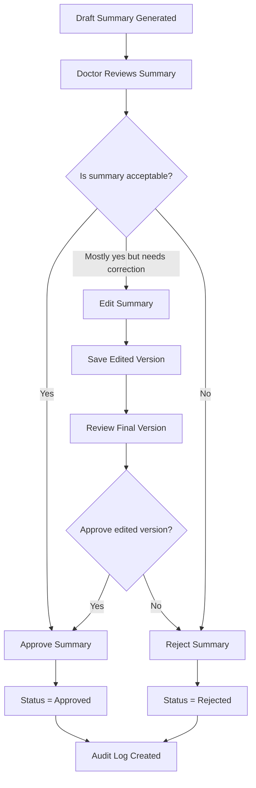
```mermaid
flowchart TD
    A[Draft Summary Generated] --> B[Doctor Reviews Summary]
    B --> C{Is summary acceptable?}
    C -->|Yes| D[Approve Summary]
    C -->|Mostly yes but needs correction| E[Edit Summary]
    E --> F[Save Edited Version]
    F --> G[Review Final Version]
    G --> H{Approve edited version?}
    H -->|Yes| D
    H -->|No| I[Reject Summary]
    C -->|No| I
    D --> J[Status = Approved]
    I --> K[Status = Rejected]
    J --> L[Audit Log Created]
    K --> L
```

## 4.4 Edit behavior

Khi bác sĩ chỉnh sửa summary:

- Hệ thống phải lưu bản gốc do AI tạo.
- Hệ thống phải lưu bản edited text.
- Hệ thống nên tính edit distance nếu có.
- Hệ thống phải ghi audit log.
- Hệ thống phải giữ citation mapping nếu claim không đổi.
- Nếu bác sĩ thêm claim mới không có citation, hệ thống nên flag là “clinician-added / citation not available”.

---

## 4.5 Doctor flow — Reject summary

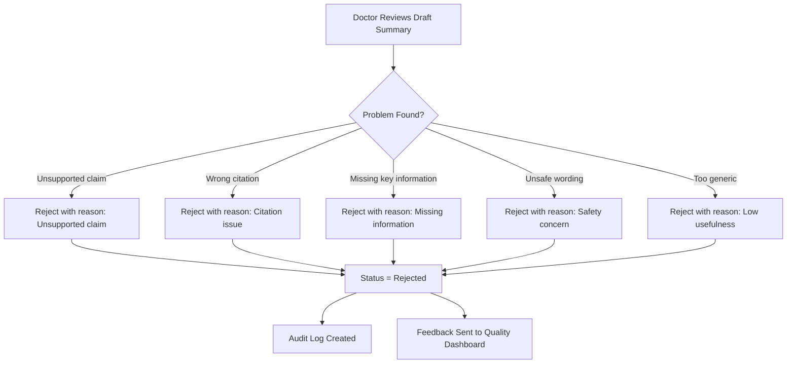
```mermaid
flowchart TD
    A[Doctor Reviews Draft Summary] --> B{Problem Found?}
    B -->|Unsupported claim| C[Reject with reason: Unsupported claim]
    B -->|Wrong citation| D[Reject with reason: Citation issue]
    B -->|Missing key information| E[Reject with reason: Missing information]
    B -->|Unsafe wording| F[Reject with reason: Safety concern]
    B -->|Too generic| G[Reject with reason: Low usefulness]
    C --> H[Status = Rejected]
    D --> H
    E --> H
    F --> H
    G --> H
    H --> I[Audit Log Created]
    H --> J[Feedback Sent to Quality Dashboard]
```

## 4.6 Reject reason taxonomy

| Reject reason | Meaning |
|---|---|
| `unsupported_claim` | AI đưa ra thông tin không có bằng chứng |
| `wrong_citation` | Citation không hỗ trợ claim |
| `missing_critical_info` | Thiếu thông tin quan trọng |
| `incorrect_clinical_fact` | Sai thông tin lâm sàng |
| `conflicting_evidence` | Nguồn dữ liệu mâu thuẫn |
| `poor_readability` | Diễn đạt khó hiểu |
| `too_generic` | Summary quá chung chung |
| `unsafe_output` | Có rủi ro gây hiểu nhầm hoặc nguy hiểm |
| `other` | Khác |

---

# 5. AI Summary Workspace Flow

Đây là màn hình quan trọng nhất của hệ thống.

## 5.1 Workspace layout

```text
┌─────────────────────────────────────────────────────────────┐
│ Patient Header                                               │
│ Patient ID | Age | Gender | Encounter | Department | Status  │
├───────────────────────────────────┬─────────────────────────┤
│ Left Panel: AI Summary            │ Right Panel: Evidence   │
│                                   │                         │
│ 1. Patient Snapshot               │ Source Document         │
│ 2. Active Problems                │ Highlighted Text Span   │
│ 3. Recent Clinical Course         │ Source Metadata         │
│ 4. Medications                    │ Timestamp               │
│ 5. Labs / Imaging                 │ Author / Department     │
│ 6. Pending Issues                 │                         │
├───────────────────────────────────┴─────────────────────────┤
│ Safety Panel                                                 │
│ Unsupported Claims | Conflicts | Missing Evidence            │
├─────────────────────────────────────────────────────────────┤
│ Actions: Edit | Regenerate | Approve | Reject | Export       │
└─────────────────────────────────────────────────────────────┘
```

---

## 5.2 Summary workspace user actions

| Action | User | System behavior |
|---|---|---|
| Generate summary | Doctor | Tạo draft summary |
| Click claim | Doctor | Highlight claim và citation |
| Click citation | Doctor | Mở source viewer |
| View source span | Doctor | Highlight đoạn text gốc |
| Edit section | Doctor | Cho phép sửa text |
| Regenerate | Doctor | Tạo version mới |
| Approve | Doctor | Chuyển status sang approved |
| Reject | Doctor | Chuyển status sang rejected, bắt nhập reason |
| Export | Doctor | Export summary nếu được duyệt |
| View safety warning | Doctor/Admin | Xem unsupported/conflicting claims |

---

## 5.3 Citation click flow

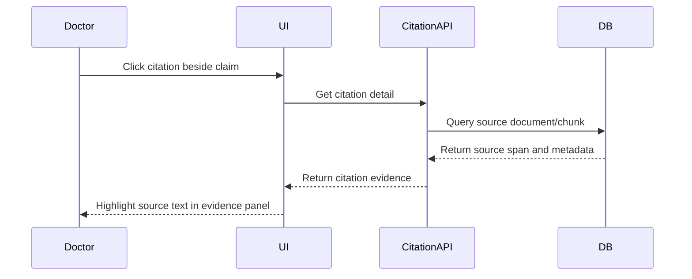
```mermaid
sequenceDiagram
    participant Doctor
    participant UI
    participant CitationAPI
    participant DB

    Doctor->>UI: Click citation beside claim
    UI->>CitationAPI: Get citation detail
    CitationAPI->>DB: Query source document/chunk
    DB-->>CitationAPI: Return source span and metadata
    CitationAPI-->>UI: Return citation evidence
    UI-->>Doctor: Highlight source text in evidence panel
```

---

## 5.4 Citation UI states

| State | UI display | Meaning |
|---|---|---|
| Supported citation | Green/normal citation badge | Claim có nguồn hỗ trợ |
| Weak citation | Yellow warning badge | Citation yếu hoặc confidence thấp |
| Missing citation | Red warning badge | Claim không có nguồn |
| Conflicting evidence | Red conflict badge | Có nguồn mâu thuẫn |
| Multiple citations | Citation group | Claim được hỗ trợ bởi nhiều nguồn |

---

# 6. Summary Status Flow

## 6.1 Summary state machine

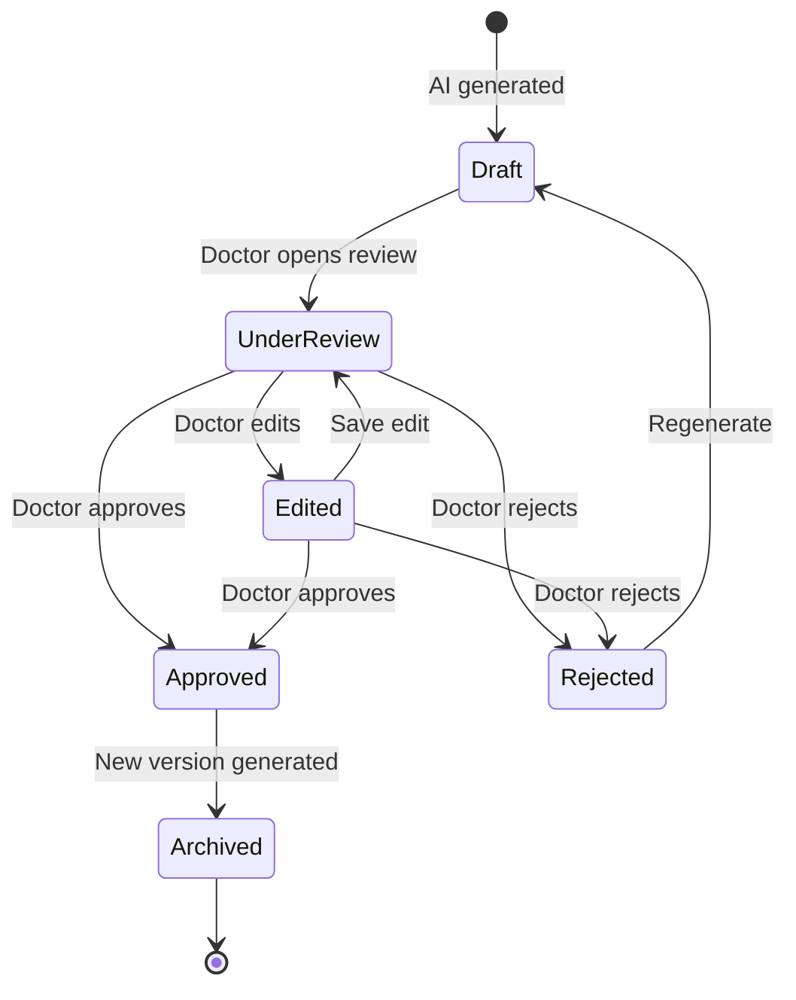
```mermaid
stateDiagram-v2
    [*] --> Draft: AI generated
    Draft --> UnderReview: Doctor opens review
    UnderReview --> Edited: Doctor edits
    UnderReview --> Approved: Doctor approves
    UnderReview --> Rejected: Doctor rejects
    Edited --> UnderReview: Save edit
    Edited --> Approved: Doctor approves
    Edited --> Rejected: Doctor rejects
    Rejected --> Draft: Regenerate
    Approved --> Archived: New version generated
    Archived --> [*]
```

---

## 6.2 Status definitions

| Status | Meaning | Editable? | Official? |
|---|---|---:|---:|
| `draft` | AI tạo, chưa review | Yes | No |
| `under_review` | Bác sĩ đang xem | Yes | No |
| `edited` | Đã được chỉnh sửa | Yes | No |
| `approved` | Đã được bác sĩ phê duyệt | Limited | Yes/Usable |
| `rejected` | Bị từ chối | No | No |
| `archived` | Phiên bản cũ | No | No |

---

## 6.3 Versioning flow

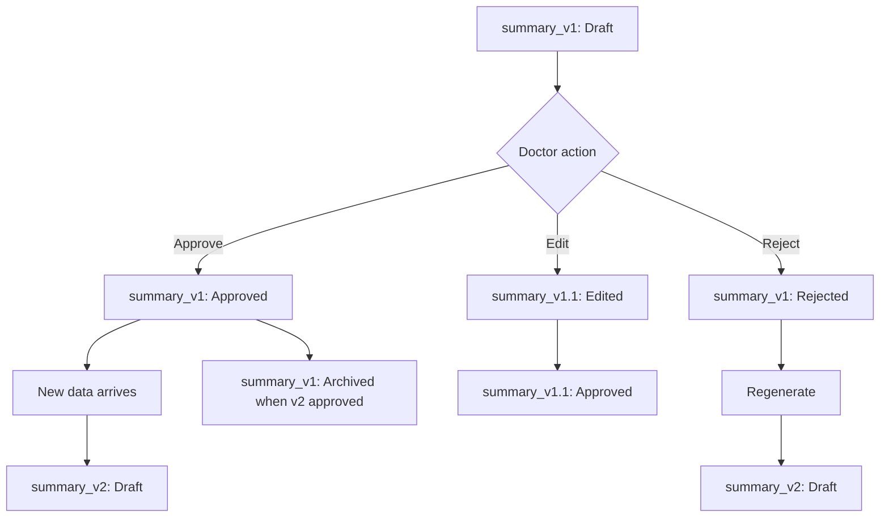
```mermaid
flowchart TD
    A[summary_v1: Draft] --> B{Doctor action}
    B -->|Approve| C[summary_v1: Approved]
    B -->|Edit| D[summary_v1.1: Edited]
    D --> E[summary_v1.1: Approved]
    B -->|Reject| F[summary_v1: Rejected]
    F --> G[Regenerate]
    G --> H[summary_v2: Draft]
    C --> I[New data arrives]
    I --> J[summary_v2: Draft]
    C --> K[summary_v1: Archived when v2 approved]
```

---

# 7. Nurse User Flow

Nurse không phải là người chính tạo hoặc approve AI summary trong MVP, nhưng có thể là người xem summary đã được duyệt để hỗ trợ bàn giao ca hoặc theo dõi bệnh nhân.

## 7.1 Nurse flow

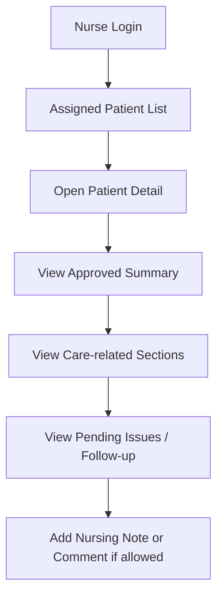
```mermaid
flowchart TD
    A[Nurse Login] --> B[Assigned Patient List]
    B --> C[Open Patient Detail]
    C --> D[View Approved Summary]
    D --> E[View Care-related Sections]
    E --> F[View Pending Issues / Follow-up]
    F --> G[Add Nursing Note or Comment if allowed]
```

## 7.2 Nurse permissions

| Action | MVP behavior |
|---|---|
| View patient list | Chỉ bệnh nhân được phân công |
| View summary | Chỉ summary đã approved hoặc được cấp quyền |
| Generate summary | Không trong MVP |
| Edit summary | Không |
| Approve/reject | Không |
| Add comment | Optional |
| View citations | Limited, tùy chính sách bệnh viện |

## 7.3 Nurse view should prioritize

- Patient snapshot.
- Current problems.
- Pending tasks.
- Medication notes if allowed.
- Recent changes.
- Safety warnings relevant to care handover.

---

# 8. Clinical Admin User Flow

Clinical Admin theo dõi chất lượng output và mức độ sử dụng hệ thống.

## 8.1 Clinical Admin dashboard flow

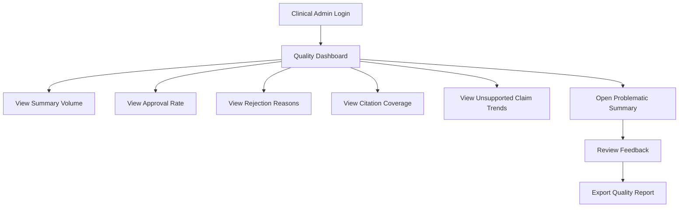
```mermaid
flowchart TD
    A[Clinical Admin Login] --> B[Quality Dashboard]
    B --> C[View Summary Volume]
    B --> D[View Approval Rate]
    B --> E[View Rejection Reasons]
    B --> F[View Citation Coverage]
    B --> G[View Unsupported Claim Trends]
    B --> H[Open Problematic Summary]
    H --> I[Review Feedback]
    I --> J[Export Quality Report]
```

## 8.2 Clinical Admin metrics

| Metric | Meaning |
|---|---|
| Total summaries generated | Tổng số summary AI tạo |
| Approval rate | Tỷ lệ được bác sĩ approve |
| Rejection rate | Tỷ lệ bị reject |
| Average edit distance | Mức độ bác sĩ phải sửa |
| Citation coverage | Tỷ lệ claim có citation |
| Unsupported claim rate | Tỷ lệ claim không có bằng chứng |
| Conflict count | Số claim có nguồn mâu thuẫn |
| Average latency | Thời gian tạo summary |
| Most common rejection reason | Lý do reject phổ biến |

---

# 9. IT Admin User Flow

IT Admin chịu trách nhiệm cấu hình hệ thống, quản lý nguồn dữ liệu và xử lý ingestion.

## 9.1 IT Admin flow

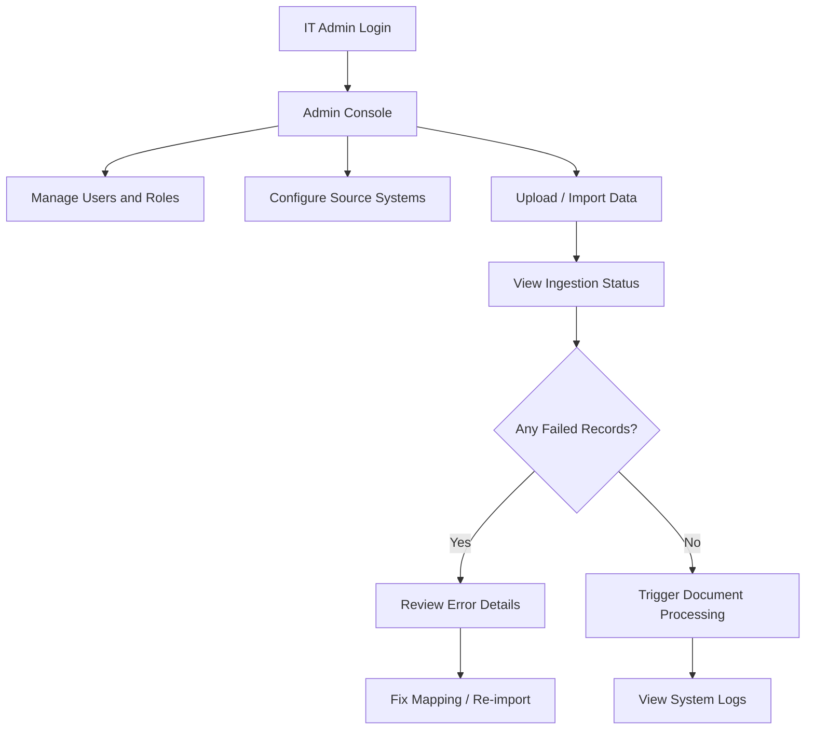
```mermaid
flowchart TD
    A[IT Admin Login] --> B[Admin Console]
    B --> C[Manage Users and Roles]
    B --> D[Configure Source Systems]
    B --> E[Upload / Import Data]
    E --> F[View Ingestion Status]
    F --> G{Any Failed Records?}
    G -->|Yes| H[Review Error Details]
    H --> I[Fix Mapping / Re-import]
    G -->|No| J[Trigger Document Processing]
    J --> K[View System Logs]
```

## 9.2 IT Admin responsibilities

| Area | Responsibility |
|---|---|
| User management | Create/deactivate users, assign roles |
| Source system config | Configure HIS/EMR/LIS/RIS connection |
| Data import | Upload or sync data |
| Mapping config | Configure field mapping if needed |
| Error handling | View failed ingestion records |
| System health | Check logs, latency, storage |
| Secrets/config | Manage API keys, model endpoints, environment config |

---

# 10. AI Safety Reviewer User Flow

AI Safety Reviewer tập trung vào các lỗi liên quan đến hallucination, citation và clinical safety.

## 10.1 Safety reviewer flow

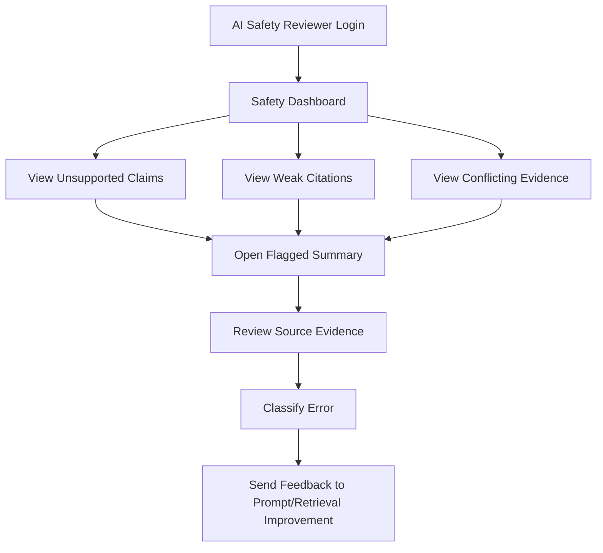
```mermaid
flowchart TD
    A[AI Safety Reviewer Login] --> B[Safety Dashboard]
    B --> C[View Unsupported Claims]
    B --> D[View Weak Citations]
    B --> E[View Conflicting Evidence]
    C --> F[Open Flagged Summary]
    D --> F
    E --> F
    F --> G[Review Source Evidence]
    G --> H[Classify Error]
    H --> I[Send Feedback to Prompt/Retrieval Improvement]
```

## 10.2 Error classification

| Error type | Description |
|---|---|
| Hallucinated diagnosis | Diagnosis không có trong nguồn |
| Wrong medication | Thuốc/liều/tần suất sai |
| Wrong lab trend | Diễn giải sai kết quả xét nghiệm |
| Missing citation | Claim không có source |
| Wrong citation | Source không hỗ trợ claim |
| Conflict not detected | Có nguồn mâu thuẫn nhưng hệ thống không flag |
| Over-compression | Tóm tắt quá ngắn, mất ý quan trọng |
| Unsafe wording | Diễn đạt gây hiểu nhầm lâm sàng |

---

# 11. Auditor User Flow

Auditor chỉ xem thông tin phục vụ kiểm tra, không chỉnh sửa dữ liệu.

## 11.1 Auditor flow

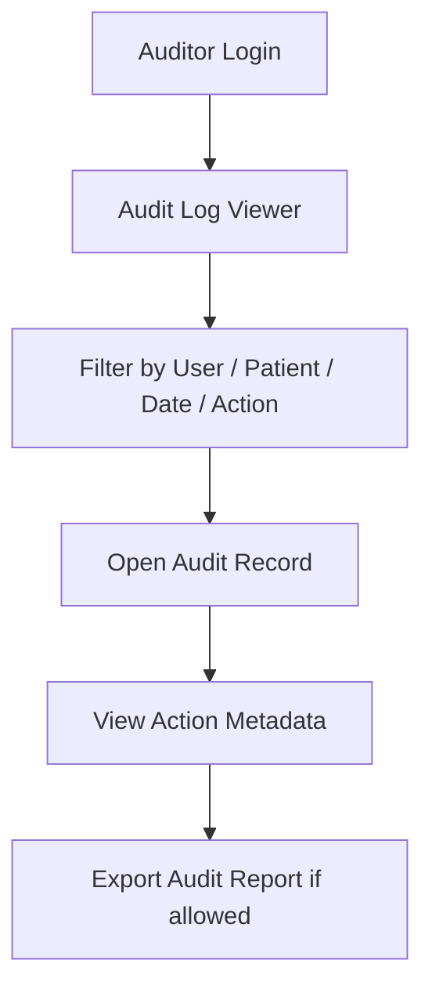
```mermaid
flowchart TD
    A[Auditor Login] --> B[Audit Log Viewer]
    B --> C[Filter by User / Patient / Date / Action]
    C --> D[Open Audit Record]
    D --> E[View Action Metadata]
    E --> F[Export Audit Report if allowed]
```

## 11.2 Audit events to track

| Event | Trigger |
|---|---|
| `view_patient` | User mở hồ sơ bệnh nhân |
| `view_document` | User xem clinical document |
| `generate_summary` | User tạo AI summary |
| `view_summary` | User xem summary |
| `view_citation` | User click citation |
| `edit_summary` | User chỉnh summary |
| `approve_summary` | User approve |
| `reject_summary` | User reject |
| `export_summary` | User export |
| `config_change` | Admin đổi cấu hình |
| `login` | User đăng nhập |
| `failed_login` | Đăng nhập thất bại |

---

# 12. Error and Exception Flows

## 12.1 No data available

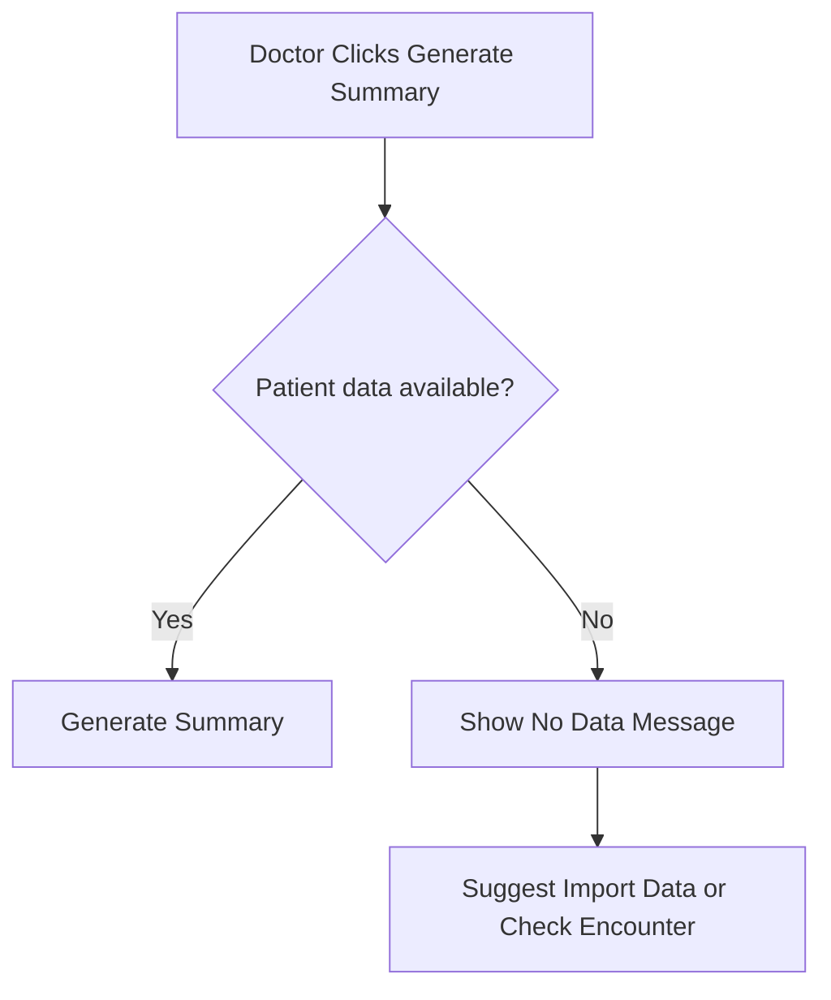
```mermaid
flowchart TD
    A[Doctor Clicks Generate Summary] --> B{Patient data available?}
    B -->|Yes| C[Generate Summary]
    B -->|No| D[Show No Data Message]
    D --> E[Suggest Import Data or Check Encounter]
```

### UI message

```text
Không đủ dữ liệu bệnh án để tạo bản tóm tắt. Vui lòng kiểm tra dữ liệu encounter, clinical notes hoặc kết quả import.
```

---

## 12.2 Missing citation

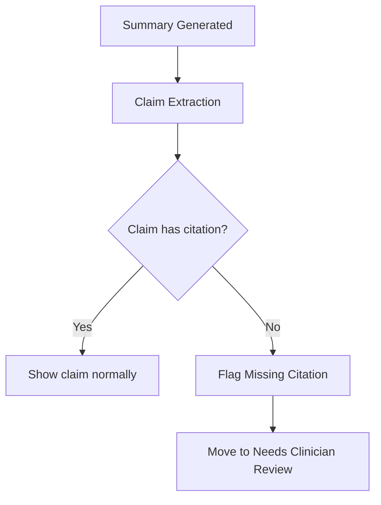
```mermaid
flowchart TD
    A[Summary Generated] --> B[Claim Extraction]
    B --> C{Claim has citation?}
    C -->|Yes| D[Show claim normally]
    C -->|No| E[Flag Missing Citation]
    E --> F[Move to Needs Clinician Review]
```

### UI behavior

- Claim không có citation không nên hiển thị như thông tin chắc chắn.
- Có thể hiển thị trong box cảnh báo: “Needs Clinician Review”.
- Doctor có thể reject hoặc chỉnh sửa.

---

## 12.3 LLM generation failure

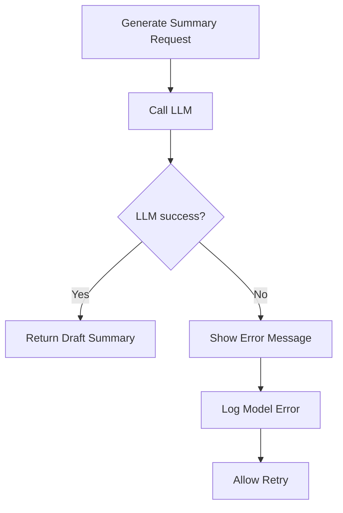
```mermaid
flowchart TD
    A[Generate Summary Request] --> B[Call LLM]
    B --> C{LLM success?}
    C -->|Yes| D[Return Draft Summary]
    C -->|No| E[Show Error Message]
    E --> F[Log Model Error]
    F --> G[Allow Retry]
```

### UI message

```text
Không thể tạo bản tóm tắt tại thời điểm này. Vui lòng thử lại hoặc liên hệ IT Admin nếu lỗi tiếp tục xảy ra.
```

---

## 12.4 Permission denied

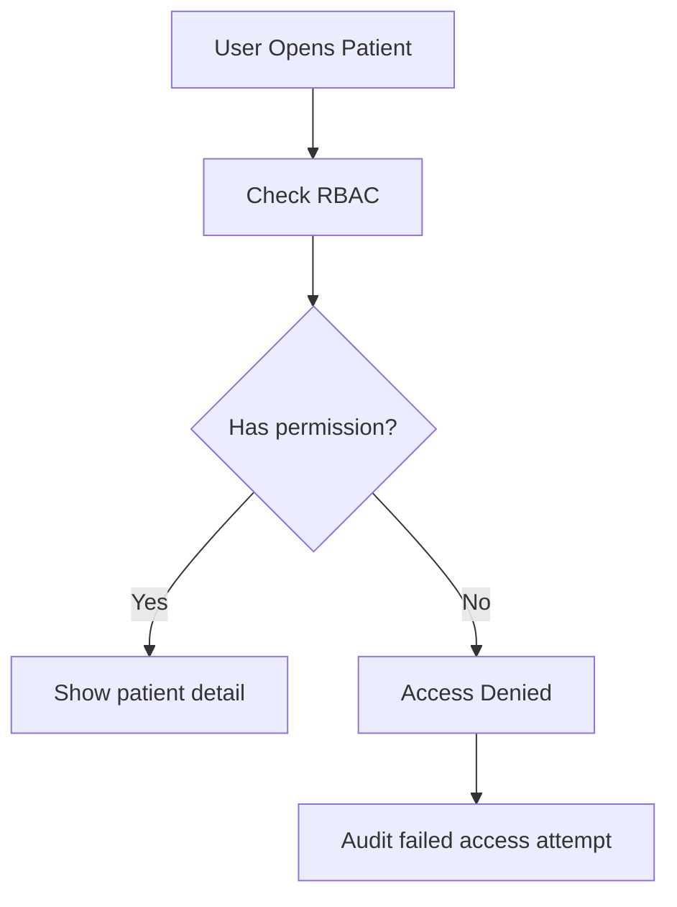
```mermaid
flowchart TD
    A[User Opens Patient] --> B[Check RBAC]
    B --> C{Has permission?}
    C -->|Yes| D[Show patient detail]
    C -->|No| E[Access Denied]
    E --> F[Audit failed access attempt]
```

### UI message

```text
Bạn không có quyền truy cập hồ sơ bệnh nhân này. Hoạt động truy cập đã được ghi nhận theo chính sách bảo mật.
```

---

## 12.5 Conflicting evidence

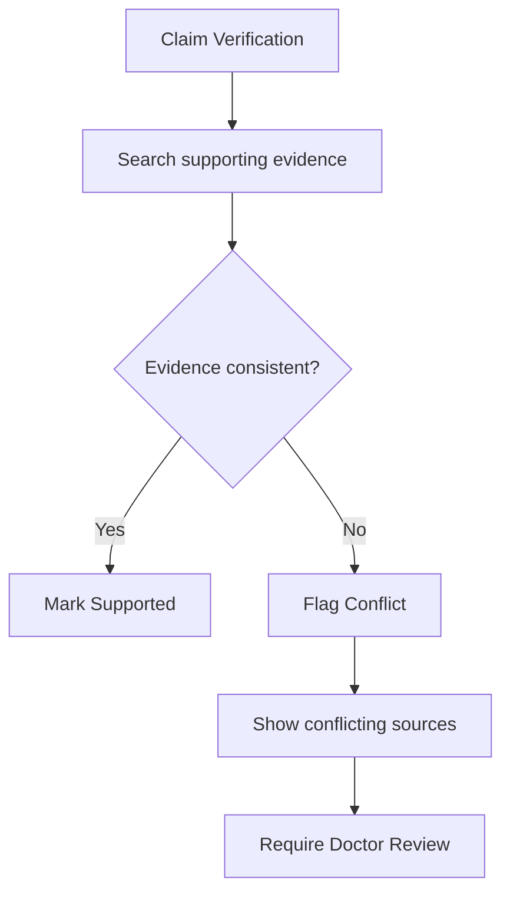
```mermaid
flowchart TD
    A[Claim Verification] --> B[Search supporting evidence]
    B --> C{Evidence consistent?}
    C -->|Yes| D[Mark Supported]
    C -->|No| E[Flag Conflict]
    E --> F[Show conflicting sources]
    F --> G[Require Doctor Review]
```

### Example

```text
Claim: Bệnh nhân không có tiền sử dị ứng thuốc.
Conflict:
- Admission note: No known drug allergy.
- Nursing note: Penicillin allergy reported by family.
```

---

# 13. User Flow by Screen

## 13.1 Login screen

### User actions

- Enter email/password or SSO.
- Select organization if required.
- Login.

### System validations

- Check credentials.
- Check account status.
- Load role and permissions.
- Create login audit event.

---

## 13.2 Patient List screen

### User actions

- Search patient.
- Filter by department, encounter status, assigned doctor.
- Open patient detail.

### Key fields

| Field | Description |
|---|---|
| Patient ID | Mã bệnh nhân hoặc mã ẩn danh |
| Age/Gender | Thông tin cơ bản |
| Current encounter | Lượt khám/đợt điều trị hiện tại |
| Department | Khoa/phòng |
| Last summary status | Draft/Approved/Rejected |
| Last updated | Lần cập nhật gần nhất |

---

## 13.3 Patient Detail screen

### Sections

- Patient header.
- Encounter list.
- Diagnosis/problem list.
- Medications.
- Recent labs/vitals.
- Clinical documents.
- AI summary entry point.

### Main CTA

```text
Generate AI Summary
```

---

## 13.4 AI Summary Workspace screen

### Sections

- Summary type selector.
- Generated summary.
- Citation panel.
- Safety panel.
- Review actions.
- Version history.

### Main CTAs

```text
Generate
Regenerate
Edit
Approve
Reject
Export
```

---

## 13.5 Source Viewer screen/panel

### Purpose

Hiển thị nguồn dữ liệu gốc khi user click citation.

### Display fields

| Field | Description |
|---|---|
| Source type | Clinical note, lab, medication, diagnostic report |
| Document title | Tên tài liệu |
| Timestamp | Thời điểm ghi nhận |
| Author/department | Người tạo/khoa |
| Highlighted span | Đoạn text hỗ trợ claim |
| Full context | Đoạn xung quanh để bác sĩ kiểm tra |

---

## 13.6 Admin Dashboard screen

### Sections

- Summary volume.
- Approval/rejection rate.
- Citation coverage.
- Unsupported claim trend.
- Latency.
- Top rejection reasons.
- Model/prompt version performance.

---

## 13.7 Audit Log screen

### Filters

- User.
- Patient.
- Action.
- Date range.
- Resource type.
- IP address.
- Status.

### Display fields

| Field | Description |
|---|---|
| Timestamp | Thời gian hành động |
| User | Người thực hiện |
| Role | Vai trò |
| Patient ID | Hồ sơ liên quan |
| Action | Loại hành động |
| Resource | Summary/document/citation |
| Metadata | Chi tiết bổ sung |

---

# 14. Detailed Use Cases

## UC-01 — Generate Patient Snapshot

| Item | Description |
|---|---|
| Actor | Doctor |
| Trigger | Doctor opens patient profile and clicks Generate AI Summary |
| Preconditions | Patient has at least one clinical document or structured data |
| Main flow | Select summary type → Generate → System retrieves evidence → Summary generated → Citations attached → Safety check → Draft displayed |
| Alternative flow | No data available → Show warning |
| Output | Draft patient snapshot |
| Audit | `generate_summary` event |

---

## UC-02 — Verify Citation

| Item | Description |
|---|---|
| Actor | Doctor |
| Trigger | Doctor clicks citation next to a claim |
| Preconditions | Summary has citation mapping |
| Main flow | Click citation → Source panel opens → Highlight source span |
| Alternative flow | Source missing → Show citation error |
| Output | Doctor verifies evidence |
| Audit | `view_citation` event |

---

## UC-03 — Approve Summary

| Item | Description |
|---|---|
| Actor | Doctor |
| Trigger | Doctor clicks Approve |
| Preconditions | Summary status is draft/under_review/edited |
| Main flow | Review → Approve → System saves approved status → Audit log created |
| Alternative flow | Unsupported critical claim exists → Require confirmation or block approval depending on safety policy |
| Output | Approved summary |
| Audit | `approve_summary` event |

---

## UC-04 — Reject Summary

| Item | Description |
|---|---|
| Actor | Doctor |
| Trigger | Doctor clicks Reject |
| Preconditions | Summary status is draft/under_review/edited |
| Main flow | Click reject → Select reason → Add comment → Submit → Status rejected |
| Alternative flow | Missing reject reason → System asks for reason |
| Output | Rejected summary with feedback |
| Audit | `reject_summary` event |

---

## UC-05 — Regenerate Summary

| Item | Description |
|---|---|
| Actor | Doctor |
| Trigger | Doctor clicks Regenerate |
| Preconditions | Existing summary draft/rejected/archived |
| Main flow | Select regenerate → System creates new model run → New summary version created |
| Alternative flow | No updated data → Warn user that regeneration may produce similar result |
| Output | New draft summary version |
| Audit | `regenerate_summary` event |

---

## UC-06 — Import Clinical Documents

| Item | Description |
|---|---|
| Actor | IT Admin |
| Trigger | IT Admin uploads clinical data file |
| Preconditions | User has import permission |
| Main flow | Upload → Validate → Normalize → Store → Chunk → Embed → Index |
| Alternative flow | Invalid format → Show failed records |
| Output | Clinical documents available for summarization |
| Audit | `import_data` event |

---

## UC-07 — Monitor Safety Issues

| Item | Description |
|---|---|
| Actor | AI Safety Reviewer |
| Trigger | Reviewer opens safety dashboard |
| Preconditions | System has generated summaries |
| Main flow | View flagged claims → Open summary → Review evidence → Classify error |
| Alternative flow | No flagged issues → Show empty state |
| Output | Error classification and improvement feedback |
| Audit | `review_safety_issue` event |

---

# 15. Acceptance Criteria

## 15.1 Doctor flow acceptance criteria

| ID | Acceptance criteria |
|---|---|
| AC-01 | Doctor can login and access patient list based on permission |
| AC-02 | Doctor can open patient detail |
| AC-03 | Doctor can generate AI summary from available data |
| AC-04 | System displays summary by structured sections |
| AC-05 | Clinical claims display citations |
| AC-06 | Doctor can click citation and view source text |
| AC-07 | Unsupported claims are clearly flagged |
| AC-08 | Doctor can edit summary before approval |
| AC-09 | Doctor can approve summary |
| AC-10 | Doctor can reject summary with reason |
| AC-11 | Every action creates audit log |
| AC-12 | Summary version history is preserved |

---

## 15.2 Admin flow acceptance criteria

| ID | Acceptance criteria |
|---|---|
| AC-13 | IT Admin can import clinical documents |
| AC-14 | System shows ingestion status |
| AC-15 | Clinical Admin can view quality dashboard |
| AC-16 | AI Safety Reviewer can view unsupported claims |
| AC-17 | Auditor can filter audit logs |
| AC-18 | System prevents unauthorized access |

---

# 16. MVP User Flow Summary

MVP user flow nên tập trung vào 5 luồng chính:

```text
1. Doctor generates citation-grounded summary
2. Doctor verifies citation and source evidence
3. Doctor edits, approves or rejects summary
4. IT Admin imports mock/FHIR-like clinical data
5. Clinical Admin / Safety Reviewer monitors quality and flagged claims
```

Các flow khác như patient-facing app, voice assistant, automated prescription, treatment recommendation hoặc direct EMR write-back không nằm trong MVP.

---

# 17. Recommended Next Document

Sau User Flow, tài liệu tiếp theo nên làm là:

```text
07_api_specification.md
```

Lý do: sau khi đã rõ architecture và user flow, bước tiếp theo là định nghĩa backend API để developer có thể build hệ thống theo đúng workflow.
