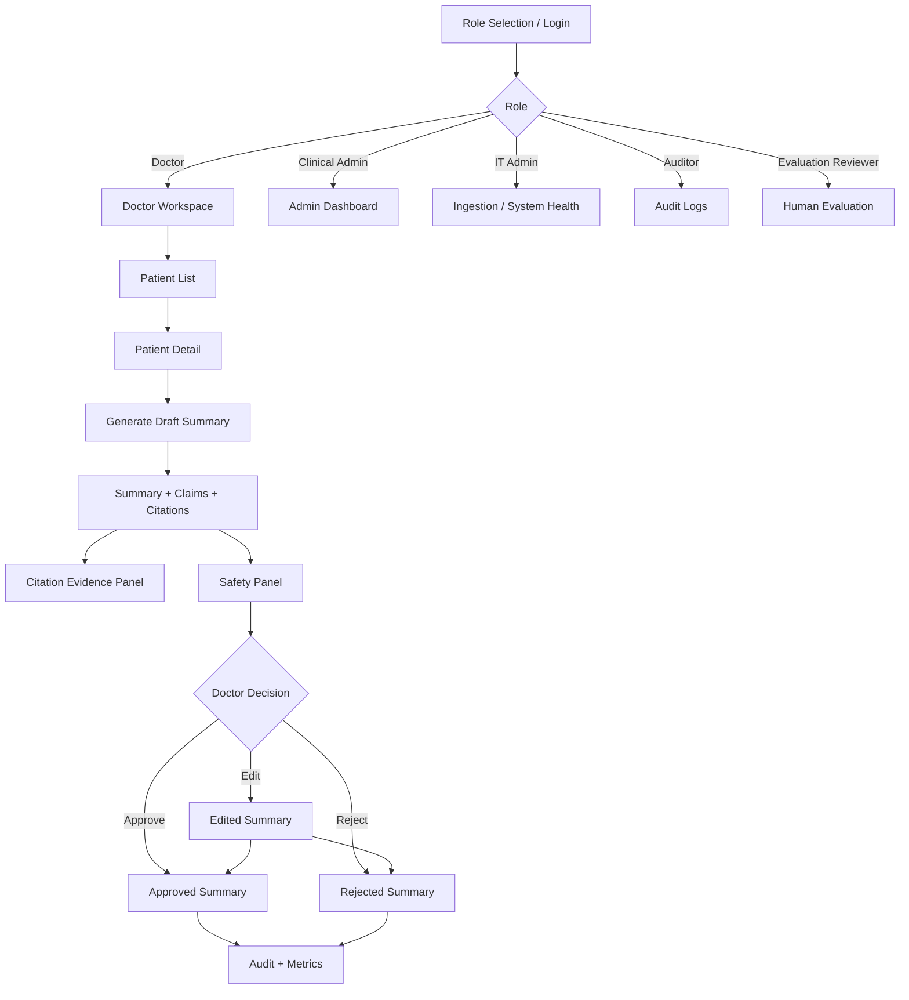
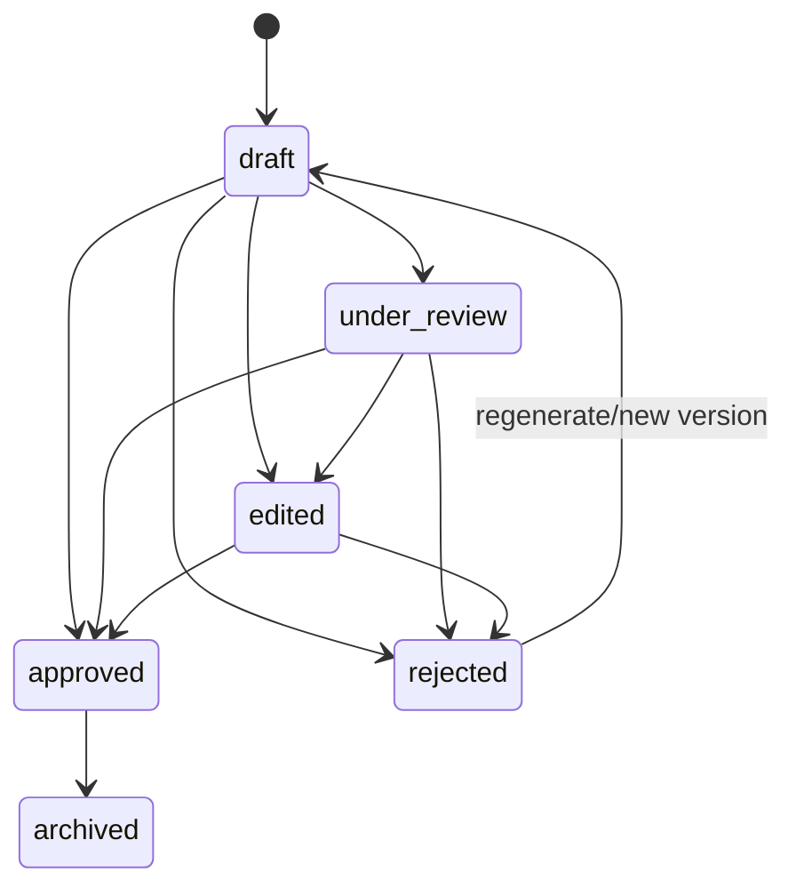

# 02 — User Flow v1.0: Clinical Record Summarization Assistant

**Document type:** Mentor-facing User Flow  
**Version:** v1.0  
**Focus:** Doctor Golden Path, Citation Verification, HITL Review, Role-based UI, Evaluation Center  

---

## 1. Purpose

Tài liệu này mô tả user flow chính của hệ thống tóm tắt bệnh án. Mục tiêu là thể hiện rõ hệ thống không chỉ sinh summary, mà còn cung cấp một workflow an toàn gồm citation, safety check, doctor review, audit log và monitoring.

Core workflow:

```text
Login / select role
→ open allowed workspace
→ select patient
→ generate draft summary
→ verify citation
→ review safety panel
→ edit / approve / reject
→ audit log + metrics update
```

---

## 2. Role Overview

| Role | Main objective | Primary UI |
|---|---|---|
| Doctor | Generate and review patient summaries | Doctor Workspace |
| Nurse | View approved/limited clinical summaries | Limited Patient View |
| Clinical Admin | Monitor quality and safety metrics | Admin Dashboard |
| IT Admin | Manage ingestion, provider readiness, system health | Admin/System Tools |
| Auditor | Review audit logs and history | Audit Log View |
| AI Safety Reviewer | Review unsupported/conflicting claims | Safety Overview |
| Evaluation Reviewer | Score generated summaries | Human Evaluation Form |

---

## 3. Role-based Navigation Matrix

| Page / Action | Doctor | Nurse | Clinical Admin | IT Admin | Auditor | AI Safety Reviewer | Evaluation Reviewer |
|---|---:|---:|---:|---:|---:|---:|---:|
| Patient List | Yes | Limited | Limited | No | Read-only | Limited | No |
| Patient Detail | Yes | Limited | Limited | No | Read-only | Limited | No |
| Generate Summary | Yes | No | No | No | No | No | No |
| View Citation | Yes | Limited | Yes | No | Read-only | Yes | Yes |
| View Safety Panel | Yes | Limited | Yes | No | Read-only | Yes | Yes |
| Edit Summary | Yes | No | No | No | No | No | No |
| Approve / Reject | Yes | No | No | No | No | No | No |
| Admin Dashboard | Limited | No | Yes | Yes | Read-only | Yes | Limited |
| Audit Logs | Limited | No | Yes | Yes | Yes | Read-only | No |
| Ingestion / Seed Data | No | No | No | Yes | No | No | No |
| Evaluation Center | Yes | Read-only | Yes | Yes | Read-only | Yes | Yes |
| Human Evaluation Form | Optional | Optional | Optional | No | No | Optional | Yes |

---

## 4. High-level User Flow



---

## 5. Doctor Golden Path

### 5.1 Goal

Bác sĩ cần xem nhanh tình trạng bệnh nhân và kiểm chứng nguồn trước khi tin hoặc approve summary.

### 5.2 Flow

| Step | User action | System behavior | Output |
|---:|---|---|---|
| 1 | Doctor selects role/logs in | Load doctor navigation and permissions | Doctor Workspace |
| 2 | Opens Patient List | Fetch patients assigned/available | Patient table |
| 3 | Selects patient | Load patient detail, encounters, documents | Patient Detail |
| 4 | Clicks Generate Summary | Build context and call selected provider | Draft Summary |
| 5 | Reviews sections | Display summary by sections and claims | Structured summary |
| 6 | Clicks citation badge | Fetch citation source | Evidence Panel |
| 7 | Checks Safety Panel | Show unsupported claims/conflicts | Safety status |
| 8 | Starts review | Status becomes under_review | Review session |
| 9 | Edits if needed | Save edited text/version | Edited summary |
| 10 | Approves or rejects | Save decision and audit log | Approved/Rejected summary |

### 5.3 UX principle

The doctor should never need to trust the AI summary blindly. Every important claim should be either supported by evidence or flagged for review.

---

## 6. Patient List Flow

### User actions

- Search patient by ID/hash.
- Filter by status/department if available.
- Open patient detail.

### Display fields

| Field | Purpose |
|---|---|
| Patient ID / Hash | De-identified patient reference |
| Age/Gender | Basic demographic context |
| Current encounter | Care context |
| Last summary status | Draft/approved/rejected overview |
| Last updated | Recency awareness |

### Exception states

| Case | Message |
|---|---|
| No patient found | Không tìm thấy bệnh nhân phù hợp. |
| Permission denied | Bạn không có quyền xem danh sách bệnh nhân này. |
| Backend error | Không thể tải dữ liệu bệnh nhân. Vui lòng thử lại. |

---

## 7. Patient Detail Flow

### Display sections

| Section | Content |
|---|---|
| Patient Header | ID, age, gender, current encounter |
| Encounters | Admission/visit list |
| Clinical Documents | Notes, structured documents, source records |
| Existing Summaries | Draft/approved/rejected summaries |
| Main CTA | Generate Summary |

### System behavior

When doctor opens patient detail, the system should load available records and show whether there is enough data for summary generation.

---

## 8. Summary Generation Flow

### Provider selector

| Provider | Use case |
|---|---|
| Deterministic | Stable demo/test default |
| BART | Baseline summarization evaluation |
| Pegasus | Baseline summarization comparison |
| Gemini | Real LLM provider for richer generation |

### Flow

```text
Select summary type
→ select provider
→ click Generate
→ build evidence/context
→ generate draft output
→ extract claims
→ match citations
→ run safety check
→ persist summary as draft
```

### Generated summary status

All generated summaries must start as:

```text
draft
```

No provider is allowed to auto-approve a summary.

---

## 9. Citation Click Flow

### Purpose

Citation click flow helps the doctor verify the basis of each clinical claim.

### Flow

```text
Doctor sees claim with citation badge
→ clicks badge
→ system fetches citation source
→ evidence panel opens
→ source record/text span displayed
→ audit event view_citation created
```

### Citation UI states

| State | Meaning | UI behavior |
|---|---|---|
| Supported | Claim has evidence | Normal citation badge |
| Weak citation | Evidence similarity/support is low | Yellow warning |
| Unsupported | No sufficient evidence | Red flag / Needs Review |
| Conflicting | Sources disagree | Red conflict tag |
| Source unavailable | Citation source cannot be loaded | Error state, audit warning |

---

## 10. Safety Panel Flow

### Safety indicators

| Indicator | Meaning |
|---|---|
| Citation coverage | Percentage of clinical claims with valid evidence |
| Unsupported claims | Claims with no sufficient evidence |
| Weak citations | Claims with low-confidence citation |
| Conflict count | Topics with contradictory evidence |
| Missing information | Important information not found in data |
| Approval blockers | Conditions that prevent approval |

### Safety flow

```text
Summary generated
→ safety service calculates metrics
→ safety panel displays warnings
→ doctor reviews flagged claims
→ doctor edits/rejects/approves accordingly
```

---

## 11. HITL Review Flow

### State machine



### Status definitions

| Status | Definition | Allowed actions |
|---|---|---|
| draft | AI/model-generated, not reviewed | start review, edit, approve, reject |
| under_review | Doctor opened review workflow | edit, approve, reject |
| edited | Doctor changed content | approve, reject |
| approved | Doctor accepted summary | view/export/lock |
| rejected | Doctor rejected summary | view reason, regenerate |
| archived | Replaced by newer approved version | read-only |

### Approval confirmation

```text
Bạn xác nhận đã kiểm tra bản tóm tắt và các citation liên quan trước khi phê duyệt?
```

### Reject reasons

| Reason | Use case |
|---|---|
| unsupported_claim | Claim thiếu bằng chứng |
| wrong_citation | Citation không hỗ trợ claim |
| missing_critical_info | Thiếu thông tin quan trọng |
| incorrect_clinical_fact | Sai sự kiện lâm sàng |
| conflicting_evidence | Nguồn mâu thuẫn |
| poor_readability | Khó đọc |
| too_generic | Quá chung chung |
| unsafe_output | Output rủi ro |
| other | Lý do khác |

---

## 12. Clinical Admin Flow

```text
Login as clinical_admin
→ open Admin Dashboard
→ view summary volume
→ view approval/rejection rate
→ view citation coverage
→ view unsupported claims
→ view top rejection reasons
→ inspect safety trends
```

Clinical Admin không approve clinical summaries. Vai trò này dùng để monitor quality and safety.

---

## 13. IT Admin Flow

```text
Login as it_admin
→ open ingestion/system tools
→ seed demo data or import structured EHR data
→ check provider readiness
→ check system health
→ review import errors
```

IT Admin không được approve/reject summary.

---

## 14. Auditor Flow

```text
Login as auditor
→ open Audit Logs
→ filter by action/user/patient/resource
→ inspect view_summary/view_citation/approve/reject/import events
→ export or document audit review
```

Auditor has read-only access.

---

## 15. Evaluation Reviewer Flow

```text
Open Evaluation Center
→ select summary/model output
→ view source + summary + citations
→ score factual correctness, completeness, conciseness, readability, citation usefulness
→ choose hallucination risk
→ submit comments
→ aggregate human evaluation updates
```

### Human evaluation criteria

| Criterion | Scale |
|---|---|
| Factual correctness | 1–5 |
| Completeness | 1–5 |
| Conciseness | 1–5 |
| Readability | 1–5 |
| Citation usefulness | 1–5 |
| Hallucination risk | low / medium / high |

---

## 16. Evaluation & Demo Control Center Flow

### Purpose

Evaluation Center acts as a single demo command center showing whether the MVP is ready and what evaluation layers are available.

### Sections

| Section | Purpose |
|---|---|
| Golden Path Status | Show doctor workflow readiness |
| Provider Status | Deterministic/BART/Pegasus/Gemini readiness |
| Citation & Safety | Citation coverage and unsupported claims |
| HITL Review | Summary status and review counts |
| Monitoring Summary | Dashboard-level metrics |
| Evaluation Layers | Functional, structured EHR, proxy model, real benchmark pending |
| Demo Checklist | Step-by-step demo readiness |

### Evaluation status display

| Layer | Status logic |
|---|---|
| Functional validation | Runnable with mock/demo data |
| Structured EHR validation | Runnable if MIMIC-III demo imported |
| BART/Pegasus proxy evaluation | Runnable on available medical text datasets |
| Real EHR note benchmark | Pending until MIMIC-IV-Ext-BHC/MIMIC-IV-Note available |
| Human evaluation | Runnable on generated summaries |

---

## 17. Exception Flows

| Scenario | System behavior |
|---|---|
| No clinical data | Show insufficient data message; disable generation |
| Provider not configured | Show provider-specific error; do not crash UI |
| Gemini disabled | Explain required environment flags |
| Missing citation | Mark claim as unsupported/needs review |
| Citation source unavailable | Show error and log event |
| Critical unsupported claim | Block approval or require explicit resolution |
| Permission denied | Show access denied and hide sensitive data |
| Real EHR benchmark missing | Show pending dataset, no fake metrics |

---

## 18. Acceptance Criteria

### Doctor flow

- Doctor can select patient.
- Doctor can generate draft summary.
- Summary status is draft.
- Claims and citations are visible.
- Citation click opens source evidence.
- Unsupported claims are flagged.
- Doctor can edit summary.
- Doctor can approve/reject summary.
- Audit logs are created.

### Admin flow

- Clinical Admin can view dashboard.
- Citation coverage and unsupported claim metrics are visible.
- Audit logs can be filtered.
- Real benchmark pending status is visible when data missing.

### Evaluation flow

- Functional validation can run with demo data.
- Human evaluation form validates scores 1–5.
- BART/Pegasus proxy results are not mislabeled as real EHR benchmark.
- Real EHR benchmark remains pending until credentialed data exists.

---

## 19. User Flow Summary

The final MVP user flow is designed around **trust through verification**. The doctor can generate a summary quickly, but every important claim must be traceable or flagged. The workflow ensures that AI output remains a draft until a clinician reviews it, while admins and reviewers can monitor safety, quality and evaluation readiness.
