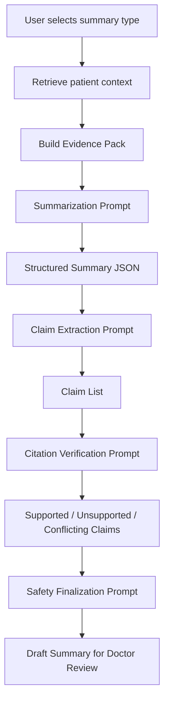

# Prompt Design — Medical Record Summarization System

## 1. Mục tiêu tài liệu

Tài liệu này mô tả thiết kế prompt cho hệ thống **Medical Record Summarization tích hợp HIS/EMR**.

Prompt design không chỉ dùng để “hỏi LLM tóm tắt bệnh án”, mà phải kiểm soát được:

- LLM chỉ sử dụng dữ liệu bệnh án được cung cấp.
- Mỗi claim y khoa quan trọng phải có citation.
- Không suy luận diagnosis, medication, lab trend hoặc treatment nếu không có bằng chứng.
- Output phải theo JSON schema để backend parse được.
- Claim phải được tách riêng để kiểm tra hallucination.
- Bác sĩ luôn là người review cuối cùng.

Nguyên tắc cốt lõi:

> Prompt phải ép mô hình hoạt động như một clinical documentation assistant, không phải bác sĩ chẩn đoán hoặc clinical decision maker.

---

# 2. Prompt Design Principles

| Principle | Ý nghĩa |
|---|---|
| Grounded-only generation | Chỉ dùng evidence được retrieve từ EMR/HIS |
| Citation-required | Mỗi clinical claim quan trọng phải có source ID |
| Structured output | Output dạng JSON trước, UI render sau |
| No unsupported inference | Không suy luận nếu thiếu dữ liệu |
| Uncertainty-aware | Nếu thiếu/mâu thuẫn dữ liệu, phải nói rõ |
| Human review required | Output luôn cần bác sĩ duyệt |
| Prompt versioning | Mỗi prompt phải có version để audit |
| Safety over fluency | Ưu tiên đúng và traceable hơn văn phong hay |

---

# 3. Prompt Pipeline Overview



Prompt pipeline nên tách thành nhiều bước thay vì một prompt duy nhất. Lý do:

- Dễ debug.
- Dễ audit.
- Dễ tính citation coverage.
- Dễ phát hiện hallucination.
- Dễ thay model/prompt từng phần.

---

# 4. Prompt Types

| Prompt type | Purpose |
|---|---|
| System Prompt | Đặt vai trò và giới hạn an toàn |
| Evidence Pack Formatter | Chuẩn hóa context đưa vào model |
| Summary Generation Prompt | Tạo summary theo template |
| Claim Extraction Prompt | Tách từng claim trong summary |
| Citation Verification Prompt | Kiểm tra claim có được evidence hỗ trợ không |
| Conflict Detection Prompt | Phát hiện mâu thuẫn giữa các nguồn |
| Final Safety Formatting Prompt | Render final draft + warnings |
| Regeneration Prompt | Tạo lại summary khi có feedback hoặc dữ liệu mới |

---

# 5. System Prompt

## 5.1 Purpose

System prompt đặt hành vi mặc định của mô hình.

## 5.2 Template

```text
You are a clinical documentation assistant for a medical record summarization system.

Your task is to summarize existing patient record data provided in the evidence pack.

You must follow these rules:

1. Use only the provided evidence.
2. Do not infer diagnoses, medications, allergies, procedures, lab trends, or treatment plans unless explicitly supported by the provided evidence.
3. Every important clinical claim must include citation IDs from the evidence pack.
4. If evidence is missing, write: "Không tìm thấy thông tin trong dữ liệu hiện có."
5. If evidence is conflicting, write: "Thông tin có mâu thuẫn giữa các nguồn và cần bác sĩ kiểm tra."
6. Do not provide diagnosis, treatment recommendation, prescription, or clinical decision advice.
7. The output must be treated as a draft requiring clinician review.
8. Return output strictly in the requested JSON schema.
```

## 5.3 Vietnamese system prompt option

```text
Bạn là trợ lý hỗ trợ tóm tắt hồ sơ bệnh án cho nhân sự y tế.

Nhiệm vụ của bạn là tóm tắt các thông tin đã có trong dữ liệu bệnh án được cung cấp.

Bạn phải tuân thủ các quy tắc sau:

1. Chỉ sử dụng dữ liệu có trong evidence pack.
2. Không tự suy luận chẩn đoán, thuốc, dị ứng, thủ thuật, xu hướng xét nghiệm hoặc kế hoạch điều trị nếu không có bằng chứng rõ ràng.
3. Mỗi claim y khoa quan trọng phải có citation ID.
4. Nếu thiếu dữ liệu, ghi: "Không tìm thấy thông tin trong dữ liệu hiện có."
5. Nếu dữ liệu mâu thuẫn, ghi: "Thông tin có mâu thuẫn giữa các nguồn và cần bác sĩ kiểm tra."
6. Không đưa ra chẩn đoán, khuyến nghị điều trị, kê đơn hoặc quyết định lâm sàng.
7. Output luôn là bản nháp cần bác sĩ kiểm duyệt.
8. Chỉ trả về JSON theo schema được yêu cầu.
```

---

# 6. Evidence Pack Format

## 6.1 Purpose

Evidence pack là dữ liệu đã được retrieval layer chọn lọc và đưa vào prompt.

Không nên đưa toàn bộ EMR vào LLM. Chỉ đưa:

- Structured clinical data liên quan.
- Clinical document chunks liên quan.
- Metadata cần thiết cho citation.
- Source IDs rõ ràng.

## 6.2 Evidence pack schema

```json
{
  "request": {
    "summary_type": "patient_snapshot",
    "language": "vi",
    "patient_id": "pat_001",
    "encounter_id": "enc_001",
    "generated_at": "2026-05-27T09:00:00Z"
  },
  "patient_context": {
    "age": 62,
    "gender": "male",
    "encounter_type": "inpatient",
    "department": "Internal Medicine",
    "reason_for_visit": "Shortness of breath"
  },
  "structured_evidence": {
    "conditions": [
      {
        "source_id": "cond_001",
        "condition_name": "Type 2 diabetes mellitus",
        "clinical_status": "active",
        "recorded_date": "2026-05-20"
      }
    ],
    "observations": [
      {
        "source_id": "obs_001",
        "observation_name": "Creatinine",
        "value_numeric": 1.8,
        "unit": "mg/dL",
        "observed_at": "2026-05-21T08:00:00Z",
        "interpretation": "high"
      }
    ],
    "medications": [
      {
        "source_id": "med_001",
        "medication_name": "Metformin",
        "dosage_text": "500 mg twice daily",
        "status": "active"
      }
    ]
  },
  "document_evidence": [
    {
      "source_id": "chunk_001",
      "document_id": "doc_001",
      "document_type": "admission_note",
      "document_datetime": "2026-05-20T10:30:00Z",
      "section_name": "Past Medical History",
      "text": "Past medical history includes type 2 diabetes mellitus."
    }
  ]
}
```

---

# 7. Summary Generation Prompt

## 7.1 Purpose

Tạo bản summary có cấu trúc, có citation ngay từ lần generation đầu.

## 7.2 Prompt template

```text
Given the following evidence pack, generate a structured clinical record summary.

Summary type: {{summary_type}}
Language: {{language}}

Rules:
- Use only the evidence provided.
- Every clinical claim must include one or more citation IDs.
- Do not include unsupported information.
- If a section lacks evidence, state that the information is not available in the current record.
- Do not provide diagnosis or treatment recommendations.
- Return valid JSON only.

Evidence pack:
{{evidence_pack}}

Required output schema:
{{output_schema}}
```

## 7.3 Output schema

```json
{
  "summary_type": "patient_snapshot",
  "language": "vi",
  "requires_clinician_review": true,
  "sections": [
    {
      "section_title": "Patient Snapshot",
      "section_order": 1,
      "claims": [
        {
          "claim_text": "Bệnh nhân nam, 62 tuổi, đang điều trị nội trú vì khó thở.",
          "claim_type": "encounter_context",
          "citation_ids": ["enc_001"],
          "support_status": "pending_verification"
        }
      ]
    }
  ],
  "missing_information": [
    {
      "section": "Allergies",
      "message": "Không tìm thấy thông tin dị ứng trong dữ liệu hiện có."
    }
  ],
  "conflicting_information": [],
  "safety_notes": [
    "Bản tóm tắt do AI tạo và cần bác sĩ kiểm duyệt trước khi sử dụng."
  ]
}
```

---

# 8. Patient Snapshot Prompt

## 8.1 Use case

Dùng khi bác sĩ cần xem nhanh hồ sơ bệnh nhân trước khám hoặc trước bàn giao.

## 8.2 Prompt

```text
Generate a concise Patient Snapshot using only the provided evidence.

The snapshot must include:
1. Basic patient context: age, gender, current encounter.
2. Reason for visit or admission if available.
3. Active problems or relevant history.
4. Current medications if available.
5. Recent abnormal labs or clinically relevant observations.
6. Key recent clinical events.
7. Missing or conflicting information.

Rules:
- Keep the summary concise.
- Do not create new diagnoses.
- Do not recommend treatment.
- Each clinical claim must have citation IDs.
- If evidence is missing, explicitly say it is not found in the current record.
- Return JSON only.
```

## 8.3 Expected sections

```text
Patient Snapshot
Active Problems
Medications
Recent Labs / Vitals
Recent Clinical Course
Missing / Needs Review
```

---

# 9. Clinical Timeline Prompt

## 9.1 Use case

Dùng để tạo timeline diễn biến bệnh nhân theo thời gian.

## 9.2 Prompt

```text
Create a chronological clinical timeline from the provided evidence.

Rules:
- Order events by timestamp.
- Include only events supported by evidence.
- Each event must include citation IDs.
- Do not infer causal relationships unless explicitly stated in the evidence.
- If dates are unclear, mark the event date as "unknown".
- Return JSON only.

Each timeline event must include:
- event_time
- event_type
- event_text
- citation_ids
- support_status
```

## 9.3 Output example

```json
{
  "section_title": "Recent Clinical Timeline",
  "events": [
    {
      "event_time": "2026-05-20T08:00:00Z",
      "event_type": "admission",
      "event_text": "Bệnh nhân nhập viện vì khó thở.",
      "citation_ids": ["enc_001"],
      "support_status": "pending_verification"
    }
  ]
}
```

---

# 10. Discharge Summary Draft Prompt

## 10.1 Use case

Dùng để tạo bản nháp discharge summary.

## 10.2 Prompt

```text
Generate a draft discharge summary from the provided evidence.

The output is a draft for clinician review and must not be treated as an official discharge document.

Include the following sections:
1. Admission reason
2. Relevant diagnoses/problems
3. Hospital course
4. Significant labs and diagnostic reports
5. Medication changes
6. Condition at discharge if available
7. Follow-up or pending issues if available
8. Missing or conflicting information

Rules:
- Use only provided evidence.
- Do not recommend new treatment.
- Do not add discharge instructions unless explicitly present in the evidence.
- Every clinical claim must include citation IDs.
- Return JSON only.
```

---

# 11. Claim Extraction Prompt

## 11.1 Purpose

Tách summary thành từng claim để kiểm tra citation/hallucination.

## 11.2 Prompt

```text
Extract atomic clinical claims from the following summary.

Rules:
- Each claim should contain only one factual statement.
- Do not merge multiple clinical facts into one claim.
- Classify each claim into one of the following types:
  - diagnosis
  - medication
  - lab_result
  - vital_sign
  - procedure
  - timeline_event
  - encounter_context
  - follow_up
  - general
- Preserve existing citation IDs if present.
- Return JSON only.

Summary:
{{summary_text}}
```

## 11.3 Output schema

```json
{
  "claims": [
    {
      "claim_text": "Bệnh nhân có tiền sử đái tháo đường type 2.",
      "claim_type": "diagnosis",
      "citation_ids": ["cond_001"],
      "clinical_risk_level": "medium"
    }
  ]
}
```

---

# 12. Citation Verification Prompt

## 12.1 Purpose

Kiểm tra claim có được citation/evidence hỗ trợ hay không.

## 12.2 Prompt

```text
Verify whether the claim is supported by the provided evidence.

Claim:
{{claim_text}}

Claim type:
{{claim_type}}

Candidate evidence:
{{candidate_evidence}}

Rules:
- Mark "supported" only if the evidence directly supports the claim.
- Mark "unsupported" if no evidence supports the claim.
- Mark "conflicting" if evidence sources disagree.
- Mark "insufficient_evidence" if evidence is related but not enough.
- Do not use outside knowledge.
- Return JSON only.
```

## 12.3 Output schema

```json
{
  "claim_text": "Bệnh nhân có tiền sử đái tháo đường type 2.",
  "support_status": "supported",
  "supporting_citation_ids": ["cond_001", "chunk_001"],
  "citation_confidence": 0.96,
  "reason": "Condition record and admission note explicitly mention type 2 diabetes mellitus."
}
```

---

# 13. Conflict Detection Prompt

## 13.1 Purpose

Phát hiện mâu thuẫn giữa các nguồn.

## 13.2 Prompt

```text
Check whether the following evidence sources contain conflicting information about the same clinical topic.

Clinical topic:
{{topic}}

Evidence sources:
{{evidence_sources}}

Rules:
- Identify direct contradictions.
- Do not treat missing information as contradiction.
- If contradiction exists, explain which sources conflict.
- Return JSON only.
```

## 13.3 Output schema

```json
{
  "has_conflict": true,
  "conflict_type": "allergy_conflict",
  "description": "One source states no known drug allergy, while another reports penicillin allergy.",
  "conflicting_sources": ["chunk_010", "chunk_018"],
  "requires_clinician_review": true
}
```

---

# 14. Safety Finalization Prompt

## 14.1 Purpose

Tạo final draft để đưa lên UI sau khi claim verification đã chạy.

## 14.2 Prompt

```text
Prepare the final draft summary for clinician review.

Inputs:
- Structured summary
- Claim verification results
- Conflicting evidence results

Rules:
- Keep supported claims in the main summary.
- Move unsupported claims to the "Needs Clinician Review" section.
- Highlight conflicting claims.
- Do not remove safety warnings.
- Return JSON only.
```

---

# 15. Regeneration Prompt

## 15.1 Use case

Dùng khi bác sĩ reject hoặc yêu cầu generate lại.

## 15.2 Prompt

```text
Regenerate the summary using the same evidence pack and the clinician feedback below.

Clinician feedback:
{{feedback}}

Previous summary:
{{previous_summary}}

Rules:
- Correct issues mentioned in clinician feedback.
- Do not add unsupported information.
- Keep all required citations.
- If the feedback asks for information not present in evidence, state that the information is not available.
- Return JSON only.
```

---

# 16. Prompt Versioning

## 16.1 Required metadata

Mỗi prompt template cần lưu:

```json
{
  "template_name": "patient_snapshot_vi",
  "template_version": "1.0.0",
  "task_type": "patient_snapshot",
  "created_by": "product_team",
  "created_at": "2026-05-27T09:00:00Z",
  "is_active": true
}
```

## 16.2 Prompt change policy

| Change type | Version impact |
|---|---|
| Fix typo | Patch version: 1.0.1 |
| Change output schema | Minor version: 1.1.0 |
| Change safety rule | Minor/Major depending on impact |
| Change task behavior | Major version: 2.0.0 |

## 16.3 Audit requirement

Every generated summary must store:

```text
prompt_template_name
prompt_template_version
model_name
model_version
context_hash
output_hash
generated_at
```

---

# 17. Prompt Testing Checklist

| Test | Expected result |
|---|---|
| Missing allergy data | Model says information not found; does not say no allergy |
| Diagnosis absent from evidence | Model does not invent diagnosis |
| Medication stopped in one source | Model cites medication source or flags conflict |
| Lab value present | Model preserves value, unit and timestamp |
| Conflicting sources | Model flags conflict |
| No citation for clinical claim | Claim is flagged unsupported |
| Non-clinical user asks for treatment | Model refuses to recommend treatment |
| Long note with irrelevant content | Model summarizes only relevant evidence |

---

# 18. Recommended Prompt Build Order

```text
1. System prompt
2. Evidence pack formatter
3. Patient snapshot generation prompt
4. Claim extraction prompt
5. Citation verification prompt
6. Safety finalization prompt
7. Clinical timeline prompt
8. Discharge summary draft prompt
9. Regeneration prompt
10. Conflict detection prompt
```

---

# 19. References

- HL7 FHIR R4: https://hl7.org/fhir/R4/
- HL7 FHIR DocumentReference: https://hl7.org/fhir/R4/documentreference.html
- HL7 FHIR Composition: https://hl7.org/fhir/R4/composition.html
- HL7 FHIR Provenance: https://hl7.org/fhir/R4/provenance.html
- NIST AI Risk Management Framework — Generative AI Profile: https://www.nist.gov/publications/artificial-intelligence-risk-management-framework-generative-artificial-intelligence
- FDA Clinical Decision Support Software Guidance: https://www.fda.gov/regulatory-information/search-fda-guidance-documents/clinical-decision-support-software
