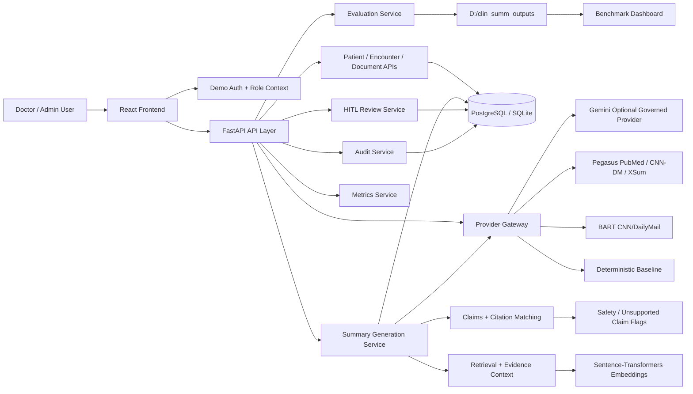
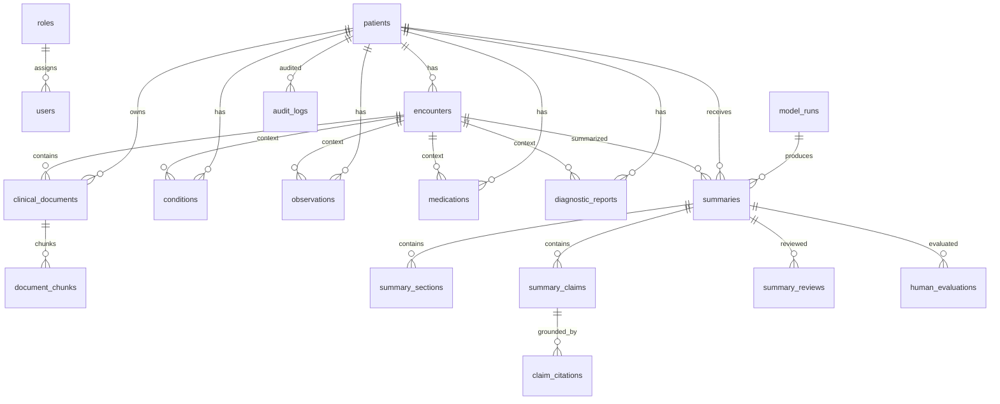
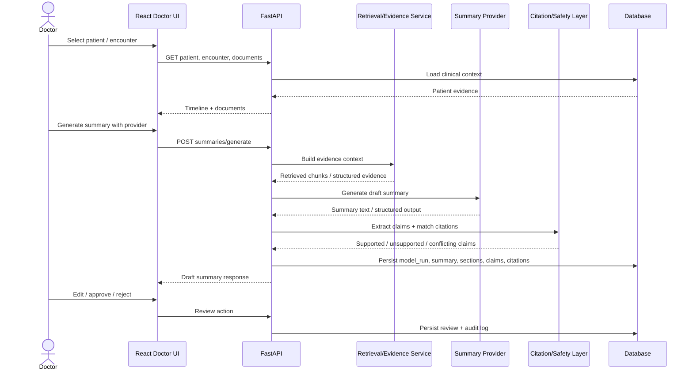
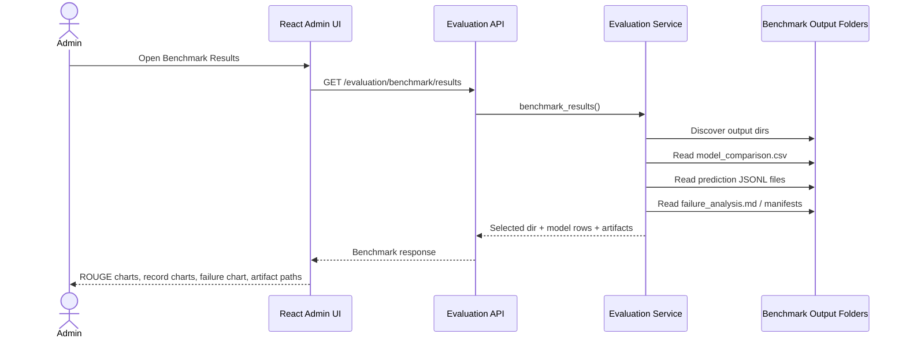
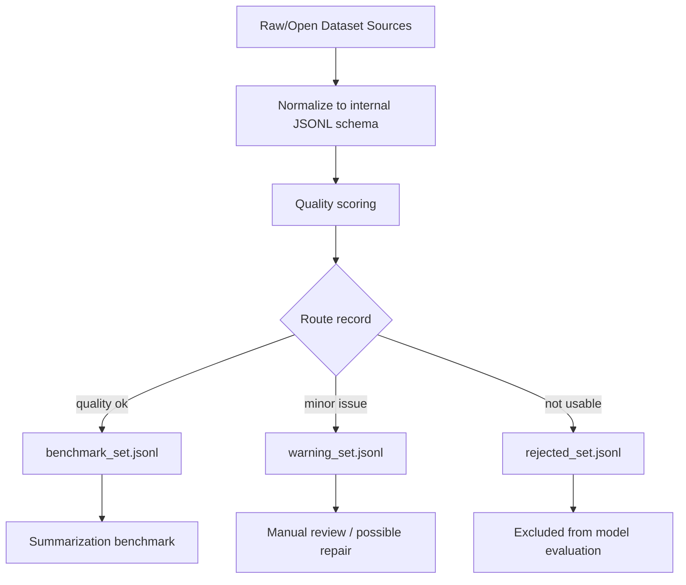

# Báo cáo tiến độ Delivery Week 2 - Medical Record Summarization MVP

**Người thực hiện:** Sơn  
**Dự án:** Citation-grounded Medical Record Summarization MVP  
**Thời điểm cập nhật:** 04/06/2026  
**Trạng thái:** MVP/prototype đã chạy được, đang chuyển trọng tâm sang benchmark, validation định lượng và PoC có thể đo lường.

## Project Links

| Hạng mục | Link |
| --- | --- |
| GitHub repository | `[https://github.com/104221795/Medical_Record_Summarization]` |
| YouTube demo | `[https://www.youtube.com/watch?v=JiXq3XdmH9E]` |
| Local React demo | `http://127.0.0.1:5173` |
| Local API docs | `http://127.0.0.1:8080/docs` |
| Local benchmark dashboard | `http://127.0.0.1:5173/admin/evaluation/benchmark` |

> Proxy evaluation only. These results do not demonstrate clinical safety, clinical effectiveness, or real-world healthcare performance. Real EHR evaluation requires credentialed datasets such as MIMIC-IV-Note or MIMIC-IV-BHC under approved governance processes.

## I. Tổng Quan Tiến Độ

Yêu cầu ban đầu của tuần 1 chủ yếu tập trung vào PRD, workflow và định hình bài toán Medical Record Summarization. Tuy nhiên, dự án đã được triển khai vượt khỏi phạm vi tài liệu thiết kế ban đầu: hiện tại repository đã có một MVP/prototype chạy được với backend FastAPI, frontend React role-based, workflow bác sĩ/admin, provider selection, citation grounding, Human-in-the-Loop review, audit log, dataset governance và benchmark dashboard.

Điểm quan trọng nhất của tiến độ hiện tại là dự án đã chuyển sớm từ giai đoạn "thiết kế sản phẩm" sang "hệ thống có thể chạy thử và đo lường". Điều này giúp các quyết định tiếp theo không chỉ dựa trên giả định sản phẩm, mà có thể dựa trên dữ liệu thực nghiệm như ROUGE, latency, provider readiness, failure analysis và benchmark-ready record count.

Tuy nhiên, cần nhấn mạnh rằng hệ thống hiện vẫn là prototype. Các kết quả benchmark đang dựa trên proxy/open datasets như MultiClinSum và mock/de-identified data, không được diễn giải là clinical safety, clinical effectiveness hoặc real-world EHR performance.

## II. Kết Quả Đã Hoàn Thành

### 1. Product Documentation

Dự án hiện đã có nền tảng documentation khá đầy đủ cho một Clinical AI MVP:

- PRD và project brief mô tả rõ bài toán Medical Record Summarization.
- MVP scope xác định ranh giới sản phẩm: hệ thống tạo draft summary có citation, không đưa ra diagnosis/treatment/prescription recommendation.
- User Flow mô tả vai trò Doctor, Clinical Admin, Auditor, AI Safety Reviewer và IT/Admin.
- Safety boundaries đã được ghi rõ trong README và AGENTS guidance: AI output là draft, cần clinician review, claim quan trọng phải có citation hoặc được flag.
- Dataset/evaluation docs phân biệt mock/de-identified data, open proxy benchmarks và future credentialed EHR datasets.
- README hiện tại đã được cập nhật với tech stack, architecture diagram, routes, backend APIs, evaluation outputs, benchmark snapshot và troubleshooting.

Điểm mạnh của phần documentation là không chỉ tập trung vào mô hình AI, mà đặt mô hình trong workflow lâm sàng có review, auditability và governance.

### 2. System Implementation

Backend hiện tại là FastAPI prototype với Pydantic schemas, SQLAlchemy/Alembic persistence, PostgreSQL-ready configuration và SQLite fallback cho local development.

Các phần backend chính đã có:

- Patient, encounter, document, chunk APIs.
- FHIR-like ingestion pathway.
- Summary generation endpoint.
- Review workflow: start review, edit, approve, reject, review history.
- Audit log service và metrics APIs.
- Provider gateway và LLM gateway cho deterministic, Gemini, BART, Pegasus PubMed, Pegasus CNN/DailyMail và Pegasus XSum.
- Evaluation service đọc benchmark artifacts từ `D:\clin_summ_outputs`.
- Auth/login prototype có role-aware session, Google OAuth config support ở mức prototype, nhưng production SSO/OAuth vẫn chưa hoàn chỉnh.

Hệ thống đã có khả năng chạy local với:

```powershell
python -m uvicorn backend.app.main:app --reload --port 8080
```

và React frontend:

```powershell
cd frontend
npm run dev
```

### 3. Doctor Workflow

Frontend React hiện tại có role-based Doctor workspace với các route chính:

- `/doctor/dashboard`
- `/doctor/patients`
- `/doctor/patients/:patientId`
- `/doctor/generate-summary`
- `/doctor/review`
- `/doctor/patient-history`
- `/doctor/audit`
- `/doctor/user-guide`

Doctor workflow đã bao gồm các bước quan trọng:

1. Xem danh sách bệnh nhân.
2. Xem patient detail, encounter timeline và documents.
3. Chọn provider để generate summary.
4. Xem draft summary.
5. Inspect citations, claim validation và unsupported claims.
6. Edit summary nếu cần.
7. Approve hoặc reject với reason/comment.
8. Xem audit history.

Điểm đúng về mặt Clinical AI là hệ thống không coi generated summary là final answer. Summary được tạo ở trạng thái draft và cần review của bác sĩ trước khi approve.

### 4. Admin / Evaluation Workflow

Admin workspace hiện có:

- `/admin/dashboard`: system monitoring, summary counts, approval/rejection, dataset readiness, provider status.
- `/admin/datasets`: dataset governance explanation.
- `/admin/evaluation`: model quality overview.
- `/admin/evaluation/benchmark`: benchmark artifacts and detailed model results.
- `/admin/audit`: audit logs.
- `/admin/settings`: provider/environment settings.

Benchmark Results dashboard đã được nâng cấp để hiển thị:

- selected benchmark output directory.
- discovered benchmark folders.
- prediction file availability.
- ROUGE comparison chart.
- records evaluated chart.
- failure pattern chart.
- model comparison table.
- artifact paths.
- proxy evaluation warning.

Dashboard hiện đọc kết quả từ backend endpoint:

```http
GET /api/v1/evaluation/benchmark/results
```

Endpoint này không load model, chỉ đọc artifacts đã sinh sẵn từ benchmark output folders.

### 5. Clinical AI Safety Layer

Safety layer hiện đã có các thành phần quan trọng:

- Claim-level support status: supported, unsupported, insufficient evidence, conflicting.
- Citation panel và source evidence visibility.
- Unsupported claims panel trong frontend.
- Review action bắt buộc trước khi approve/reject.
- Audit logging cho sensitive actions.
- Safety metrics gồm unsupported claim count/rate, citation coverage và safety gate status.
- Guardrails không cho hệ thống trình bày autonomous clinical action như diagnosis recommendation, treatment recommendation hoặc prescription.

Đây là điểm mạnh lớn của dự án: hệ thống được thiết kế như một clinical workflow có governance, không phải chỉ là một summarization demo.

### 6. Dataset Governance

Dataset governance hiện đã có benchmark-ready set thật trong workspace:

```text
data/processed/governance/benchmark_set.jsonl
data/processed/governance/warning_set.jsonl
data/processed/governance/rejected_set.jsonl
```

Record count hiện tại:

| Set | Count | Ghi chú |
| --- | ---: | --- |
| benchmark_set | 25,902 | Benchmark-ready MultiClinSum records |
| warning_set | 0 | File tồn tại nhưng hiện không có record |
| rejected_set | 0 | File tồn tại nhưng hiện không có record |

MultiClinSum full cũng có 25,902 records:

```text
data/processed/multiclinsum/multiclinsum_train_full.jsonl
```

Dataset interpretation:

- MultiClinSum được dùng làm primary open proxy clinical summarization benchmark.
- Synthea/SyntheticMass phù hợp hơn cho FHIR-like ingestion validation, không phải supervised summarization benchmark chính.
- MTS-Dialog và MEDIQA-Sum được định vị là future cross-dataset benchmark.
- MIMIC-IV-Note và MIMIC-IV-BHC vẫn là future credentialed EHR benchmark, cần access/governance approval.

Một hạn chế cần ghi rõ: các manifest như `dataset_manifest.json` hoặc `dataset_governance_report.md` không thấy tồn tại trong workspace tại thời điểm kiểm tra này. Vì vậy, phần governance hiện đã có benchmark/warning/rejected JSONL sets, nhưng manifest/report generation cần được chuẩn hóa hoặc chạy lại để đóng gói đầy đủ.

### 7. Benchmark / Evaluation Layer

Hệ thống hiện có medium benchmark output ở:

```text
D:\clin_summ_outputs\medium_benchmark_bart_pegasus
```

Các artifacts chính:

- `evaluation_run_manifest.json`
- `model_comparison.csv`
- `per_record_metrics.csv`
- `deterministic_predictions.jsonl`
- `bart_predictions.jsonl`
- `pegasus_predictions.jsonl`
- `pegasus_pubmed_predictions.jsonl`
- `pegasus_cnn_dailymail_predictions.jsonl`
- `all_predictions.jsonl`
- `failure_analysis.md`
- `EVALUATION_REPORT.md`
- `run.log`

Current proxy benchmark snapshot:

| Provider | Checkpoint | Records | ROUGE-1 | ROUGE-2 | ROUGE-L | Ghi chú |
| --- | --- | ---: | ---: | ---: | ---: | --- |
| deterministic | `deterministic_sentence_baseline` | 50/50 | 0.3138 | 0.1504 | 0.2407 | Fast extractive baseline |
| BART | `facebook/bart-large-cnn` | 200/200 | 0.3379 | 0.1615 | 0.2533 | Best ROUGE-L trong current proxy run |
| Pegasus XSum | `google/pegasus-xsum` | 200/200 | 0.1804 | 0.0512 | 0.1340 | General Pegasus baseline |
| Pegasus PubMed | `google/pegasus-pubmed` | 200/200 | 0.3301 | 0.1099 | 0.2108 | Medical/scientific Pegasus baseline |
| Pegasus CNN/DailyMail | `google/pegasus-cnn_dailymail` | 104/104 | 0.2810 | 0.1499 | 0.2303 | Auxiliary comparison |

Kết luận từ snapshot hiện tại:

- BART đang tốt nhất theo ROUGE-L trong medium proxy benchmark hiện tại.
- Pegasus PubMed tốt hơn Pegasus XSum và có domain fit tốt hơn cho medical/scientific text, nhưng chưa vượt BART trong run hiện tại.
- Pegasus CNN/DailyMail mới có 104/104 records trong auxiliary file, chưa nên so sánh ngang hoàn toàn với 200-record BART/PubMed run.
- BERTScore hiện là optional và không thấy được tính trong medium run hiện tại.
- Citation coverage/unsupported claim metrics tồn tại trong app metrics và safety layer, nhưng chưa phải metric chính trong external summarization benchmark output.

Failure analysis hiện ghi nhận các nhóm lỗi:

| Failure pattern | Count |
| --- | ---: |
| source data limitation | 450 |
| retrieval-related failure | 260 |
| incomplete summary | 184 |
| missing medication | 160 |
| missing diagnosis | 152 |
| missing timeline | 145 |
| hallucinated content | 69 |

Các số liệu này có ý nghĩa như tín hiệu debugging cho proxy benchmark, không phải kết luận clinical safety.

## III. Technical Architecture, DB Schema Và Workflows

### 1. Technology Stack Hiện Tại

| Layer | Công nghệ | Vai trò trong hệ thống |
| --- | --- | --- |
| Frontend | React 18, JSX, Vite, React Router | Role-based UI cho Doctor/Admin, routing, dashboard, benchmark visualization |
| UI foundation | CSS modules/global styles, reusable components | Card, Button, Badge, Table, PageHeader, Loading/Error states, benchmark charts |
| Backend API | FastAPI | REST API cho patient, document, summary, review, audit, evaluation, provider |
| Validation schema | Pydantic | Request/response models, provider payload validation, auth payload validation |
| Database ORM | SQLAlchemy | Entity mapping cho clinical data, summaries, reviews, citations, audit logs |
| Migration | Alembic | Database schema migration |
| Persistence | PostgreSQL, SQLite fallback | PostgreSQL cho production-style local setup; SQLite cho quick local checks |
| Retrieval | Sentence Transformers, default `sentence-transformers/all-MiniLM-L6-v2` | Embedding backend cho retrieval/evidence context |
| Summarization | Deterministic baseline, Hugging Face BART/Pegasus, optional Gemini | Provider-selectable draft summary generation |
| Local model execution | `AutoTokenizer`, `AutoModelForSeq2SeqLM`, `model.generate()` | Direct seq2seq generation; không dùng `pipeline("summarization")` |
| Evaluation metrics | ROUGE-1, ROUGE-2, ROUGE-L, optional BERTScore | Proxy benchmark quality measurement |
| Governance outputs | JSONL, CSV, Markdown reports | Benchmark sets, prediction files, comparison CSV, report artifacts |
| Auth/session prototype | Demo login, role-aware headers, Google OAuth config support | Local role handling; production OAuth/SSO vẫn là planned |
| Cache/model storage | `D:\hf_cache` | Hugging Face model/data cache trên D drive |
| Dev environment | PowerShell, Python venv, npm/Vite | Local development and validation |

### 2. High-Level Architecture Diagram



### 3. DB Schema Map

Database hiện tại tập trung vào 5 nhóm dữ liệu: identity/role, clinical records, summarization/citation, review/evaluation và audit.

| Nhóm | Tables / Entities | Mục đích |
| --- | --- | --- |
| Identity / RBAC | `roles`, `users` | Demo users, role code, tenant-aware local workflow |
| Clinical data | `patients`, `encounters`, `clinical_documents`, `document_chunks` | Patient context, encounter timeline, raw clinical notes, chunked evidence |
| Structured clinical evidence | `conditions`, `observations`, `medications`, `diagnostic_reports` | FHIR-like structured evidence used for summary grounding |
| Model execution | `model_runs` | Provider/model metadata, status, latency, run tracking |
| Summary output | `summaries`, `summary_sections`, `summary_claims` | Draft summaries, section text, claim-level safety metadata |
| Citation grounding | `claim_citations` | Links claims back to source document/chunk/structured evidence |
| Human review | `summary_reviews`, `human_evaluations` | HITL edit/approve/reject actions and evaluation scoring |
| Auditability | `audit_logs` | Sensitive action traceability |

### 4. DB Relationship Diagram



### 5. Workflow 1 - Doctor Summary Generation And Review



### 6. Workflow 2 - Admin Benchmark Dashboard



### 7. Workflow 3 - Dataset Governance And Benchmark Preparation



## IV. Baseline Models Và Provider Interpretation

### 1. Baseline Model Taxonomy

| Provider | Model/checkpoint | Vai trò | Official comparison status hiện tại |
| --- | --- | --- | --- |
| deterministic | `deterministic_sentence_baseline` | Safety/development baseline; fast smoke test | Completed 50/50 |
| BART | `facebook/bart-large-cnn` | Main general abstractive summarization baseline | Completed 200/200; best current ROUGE-L |
| Pegasus XSum | `google/pegasus-xsum` | General single-summary Pegasus baseline | Completed 200/200; lower current score |
| Pegasus PubMed | `google/pegasus-pubmed` | Medical/scientific Pegasus baseline | Completed 200/200; preferred Pegasus domain-fit |
| Pegasus CNN/DailyMail | `google/pegasus-cnn_dailymail` | Auxiliary general Pegasus comparison | Completed 104/104 in auxiliary output |
| Gemini | Configured external provider | Optional governed LLM provider | Not official unless completed benchmark records exist |

### 2. Model Interpretation Rules

- **Deterministic** không phải mô hình mạnh nhất, nhưng là baseline quan trọng để kiểm tra workflow, persistence và evaluation plumbing.
- **BART** hiện là baseline chính theo kết quả ROUGE-L trong medium proxy benchmark.
- **Pegasus PubMed** là Pegasus checkpoint phù hợp hơn với medical/scientific text so với XSum, nhưng trong current run chưa vượt BART.
- **Pegasus CNN/DailyMail** chỉ nên được xem là auxiliary comparison vì current file mới có 104 records.
- **Gemini** không được đưa vào official benchmark comparison nếu chưa có completed prediction files và governance flags rõ ràng.

## V. Bộ Đánh Giá Chuẩn Đề Xuất

### 1. Evaluation Protocol

Bộ đánh giá chuẩn nên gồm 5 tầng:

| Layer | Mục tiêu | Dataset/input | Metric/output |
| --- | --- | --- | --- |
| Functional validation | Kiểm tra hệ thống chạy được end-to-end | Mock/de-identified demo data | Pass/fail checks, audit log, citation visibility |
| Dataset governance | Bảo đảm record đủ chất lượng trước benchmark | MultiClinSum processed JSONL | quality_score, benchmark/warning/rejected sets |
| Retrieval/evidence validation | Kiểm tra context có đủ evidence | Chunks + queries | Recall@K, MRR, nDCG, latency |
| Summarization benchmark | So sánh deterministic/BART/Pegasus | benchmark_set.jsonl | ROUGE-1/2/L, optional BERTScore, latency |
| Human/clinical review | Đánh giá factuality và usefulness | Generated summaries + evidence | reviewer scores, unsupported claim rate, citation usefulness |

### 2. Required Benchmark Artifacts

Mỗi run benchmark chính thức nên tạo đủ:

```text
evaluation_run_manifest.json
dataset_manifest.json
model_comparison.csv
per_record_metrics.csv
all_predictions.jsonl
deterministic_predictions.jsonl
bart_predictions.jsonl
pegasus_predictions.jsonl
pegasus_pubmed_predictions.jsonl
failure_analysis.md
EVALUATION_REPORT.md
run.log
```

Nếu artifact nào không tồn tại, report phải ghi rõ là missing/planned, không được giả định đã hoàn thành.

### 3. Standard Metrics

| Metric | Status hiện tại | Ghi chú |
| --- | --- | --- |
| ROUGE-1 | Đã có | Main lexical overlap metric |
| ROUGE-2 | Đã có | Useful for phrase-level overlap |
| ROUGE-L | Đã có | Current comparison ranking uses ROUGE-L |
| BERTScore | Optional/planned trong medium run | Chỉ report nếu package/model khả dụng |
| Citation coverage | Có trong app metrics/safety layer | Cần đưa vào benchmark report chuẩn |
| Unsupported claim rate | Có trong app metrics/safety layer | Cần chuẩn hóa theo provider/model |
| Factuality/faithfulness | Planned | Cần rubric hoặc claim-source verification |
| Human review score | Endpoint/template đã có | Cần reviewer protocol và sample size |
| Latency | Đã có trong benchmark rows | Cần tách average/P50/P95 nếu scale lên |

## VI. PoC End-To-End Development Plan

Mục tiêu PoC là chứng minh một luồng chạy được, đo được và review được:

```mermaid
flowchart LR
    A[Import / Seed Patient Data] --> B[Build Patient Timeline]
    B --> C[Retrieve Evidence Context]
    C --> D[Generate Draft Summary]
    D --> E[Extract Claims]
    E --> F[Match Citations]
    F --> G[Flag Unsupported Claims]
    G --> H[Doctor Review]
    H --> I[Approve / Reject / Edit]
    I --> J[Audit Log]
    J --> K[Admin Metrics + Benchmark Dashboard]
```



PoC success criteria:

| Area | Success condition |
| --- | --- |
| Data | Patient/encounter/document context loads without raw PHI logging |
| Generation | At least deterministic and one local seq2seq provider can generate draft |
| Grounding | Claims are linked to citations or flagged unsupported |
| HITL | Doctor can edit, approve, reject and see review history |
| Audit | Generate/review/approve/reject actions create audit logs |
| Evaluation | Dashboard shows model comparison, prediction files and proxy warning |
| Reporting | Mentor-facing report includes benchmark results and limitations |

## VII. Phân Tích Điểm Mạnh

### Product-Oriented

Dự án không chỉ giải quyết bài toán "tạo summary", mà đặt summary vào bối cảnh sử dụng thật: bác sĩ cần đọc evidence, sửa draft, approve/reject và để lại audit trail. Đây là tư duy sản phẩm tốt cho Clinical AI vì nó tránh overclaim rằng AI có thể tự động thay thế quyết định lâm sàng.

### System-Oriented

Repository hiện đã có backend, frontend, persistence, routing, provider gateway, evaluation pipeline và dashboard. Điều này chứng minh dự án đã đi xa hơn một research notebook hoặc prompt demo đơn thuần.

### Evaluation-Oriented

Hệ thống đã có benchmark artifacts thật, model comparison, prediction JSONL, failure analysis và dashboard. Việc có ROUGE-1/2/L, latency, prediction files và failure categories giúp dự án bắt đầu bước vào validation định lượng.

### Clinical AI Risk Awareness

Dự án nhận diện đúng các rủi ro chính:

- hallucination.
- unsupported claims.
- missing diagnosis/medication/timeline.
- retrieval-related failure.
- source data limitation.
- clinical overclaim risk.
- need for credentialed real EHR evaluation.

Việc giữ proxy warning trong README/report/dashboard là rất quan trọng để bảo vệ ranh giới khoa học và đạo đức của dự án.

## VIII. Hạn Chế Hiện Tại

1. **Vẫn là MVP/prototype.** Hệ thống chạy được nhưng chưa phải production HIS/EMR integration.
2. **Chưa thể tuyên bố hiệu quả lâm sàng.** Benchmark hiện tại dùng MultiClinSum/open proxy data, chưa phải MIMIC-IV credentialed real EHR note benchmark.
3. **Human evaluation chưa đủ mạnh.** Có human evaluation endpoint/template nhưng cần protocol, reviewer rubric và nhiều đánh giá thật hơn.
4. **Benchmark cần mở rộng có kiểm soát.** Current medium run đã có 200-record BART/Pegasus PubMed, nhưng cần 500+ và cross-dataset evaluation.
5. **BERTScore/factuality chưa ổn định trong medium run.** ROUGE đã có, nhưng BERTScore và factuality/faithfulness metrics cần được chuẩn hóa hơn.
6. **Dataset governance report/manifests cần đóng gói lại.** Benchmark/warning/rejected JSONL sets có tồn tại, nhưng manifest/report artifacts không thấy ở path đã kỳ vọng.
7. **UI/UX đã cải thiện nhưng vẫn cần validation thực tế.** React UI có route-aware navigation và dashboard mới, nhưng cần kiểm tra thêm với user flows dài và dữ liệu lớn.
8. **Scope cần được kiểm soát.** Dự án đã mở rộng rất nhanh sang frontend, backend, benchmark, provider, auth, dashboard. Giai đoạn tiếp theo nên ưu tiên validation và robustness thay vì thêm nhiều feature mới.

## IX. Giai Đoạn Tiếp Theo

Trọng tâm tiếp theo nên là validation định lượng và PoC end-to-end có thể demo rõ:

- Chuẩn hóa dataset governance artifacts.
- Chạy benchmark theo stage 50 -> 200 -> 500+.
- So sánh deterministic, BART, Pegasus PubMed và Pegasus CNN/DailyMail trong cùng điều kiện.
- Bổ sung BERTScore nếu dependency/model khả dụng.
- Đưa citation coverage, unsupported claim rate và factuality/faithfulness vào evaluation report.
- Tạo human evaluation template với rubric rõ ràng.
- Hoàn thiện failure analysis theo provider/model.
- Giữ Gemini là optional governed provider, không fake hoặc ước lượng nếu chưa benchmark chính thức.
- Tập trung vào demo kỹ thuật: input -> retrieval/evidence -> summary -> citations -> review -> audit -> dashboard.

## X. KPI Định Lượng Đề Xuất

| Hạng mục | KPI | Cách đo | Target đề xuất |
| --- | --- | --- | --- |
| Dataset readiness | Benchmark-ready records | Count records trong `benchmark_set.jsonl` | >= 25,000 hiện tại, maintain quality routing |
| Dataset governance | Rejected/warning routing | Count warning/rejected records và lý do | Có manifest/report đầy đủ, rejected không vào evaluation |
| Summarization quality | ROUGE-1 | Mean ROUGE-1 trên benchmark set | Track theo model, không đặt target clinical |
| Summarization quality | ROUGE-2 | Mean ROUGE-2 trên benchmark set | Track theo model, ưu tiên trend tăng |
| Summarization quality | ROUGE-L | Mean ROUGE-L trên benchmark set | BART hiện 0.2533, dùng làm baseline hiện tại |
| Semantic similarity | BERTScore F1 | Optional BERTScore khi package/model khả dụng | Planned, report nếu skipped |
| Evidence grounding | Citation coverage | Supported claims / total claims | >= 80% trên mock/demo trước khi mở rộng |
| Safety | Unsupported claim rate | Unsupported claims / total claims | Giảm dần; flag rõ thay vì ẩn |
| Factuality | Faithfulness score | Human/LLM-assisted factuality rubric hoặc claim-source verification | Planned; cần rubric |
| Human review | Human review score | Average factual correctness/completeness/readability | >= 4/5 trong demo validation |
| Workflow quality | Approval/rejection rate | Metrics API từ reviewed summaries | Không tối ưu một chiều; dùng để phát hiện quality issue |
| Performance | Latency per summary | `average_latency_ms` per provider | Deterministic < 1s; local seq2seq cần measured budget |
| Provider readiness | Provider availability | `/api/v1/providers` status và env/cache checks | Không provider nào silently fake result |
| Auditability | Audit log completion rate | Sensitive actions có audit log / total sensitive actions | 100% cho generate/review/approve/reject |

## XI. Kế Hoạch Các Tuần Tới

### Tuần 2

Mục tiêu: hoàn thiện dataset/evaluation foundation.

- Chuẩn hóa dataset governance outputs: `dataset_manifest.json`, `benchmark_manifest.jsonl`, `warning_manifest.jsonl`, `rejected_manifest.jsonl`.
- Xác nhận lại 25,902 benchmark-ready MultiClinSum records.
- Chạy deterministic/BART/Pegasus PubMed benchmark theo stage 50 và 200.
- Chuẩn hóa `model_comparison.csv`, `per_record_metrics.csv`, prediction JSONL và `EVALUATION_REPORT.md`.
- Dashboard phải đọc đúng Pegasus PubMed từ `pegasus_pubmed_predictions.jsonl`.
- Không đưa Gemini vào official comparison nếu chưa có completed benchmark records.

### Tuần 3

Mục tiêu: citation-grounded summarization và failure analysis.

- Nối chặt benchmark output với citation/factuality evaluation.
- Mở rộng failure analysis theo model: missing diagnosis, missing medication, missing timeline, hallucination, retrieval-related failure.
- Chuẩn hóa human evaluation template/rubric.
- Kiểm tra doctor review workflow end-to-end với nhiều case.
- Bắt đầu đo citation coverage và unsupported claim rate trong evaluation report.

### Tuần 4

Mục tiêu: PoC end-to-end và demo kỹ thuật.

- Chuẩn bị demo flow hoàn chỉnh: patient import -> summary generation -> evidence/citation -> doctor review -> audit -> admin dashboard.
- Chạy benchmark 500+ nếu compute/time cho phép.
- Hoàn thiện dashboard benchmark và admin monitoring.
- Viết báo cáo benchmark có kết quả, limitation và proxy warning.
- Chuẩn bị slide/demo script cho mentor/supervisor.

## XII. Kết Luận

Dự án đã vượt yêu cầu tuần 1. Thay vì chỉ dừng ở PRD và workflow, hệ thống hiện đã có MVP/prototype chạy được với frontend React, backend FastAPI, persistence, provider selection, HITL review, citation grounding, auditability, dataset governance và benchmark dashboard.

Điểm mạnh lớn nhất là tư duy Clinical AI đúng hướng: không coi model output là kết luận lâm sàng, không overclaim benchmark proxy, và luôn đặt AI summary trong workflow có evidence, human review và audit trail.

Giai đoạn tiếp theo không nên mở rộng scope quá nhanh. Trọng tâm nên chuyển sang benchmark có kiểm soát, validation định lượng, dataset governance artifacts, factuality/citation metrics và PoC end-to-end có thể demo được. Nếu làm tốt, dự án sẽ không chỉ là một UI demo hoặc model demo, mà trở thành một Medical Record Summarization MVP có nền tảng kỹ thuật, sản phẩm và evaluation tương đối vững cho giai đoạn internship/prototype.

Hạn chế hiện tại là hệ thống vẫn là MVP/prototype, chưa thể claim clinical performance. ROUGE hiện mới là metric chính; các metric quan trọng hơn cho Clinical NLP như BERTScore, citation coverage, unsupported claim rate, factuality, faithfulness và human evaluation score cần được chuẩn hóa thêm.

Bước tiếp theo em sẽ không ưu tiên thêm model mới ngay, mà tập trung cải thiện evaluation quality: chuẩn hóa preprocessing và dataset governance manifest, mở rộng benchmark từ 200 lên 500+ records, thêm BERTScore nếu khả dụng, đưa citation coverage và unsupported claim rate vào report, chuẩn hóa failure analysis theo model, và tạo human evaluation rubric.

Mục tiêu cuối cùng của em trong giai đoạn tới là hoàn thiện một PoC end-to-end có thể demo được: input patient data -> retrieve evidence -> generate draft summary -> citation grounding -> doctor review -> audit log -> admin benchmark dashboard. Em muốn chứng minh hệ thống không chỉ generate được summary, mà còn có thể được đo lường, review và kiểm soát rủi ro theo đúng hướng Clinical AI.
