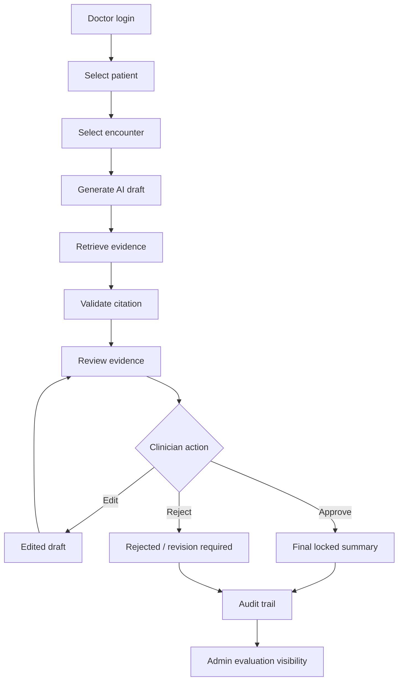
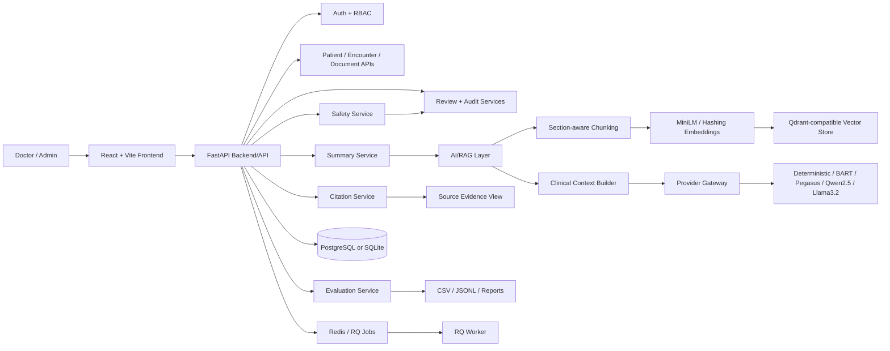

# Proposal: Citation-grounded Medical Record Summarization MVP

> **Document purpose:** bản proposal/presentation cho PoC tóm tắt hồ sơ bệnh án
> có citation. Tài liệu này có thể dùng để chuyển thành slide.
>
> **Positioning:** de-identified, clinician-review-only PoC. Không tuyên bố hệ
> thống đã sẵn sàng vận hành bệnh viện, không chứng minh an toàn/hiệu quả lâm
> sàng, không xác nhận validation trên EHR thật, không tích hợp HIS/EMR thật và
> không hỗ trợ chẩn đoán/điều trị/kê đơn tự động.
>
> **Verified demo path:** Docker Compose local staging. Public cloud deployment
> chỉ là future work tùy chọn.

## 0. Cover Slide

| Field | Content |
| --- | --- |
| Project name | Citation-grounded Medical Record Summarization MVP |
| Subtitle | Evidence-first AI draft summary workflow with clinician review, citation validation, audit trail and proxy evaluation |
| Author | `[AUTHOR_NAME / TEAM_NAME]` |
| Date | 2026-06-24 |
| Status | Local/development PoC; Docker Compose local staging is the verified demo path |
| Disclaimer | AI-generated summaries are clinician-review-only drafts. This PoC uses mock/de-identified/proxy data and does not claim hospital deployment, live EHR validation, autonomous diagnosis, treatment recommendation or prescribing. |

## 1. Executive Summary

| Executive point | Slide-ready message |
| --- | --- |
| Problem | Medical records are fragmented, time-consuming to review, and generic LLM summaries can omit or invent clinically important details without clear source evidence. |
| Solution | A citation-grounded RAG workflow creates an AI-generated draft scoped to patient/encounter evidence, then requires clinician edit/approve/reject before final lock. |
| Evidence | The PoC includes doctor review workflow, citation/source view, unsupported-claim visibility, audit-oriented flow, Admin Evaluation dashboards, Flow 2.1 benchmark artifacts and verified Docker Compose local staging. |
| Limitation | Results are proxy evaluation only; the system has no live EHR validation, no hospital deployment claim and no autonomous clinical decision authority. |
| Next step | Use this proposal as a slide-ready bridge from product/technical PoC to Vinmec-specific controlled research pilot design; keep public cloud deployment as optional future work only. |

## 2. Agenda

1. Solution Introduction
2. Problem Assessment
3. Business Proposal
4. Technical Proposal
5. Project Delivery and Demo Readiness
6. Vinmec-specific Research/Pilot Bridge
7. Limitations, Maintenance, and Roadmap

## 2.1 Proposal Structure Mapped to Sample Proposal

| Sample section | Adapted section in this proposal | Purpose |
| --- | --- | --- |
| Solution Introduction | Section 3 — Solution Introduction | Introduce project identity, target users, main capabilities and safety boundary |
| Problem Assessment | Section 4 — Problem Assessment; Section 5 — Why This Solution | Explain why medical summarization needs evidence-grounded workflow, clinician review and richer metrics |
| Business Proposal | Section 6 — User Requirements; Section 7 — User / Role / Function Mapping; Section 8 — Business Proposal | Map user groups, pain points, workflow and business value |
| Technical Proposal | Section 9 — Technical Proposal; Section 10 — RAG and Citation Pipeline | Present architecture, components, RAG/citation pipeline and technical limitations |
| Project Delivery and Demo Readiness | Section 11 — Evaluation Framework; Section 12 — Benchmark Result Summary; Section 13–15 — Demo, Evidence, Delivery Schedule | Show completed artifacts, benchmark discipline and repeatable demo path |
| Vinmec-specific Research/Pilot Bridge | Section 19 — Integrated Product-to-Vinmec Storyline | Connect the product/technical proposal to a conservative Vinmec research pilot appendix without implying deployment or approval |
| Limitations, Maintenance and Roadmap | Section 16–18; Section 21 — Transition/Handover/Maintenance, Limitations, Roadmap, Conclusion | Define handover package, known limitations, support boundary and conservative next steps |
| Slide Presentation | Section 20 — Slide Conversion Format | Provide slide-ready title, key message, bullets, visual suggestion and speaker note |

## 3. Solution Introduction

### 3.1 Project identity

| Item | Description |
| --- | --- |
| Project | Citation-grounded Medical Record Summarization MVP |
| Scope | Local/development PoC using mock or approved de-identified data |
| Primary workflow | Doctor-facing draft summary with citation/evidence review |
| Evaluation scope | Proxy benchmark and research evaluation only |
| Verified demo path | Docker Compose local staging |
| Future applicability | Research-first pilot under governance, not direct hospital rollout |

### 3.2 Target users

- Doctor / Clinician Reviewer
- Admin / Evaluator
- Technical Reviewer
- Research Evaluator
- Project Mentor / Reviewer

### 3.3 Main capabilities

| Capability | Description | PoC status |
| --- | --- | --- |
| AI draft summary | Generate a draft from patient/encounter-scoped clinical sources | Implemented for demo workflow |
| RAG evidence retrieval | Retrieve evidence chunks using clinical context and vector search | Implemented in Flow 2/2.1 benchmark path |
| Citation validation | Link important claims to source evidence | Implemented as citation/source workflow |
| Unsupported claim visibility | Keep unsupported/insufficient/conflicting evidence visible | Implemented at safety/review layer |
| Clinician edit/approve/reject | Preserve human review as final control | Implemented in review workflow |
| Audit trail | Record review and citation-view events with PHI-safe metadata intent | Implemented as audit-oriented workflow |
| Admin evaluation dashboard | Show benchmark results, provider comparison, failure analysis and human-review surfaces | Implemented in Admin Evaluation pages |
| Flow 2.1 visibility | Show RAG Best Models benchmark artifacts and provider comparison | Implemented with portable artifact loading |

### 3.4 Safety boundary

- Draft-only output.
- Clinician-review-only workflow.
- Mock/de-identified/proxy data for demo.
- No autonomous diagnosis, treatment recommendation, prescribing or discharge
  approval.
- No HIS/EMR writeback in the PoC.
- No claim that proxy benchmark results establish hospital-grade validation.

## 4. Problem Assessment

Medical records are often long, fragmented and hard to review quickly. A single
encounter may contain admission notes, progress notes, medication changes,
allergies, lab results, imaging reports, procedures, consults and discharge
planning. Generic summarization can produce fluent text, but fluent text alone
does not solve the clinical review problem.

Clinicians need:

- evidence traceability;
- patient/encounter-scoped retrieval;
- visibility of unsupported or conflicting claims;
- human review before final use;
- auditability;
- evaluation beyond lexical similarity metrics.

### 4.1 Current challenge assessment

| Current challenge | Impact | Required capability |
| --- | --- | --- |
| Clinical notes are fragmented across documents and sections | Reviewer spends time searching and reconciling evidence | Patient/encounter-scoped evidence retrieval |
| Generic LLM output can sound confident without source support | Risk of unsupported or misleading draft content | Citation-grounded generation and unsupported claim visibility |
| ROUGE/BERTScore alone can reward lexical or semantic similarity but miss grounding failures | Model can look good while omitting critical facts or citing weak evidence | Citation coverage, unsupported claim rate, omission and hallucination proxy metrics |
| Doctor workflow requires accountability | Draft must not be confused with signed medical documentation | Clinician review, final lock and reviewer signature |
| Evaluation artifacts can be machine-specific | Demo and review become hard to repeat | Portable artifact loading and reproducibility manifest |
| Heavy ML dependencies are not required for staging startup | Deployment image can become slow and fragile | Lightweight runtime dependency boundary |

## 5. Why This Solution

### 5.1 Why citation-grounded RAG instead of generic LLM summarization?

Generic LLM summarization optimizes for producing coherent text. In medical
record summarization, the more important question is not only “does the summary
sound correct?” but “can each important claim be checked against the source?”

Citation-grounded RAG is more appropriate for this PoC because it adds four
controls that generic summarization does not guarantee:

1. **Evidence traceability:** important clinical claims can point back to source
   evidence.
2. **Patient/encounter boundary:** retrieval can be scoped to the selected
   patient and encounter.
3. **Safe refusal/gating behavior:** missing mandatory evidence can block or
   flag generation instead of forcing unsupported output.
4. **Reviewer efficiency:** clinicians can inspect targeted evidence chunks
   rather than re-reading every source document.

The project therefore positions RAG as **evidence infrastructure**, not as a
promise that ROUGE will always improve.

### 5.2 Why clinician-review-only design is necessary?

Medical summarization can affect how a patient history is understood. Even if a
draft is useful, the system must not become the final clinical authority. A
clinician-review-only design is necessary because:

- source records may be incomplete, duplicated or conflicting;
- retrieval can miss a relevant chunk or retrieve weak evidence;
- generated text can omit medication, allergy, diagnosis or timeline details;
- citations can be algorithmically matched but still clinically insufficient;
- accountability must remain with authorized clinical staff.

For this reason, the PoC requires doctor review, edit/reject/approve actions and
final lock. The AI output remains a draft until reviewed.

### 5.3 Why evaluation must go beyond ROUGE/BERTScore?

ROUGE and BERTScore are useful but incomplete. They can measure textual overlap
or semantic similarity, but they do not fully answer whether a clinical claim is
supported by evidence.

The proxy evaluation therefore includes:

| Metric family | Why it matters |
| --- | --- |
| ROUGE-L | Baseline lexical similarity to reference summaries |
| BERTScore | Semantic similarity to reference summaries |
| Citation coverage | Whether important claims have linked evidence |
| Unsupported claim rate | Whether generated claims lack sufficient support |
| Faithfulness/factuality proxy | Whether output aligns with retrieved/source information |
| Timeline completeness | Whether clinical progression is represented |
| Hallucinated entity proxy | Whether new unsupported clinical entities appear |
| Critical omission proxy | Whether important diagnosis/medication/timeline information is missing |
| Failure labels | Helps explain model/provider failure patterns |

These metrics are still proxy evaluation. Human clinician review remains the
required next step before any real clinical workflow study.

## 6. User Requirements

| Requirement | Proposed response | Current status |
| --- | --- | --- |
| Patient/encounter-scoped summary generation | Generate draft only from selected patient/encounter context | Implemented for PoC workflow |
| Evidence/citation display | Link claims to source chunks/documents and display surrounding context | Implemented in citation source workflow |
| Unsupported claim visibility | Keep unsupported, insufficient or conflicting evidence visible for review | Implemented in safety/review workflow |
| Clinician review and final lock | Doctor can edit, approve, reject or request revision; approved summary is final locked | Implemented in review workflow |
| Audit trail | Record relevant review/citation actions with safe metadata intent | Implemented as audit-oriented workflow |
| Admin benchmark dashboard | Show provider comparison and benchmark artifacts | Implemented in Admin Evaluation pages |
| Portable benchmark artifacts | Load repository-relative evaluation artifacts in Docker Compose | Implemented for Flow 2.1 snapshot |
| Docker Compose local staging | Run app, worker, PostgreSQL and Redis locally | Verified demo path |
| Human evaluation package | Provide blinded cases and blank scoring sheet | Prepared; real reviewer scoring pending |
| Public demo deployment | Optional only when resources and governance allow | Future work only |

## 7. User / Role / Function Mapping

| User group | Pain point | Required capability | Proposed feature | Current status | Value |
| --- | --- | --- | --- | --- | --- |
| Doctor / Clinician Reviewer | Must review long and fragmented records before writing or signing summary | Fast draft with evidence visibility and final human control | Patient/encounter selection, AI draft, Review & Evidence workspace, edit/approve/reject/final lock | Implemented for local PoC demo | Reduces manual navigation burden while preserving clinician authority |
| Doctor / Clinician Reviewer | Needs to verify important claims quickly | Claim-level citation and source context | Citation source view, highlighted span, surrounding context | Implemented | Makes evidence review more targeted |
| Doctor / Clinician Reviewer | Needs unsupported or conflicting evidence to remain visible | Safety warnings and unsupported/conflict status | Unsupported claim count, conflict visibility, review boundary | Implemented as PoC safety layer | Prevents hiding uncertainty behind fluent text |
| Admin / Evaluator | Needs to compare provider outputs and benchmark quality | Admin dashboard with metrics and provider comparison | Flow 2.1 RAG Best Models dashboard, benchmark result views | Implemented | Gives reviewer a single place to inspect proxy evaluation |
| Admin / Evaluator | Needs audit and governance visibility | Audit trail and PHI-safe export intent | Audit pages, audit export, event metadata | Implemented for PoC audit workflow | Improves traceability of review actions |
| Technical Reviewer | Needs to verify the demo is repeatable | Local staging, health/readiness checks and runtime boundary | Docker Compose, `/health`, `/ready`, app/worker/db/redis topology | Verified in evidence package | Supports reproducible demo and handover |
| Technical Reviewer | Needs to confirm heavy ML packages are not required in runtime image | Dependency separation | `requirements-runtime.txt`, lightweight Docker image, ML packages excluded from runtime | Verified in Week 4/5 evidence | Keeps staging startup practical |
| Research Evaluator | Needs evaluation beyond ROUGE/BERTScore | Grounding and safety proxy metrics | Citation coverage, unsupported claim rate, factuality proxy, hallucination proxy, omission proxy, failure labels | Implemented in benchmark artifacts | Makes model comparison clinically more meaningful |
| Research Evaluator | Needs to avoid mixing different runs | Separate historical, Week 3, gated and no-gate result interpretation | Run separation in Week 4/5 reports and artifacts | Documented | Prevents misleading before/after claims |
| Project Mentor / Reviewer | Needs a clear project story and future direction | Delivery report plus professional proposal | Week 5 delivery report and this proposal | Prepared | Converts technical work into reviewable solution narrative |
| Project Mentor / Reviewer | Needs conservative safety positioning | Explicit limitations and future governance path | Clinician-review-only, proxy evaluation, de-identified, optional public deployment | Documented | Reduces overclaim risk |

## 8. Business Proposal

### 8.1 Business Workflow Diagram

The proposed business workflow is a doctor-centered review process. The system
assists, but the clinician remains the final reviewer.



### 8.2 Business value

| Value area | Proposal value | Boundary |
| --- | --- | --- |
| Faster review preparation | AI draft and targeted evidence can reduce manual navigation during demo workflow | Real time-saving requires human workflow study |
| Evidence-grounded review | Citation and evidence display make claims easier to verify | Citation support must still be reviewed by clinicians |
| Better auditability | Review actions and source access are traceable | Audit design is PoC-level, not hospital compliance sign-off |
| Better model comparison | Multiple providers are compared with grounding-oriented metrics | Proxy evaluation only |
| Safer PoC boundary | Clinician-review-only design reduces risk of over-reliance | Not a substitute for governance and clinical validation |

## 9. Technical Proposal

### 9.1 High-level architecture



### 9.2 Technical Component Map

| Layer | Component | Role | Current implementation | Limitation |
| --- | --- | --- | --- | --- |
| Frontend | Doctor UI | Patient selection, encounter selection, draft/review workflow | React/Vite frontend with doctor workflow surfaces | Demo screenshots still need final capture |
| Frontend | Admin Evaluation UI | Benchmark and evaluation visibility | Admin pages for benchmark, RAG best models, jobs, human review and failure analysis | UI depends on prepared artifacts |
| Frontend | Review & Evidence workspace | Evidence inspection and clinician action | Claim/evidence review, edit/approve/reject pattern | Real clinician usability study pending |
| Backend/API | FastAPI app | Main API surface | FastAPI routers/services, auth/RBAC, persistence schemas | Not integrated with real HIS/EMR |
| Backend/API | Auth/RBAC | User role separation | Doctor/admin-oriented access paths | Demo accounts only; hospital IAM integration future |
| Backend/API | Model jobs | Long-running generation workflow | Local mode and Redis/RQ mode | Queue behavior validated for PoC staging, not hospital SLA |
| AI/RAG | Clinical chunking | Split source notes into evidence units | Section-aware chunking and clinical context builder | Vietnamese/mixed-language normalization needs future validation |
| AI/RAG | Embeddings/vector retrieval | Retrieve evidence chunks | MiniLM in benchmark path; hashing in lightweight staging; Qdrant-compatible store | Retrieval quality remains proxy-evaluated |
| AI/RAG | Provider gateway | Route to deterministic/HF/Ollama providers | Deterministic, BART, Pegasus, Qwen2.5, Llama3.2 benchmark paths | Local model availability depends on machine setup |
| Citation & Safety | Citation service | Return source evidence and prevent wrong-patient source access | Citation source service validates patient match | Citation support still needs clinician review |
| Citation & Safety | Safety service | Compute citation coverage, unsupported and conflict counts | Deterministic safety calculator for claim drafts | Not a medical device safety validation |
| Evaluation | Evaluation service | Benchmark result loading and dashboard APIs | Flow comparison, RAG best models, human-eval rubric, artifact discovery | Proxy metrics only |
| Evaluation | Benchmark scripts | Generate provider predictions and metrics | `scripts/run_rag_grounded_benchmark.py` and Week 5 analysis scripts | Heavy benchmark should not be rerun for final demo |
| Data | Mock/de-identified data | Demo and local development | Demo seed data and de-identified benchmark artifacts | No real Vinmec/EHR data |
| Data | Benchmark artifacts | Portable result package | CSV/JSONL/report artifacts under `artifacts/evaluation` | Generated artifacts require review before sharing |
| Runtime/Deployment | Dockerfile | Build frontend and backend runtime | Multi-stage Dockerfile; runtime uses lightweight requirements | Public cloud deployment not required |
| Runtime/Deployment | Docker Compose | Local staging topology | App, worker, PostgreSQL, Redis | Current validated path is local staging |
| Runtime/Deployment | Health/readiness | Demo operational checks | `/health`, `/ready`, Docker healthcheck | Readiness is PoC/staging-level |

## 10. RAG and Citation Pipeline

### 10.1 Pipeline

```text
Clinical note
→ patient/encounter scope
→ chunking and section classification
→ section-aware retrieval
→ clinical context builder
→ provider generation
→ citation matching
→ safety/proxy metrics
→ clinician review
→ final lock and audit
```

### 10.2 Key controls

| Control | Purpose | Current status |
| --- | --- | --- |
| Patient/encounter scope | Prevent evidence leakage across records | Implemented in PoC workflow and citation source checks |
| Retrieval gate | Block or flag generation when mandatory evidence is missing | Demonstrated in stricter gated run with 2 blocked records |
| Citation coverage | Measure whether important claims have source support | Implemented in benchmark and safety metrics |
| Unsupported claim rate | Track generated content without sufficient evidence | Implemented as proxy metric |
| Wrong-patient/wrong-encounter prevention | Avoid citing source evidence outside scope | Patient match validation implemented; encounter-scoped checks documented in delivery report |
| Review & Evidence workflow | Give clinician control over draft | Implemented in doctor review workflow |

## 11. Evaluation Framework

### 11.1 Evaluation design

The evaluation framework is built around Flow 2.1 RAG Best Models:

- 50 records x 5 providers in the completed no-gate run;
- providers: deterministic, BART, Pegasus, Qwen2.5, Llama3.2;
- BERTScore computed for saved prediction/reference pairs in the no-gate run;
- ROUGE-L, citation coverage, unsupported claim rate, faithfulness/factuality
  proxy, timeline completeness, hallucination proxy, critical omission proxy and
  failure labels.

### 11.2 Run separation

These runs must remain separate:

| Run | Purpose | Evidence/status | Interpretation boundary |
| --- | --- | --- | --- |
| Historical optimized 50-record baseline | Early retrieval-grounded baseline | Reported in Week 4 as historical baseline | Not a controlled before/after comparison |
| Week 3 provider-selection run | Compare BART, Pegasus, Qwen2.5, Llama3.2 on 20 records | Reported in Week 4 baseline section | Provider selection signal only |
| Stricter gated run | Show retrieval quality gate behavior | 50/50 evaluated; 48 generated; 2 blocked by gate | Refusal behavior demonstration, BERTScore not required |
| No-gate completed 50-record run | Complete generation for all five providers before data diversity analysis | 50 records x 5 providers = 250/250 predictions; BERTScore available | Proxy evaluation only |

## 12. Benchmark Result Summary

### 12.1 Verified run facts

| Item | Verified result | Source |
| --- | --- | --- |
| Stricter gated run | 50/50 evaluated; 48 generated; 2 blocked by retrieval quality gate | `docs/delivery 4/delivery week4.md`; `docs/delivery 5/WEEK5_FINAL_DELIVERY.md` |
| No-gate run | 50 records x 5 providers = 250/250 predictions completed | `docs/delivery 5/WEEK5_FINAL_DELIVERY.md`; `artifacts/evaluation/rag_best_models_benchmark_50_no_gate` |
| BERTScore | Available for all five providers in no-gate run | `docs/delivery 5/WEEK5_FINAL_DELIVERY.md`; `artifacts/evaluation/rag_best_models_benchmark_50_no_gate/model_comparison.csv` |
| Strongest generative provider | Qwen2.5 in completed no-gate proxy run | `docs/delivery 5/WEEK5_FINAL_DELIVERY.md`, Section 4/5 |
| Smoke/control provider | Deterministic remains the most stable control provider | `docs/delivery 5/WEEK5_FINAL_DELIVERY.md`, Section 4/5 |

### 12.2 Completed no-gate 50-record summary

Source: `docs/delivery 5/WEEK5_FINAL_DELIVERY.md` and
`artifacts/evaluation/rag_best_models_benchmark_50_no_gate/model_comparison.csv`.
If the benchmark artifacts are regenerated, use the latest approved evidence
package instead of manually editing these values.

| Provider | Completion | ROUGE-L | BERTScore F1 | Citation coverage | Unsupported claim rate | Factuality proxy | Timeline completeness | Hallucination proxy | Critical omission |
| --- | ---: | ---: | ---: | ---: | ---: | ---: | ---: | ---: | ---: |
| Deterministic | 50/50 | `0.1737` | `0.7952` | `0.9147` | `0.0000` | `0.9071` | `0.6667` | `0.0000` | `0.3688` |
| BART | 50/50 | `0.0757` | `0.8010` | `0.1307` | `0.0000` | `0.7585` | `0.0645` | `0.0000` | `0.9583` |
| Pegasus | 50/50 | `0.1495` | `0.8232` | `0.3800` | `0.0100` | `0.7626` | `0.1290` | `0.0200` | `0.9236` |
| Qwen2.5 | 50/50 | `0.2122` | `0.8391` | `0.8884` | `0.0346` | `0.8713` | `0.4785` | `0.4800` | `0.4460` |
| Llama3.2 | 50/50 | `0.1863` | `0.8149` | `0.8620` | `0.0618` | `0.8413` | `0.4570` | `1.3000` | `0.5108` |

Interpretation:

- Qwen2.5 is the strongest generative provider in the completed no-gate proxy
  run.
- Deterministic is the most stable smoke/control provider for staging
  verification.
- BART/Pegasus remain useful baselines but are weaker for citation-first doctor
  workflow.
- The stricter gated run shows the retrieval gate working as intended by
  blocking 2/50 records rather than forcing unsupported generation.

All benchmark results are proxy evaluation. They do not establish readiness for
real clinical use.

## 13. Demo and Delivery Model

### 13.1 Enterprise-style delivery model adapted to PoC

| Phase | Objective | Key activities | Deliverables | Sign-off/evidence |
| --- | --- | --- | --- | --- |
| Requirement clarification | Define doctor/admin/reviewer needs | Identify draft-only workflow, citation needs, benchmark needs | Requirements captured in README and delivery docs | Reviewer acceptance of scope |
| Solution design | Design evidence-first architecture | RAG flow, citation validation, review boundary, admin evaluation | Architecture docs and PoC implementation | Architecture review |
| Prototype | Build doctor and admin surfaces | Patient/encounter generation, Review & Evidence, Admin dashboards | Working local MVP | Local demo |
| Evaluation | Compare providers and metrics | Flow 2.1 benchmark, failure analysis, human-review package | CSV/JSONL/report artifacts | Benchmark artifact review |
| Demo staging | Verify repeatable local environment | Docker Compose, `/health`, `/ready`, tests/build evidence | Demo evidence package | Local staging sign-off |
| Final demo and handover | Package report, proposal and evidence | Week 5 delivery, proposal, runbook, checklist | Submission package | Mentor/project review |

### 13.2 Demo flow

1. Start Docker Compose.
2. Check `/health`.
3. Check `/ready`.
4. Login as doctor.
5. Select patient.
6. Select encounter.
7. Generate AI draft.
8. Review citation/evidence.
9. Edit/approve/reject as clinician.
10. Inspect audit trail.
11. Login as admin.
12. Show Flow 2.1 dashboard.
13. Show benchmark artifacts and proxy-evaluation disclaimer.

## 14. Demo Evidence Package

| Evidence | Expected item | Current evidence/status |
| --- | --- | --- |
| Source code | Repository snapshot | Present in repository |
| README | Project overview and operational docs | `README.md` |
| Week 4 report | Historical Week 4 delivery evidence | `docs/delivery 4/delivery week4.md` |
| Week 5 report | Final delivery report | `docs/delivery 5/WEEK5_FINAL_DELIVERY.md` |
| Demo video | End-to-end recording | `[PLACEHOLDER: DEMO_VIDEO_LINK_OR_LOCAL_PATH]` |
| `/health` output | HTTP 200 status | `artifacts/demo_evidence/2026-06-22/health.json`; see latest evidence package if rerun |
| `/ready` output | Readiness checks | `artifacts/demo_evidence/2026-06-22/ready.json`; see latest evidence package if rerun |
| Docker Compose ps/logs | App/worker/db/redis topology | `artifacts/demo_evidence/2026-06-22/docker_compose_ps.txt`; `artifacts/demo_evidence/2026-06-22/docker_compose_logs.txt` |
| Backend test result | Current full suite result | `artifacts/demo_evidence/2026-06-22/backend_full_suite.txt`; latest reported result in Week 5 evidence package |
| Deployment-focused test result | Week 4 deployment-focused suite | `docs/delivery 4/delivery week4.md`; use `[PLACEHOLDER: RAW_LOG_OR_SCREENSHOT]` if reviewer requires original log |
| Frontend build result | Vite production build | `artifacts/demo_evidence/2026-06-22/frontend_build.txt`; see latest evidence package if rerun |
| Docker build result | Image build output | `artifacts/demo_evidence/2026-06-22/docker_build.txt`; see latest evidence package if rerun |
| Benchmark CSV/JSON/report | Flow 2.1 provider outputs and metrics | `artifacts/evaluation/rag_best_models_benchmark_50_no_gate`; `artifacts/evaluation/week5_analysis` |
| SharePoint upload | Review package upload | `[PLACEHOLDER: SHAREPOINT_LINK]` |

Do not invent missing links. If a video, screenshot or SharePoint URL has not
been created yet, keep it as a placeholder until captured.

## 15. Delivery Schedule

| Week | Planned deliverable | Completed artifact | Evidence | Status |
| --- | --- | --- | --- | --- |
| Week 1 | BART/Pegasus Evaluation & UI | Baseline model/evaluation path and frontend evaluation surfaces | Code/components present; exact Week 1 evidence link `[PLACEHOLDER]` | Completed in repo history; evidence link pending |
| Week 2 | Weekly review + final demo preparation | Demo preparation and review direction | README/demo docs; exact weekly review note `[PLACEHOLDER]` | Completed/planned evidence consolidation |
| Week 3 | Study PRD & workflow | Evidence-first RAG direction, provider-selection run, workflow baseline | Week 4 report baseline section | Completed |
| Week 4 | Prepare EHR/proxy dataset and PoC integration | End-to-end local staging PoC, retrieval gate, review/audit hardening | `docs/delivery 4/delivery week4.md` | Completed |
| Week 5 | Summarization baseline and benchmark | 50-record no-gate benchmark, BERTScore, P1/P2 analysis, evidence package | `docs/delivery 5/WEEK5_FINAL_DELIVERY.md`; `artifacts/evaluation/...` | Completed |
| Week 6 | Citation pipeline and evaluation completion | Professional proposal, final demo package, slide-ready outline | This proposal; demo evidence placeholders | In progress / final packaging |

## 16. Transition / Handover / Maintenance & Support

| Handover item | Content | Status |
| --- | --- | --- |
| Source code handover | Backend, frontend, scripts, Docker and docs in repository | Ready |
| README | Project status, tech stack, operations and links | Updated |
| Demo video | End-to-end recording | Placeholder until recorded |
| Benchmark artifacts | CSV/JSONL/report files for Flow 2.1 and Week 5 analysis | Available under `artifacts/evaluation` |
| Docker Compose demo checklist | Step-by-step local staging runbook | `docs/demo/LOCAL_DOCKER_COMPOSE_DEMO_CHECKLIST.md` |
| Final demo runbook | Presentation flow and evidence checklist | `docs/demo/FINAL_DEMO_AND_PRESENTATION_RUNBOOK.md` |
| Known limitations | Proxy data, no real EHR validation, no autonomous clinical action | Documented |
| Future tasks | Human review scoring, optional public demo, additional datasets, stronger validation | Documented as future work |
| Optional public deployment | Render/Railway/public cloud | Future work only; not required for current delivery |

### 16.1 Maintenance & Support Scope

| Support area | Included support | Current artifact | Boundary |
| --- | --- | --- | --- |
| Handover | Source code, README, delivery report, proposal, demo docs and benchmark artifacts | Repository + `README.md` + Week 5 report + this proposal | Handover package, not hospital operations acceptance |
| Known limitations | Proxy data, no live EHR validation, no autonomous clinical action, human review study pending | Section 17 and delivery reports | Limitations must remain visible in slides and demo |
| Demo support | Docker Compose runbook, `/health`, `/ready`, doctor/admin demo flow | `docs/demo/LOCAL_DOCKER_COMPOSE_DEMO_CHECKLIST.md`; `docs/demo/FINAL_DEMO_AND_PRESENTATION_RUNBOOK.md` | Local staging support only |
| Artifact maintenance | Keep benchmark CSV/JSON/report artifacts immutable once reported; keep gated/no-gate/historical runs separate | `artifacts/evaluation/...`; `docs/demo/DEMO_EVIDENCE_PACKAGE.md` | Do not manually merge or rewrite reported metrics |
| Evidence refresh | If tests/build/demo are rerun, update evidence package instead of editing numbers ad hoc | `artifacts/demo_evidence/...` | Use “see latest evidence package” when exact log is not attached |
| Future enhancement support | Human review scoring, adaptive routing, stronger citation validation, optional public demo | Roadmap section | Future work only; requires separate approval |
| Operational support boundary | No official operations SLA is provided by this PoC | This proposal and README | Not a live hospital service support commitment |

### 16.2 Maintenance guidance

- Keep source code handover, README and demo runbooks together.
- Keep benchmark artifacts immutable once reported.
- If a metric is rerun, update the evidence package and reference that package.
- Do not merge gated/no-gate/historical runs in the same claim.
- Keep demo data mock/de-identified.
- Keep public cloud deployment optional.
- Avoid adding new major features before final demo.
- Treat live EHR evaluation as a future governance-controlled activity.

## 17. Limitations and Risk Controls

| Risk / limitation | Mitigation | Remaining limitation |
| --- | --- | --- |
| Proxy data only | Use de-identified/mock data and state boundary clearly | Does not prove performance on hospital data |
| No real HIS/EMR integration | Keep read/write boundary outside current scope | Future integration requires governance and IT review |
| Citation matching is algorithmic | Display citations and require clinician review | Citation support can still be clinically weak |
| Unsupported claim risk | Show unsupported/insufficient/conflicting claims | Human review still required |
| Wrong-patient/wrong-encounter evidence risk | Patient/encounter scope and citation source checks | Must be retested under real data architecture |
| Human review study pending | Provide blank blinded review package | No real reviewer scores yet |
| Public deployment not required | Use Docker Compose local staging | Public demo depends on resources and governance |
| Heavy benchmark dependencies | Separate runtime and ML dependencies | Local benchmark environment still required for reruns |

## 18. Roadmap

The roadmap should be presented as a staged movement from **validated local PoC**
to **governed research pilot design**, not as a direct hospital rollout.

| Horizon | Objective | Recommended next work | Boundary |
| --- | --- | --- | --- |
| P0 — Final demo readiness | Make the current PoC easy to review and repeat | Final demo video, evidence package cleanup, slide-ready screenshots, README/runbook verification, final proposal packaging | Local staging demo only |
| P1 — Research evaluation readiness | Turn proxy benchmark evidence into a human-review study plan | Clinician review rubric, blinded review package, error taxonomy, data diversity plan, Raw vs Structured vs RAG vs Adaptive comparison design | Proxy + de-identified retrospective evaluation only |
| P2 — Vinmec pilot design | Define how this could be evaluated in a Vinmec-like hospital research setting | Governance discovery, workflow discovery, clinical PI/reviewer roles, retrospective de-identified dataset criteria, silent/shadow-mode feasibility | No live EHR writeback; no clinical deployment claim |

Conservative roadmap:

1. Package repeatable local staging evidence.
2. Preserve the completed no-gate Flow 2.1 benchmark and keep it separate from
   the stricter gated run.
3. Prepare a clinician human-evaluation rubric and blinded review form.
4. Extend analysis from model ranking to workflow risk: unsupported claims,
   omissions, citation weakness, wrong-context evidence and over-trust.
5. Design an adaptive comparison study: Raw-only vs Structured-only vs
   RAG-only vs Adaptive routing.
6. Treat public cloud deployment as optional future work only.
7. Treat any Vinmec or hospital setting as a governed research/pilot design
   problem, not as confirmed deployment.

## 19. Integrated Product-to-Vinmec Storyline

This section is the recommended bridge for the final presentation. The deck
should not feel like two separate documents: one technical proposal and one
Vinmec appendix. It should feel like one enterprise storyline:

> The product/technical PoC answers whether an evidence-first summarization
> workflow can be built and inspected. The Vinmec-specific research/pilot
> appendix answers how such a workflow should be evaluated responsibly in a
> hospital research context.

### 19.1 Core narrative

| Story layer | What it proves | How it connects to Vinmec pilot design |
| --- | --- | --- |
| Problem layer | Generic summarization is not enough for clinical review because the reviewer needs evidence, omissions, unsupported claims and auditability | A hospital pilot should evaluate evidence usefulness, not only summary fluency |
| Product layer | The PoC has doctor/admin workflow, patient/encounter scope, AI draft generation, citation review, approve/reject and audit trail | A future pilot can test whether this workflow fits discharge handoff or encounter-review tasks |
| Technical layer | RAG, citation validation, provider gateway, benchmark artifacts and local Docker Compose staging make the system inspectable | A research pilot can reuse the evidence package pattern for reproducibility and governance review |
| Evaluation layer | Flow 2.1 proxy benchmark includes ROUGE-L, BERTScore, citation coverage, unsupported claim rate, omission and hallucination proxy | Human reviewer study should validate whether proxy metrics align with clinician judgment |
| Vinmec pilot layer | The proposed next step is retrospective, de-identified, clinician-reviewed and governance-first | The appendix becomes the controlled study plan, not a deployment claim |

### 19.2 Four-act slide logic

Use this four-act structure for slide creation:

1. **Act 1 — Why this matters.** Medical records are fragmented; generic LLM
   summaries can be fluent but unsupported; evidence traceability is the real
   clinical-review need.
2. **Act 2 — What the PoC built.** Show the product workflow: role-based entry,
   patient/encounter context, AI draft, evidence quality gate, citation review,
   clinician edit/approve/reject and audit history.
3. **Act 3 — Why it is technically credible.** Show architecture, RAG/citation
   pipeline, Admin Evaluation, benchmark results, artifacts and local staging
   readiness.
4. **Act 4 — How it becomes a Vinmec research pilot.** Move from PoC evidence
   to research protocol: governance discovery, retrospective de-identified
   study, clinician evaluation, silent/shadow mode and risk controls.

### 19.3 Bridge sentences for slides

Use these sentences to connect sections smoothly:

- “The product proposal shows the workflow; the research appendix shows how to
  validate the workflow responsibly.”
- “The PoC is not the hospital system; it is the evidence package needed to
  justify a controlled pilot design.”
- “RAG is used here as evidence infrastructure, not as a guarantee of clinical
  correctness.”
- “The benchmark does not prove clinical effectiveness; it identifies which
  providers and failure modes deserve human review.”
- “The Vinmec-specific path should begin with retrospective de-identified
  evaluation before any clinician-visible workflow pilot.”

### 19.4 How to use the Vinmec-specific appendix

The Vinmec-specific material should appear near the end of the deck as a
strategic next step, not as a separate disconnected appendix.

| Appendix material | Where to use it in slides | How to phrase it safely |
| --- | --- | --- |
| Why Vinmec is a relevant context | Roadmap / pilot rationale slide | “Vinmec-like hospital research context” or “proposed Vinmec research pilot design” |
| Discharge handoff draft as first pilot workflow | Pilot scope slide | “Candidate first workflow”, not confirmed scope |
| Retrospective de-identified study | Pilot phases slide | “Recommended first study phase” |
| Clinician human evaluation | Evaluation roadmap slide | “Needed to validate proxy metrics against reviewer judgment” |
| Silent/shadow mode | Later pilot phase slide | “Future feasibility phase after governance approval” |
| Governance and risk controls | Closing slide | “Required before real EHR access, writeback or clinical workflow use” |

### 19.5 What not to do in slides

Avoid these presentation mistakes:

- Do not present the PoC as deployed at Vinmec.
- Do not say the benchmark proves clinical safety or clinical effectiveness.
- Do not merge the stricter gated run with the completed no-gate Flow 2.1 run.
- Do not make Vinmec pilot slides sound like implementation has already been
  approved.
- Do not bury the clinician-review-only boundary at the end; mention it at the
  beginning, during evaluation and again in the closing.

## 20. Slide Conversion Format

The recommended final deck is a 24-slide enterprise proposal. It blends the
main technical/product proposal with the Vinmec-specific research/pilot appendix
as one narrative.

| Slide | Slide title | Key message | Main bullet points | Suggested visual | Speaker note |
| ---: | --- | --- | --- | --- | --- |
| 1 | Premium Cover | Citation-grounded Medical Record Summarization PoC | Vinmec × VinSmartFuture; evidence-first AI draft; clinician-review-only; proxy data; not clinical deployment | Dark navy cover with gold accent and abstract medical data network | “This is a controlled evidence-first PoC and pilot proposal, not a deployment claim.” |
| 2 | Executive Narrative | The PoC is the bridge from product evidence to controlled Vinmec pilot design | Problem; solution; proof; boundary; next step | Four executive cards | “The story is PoC evidence first, then governed pilot design.” |
| 3 | Proposal Agenda | The deck follows enterprise proposal logic | Context/problem; proposed solution; doctor workflow; evaluation/evidence; technical readiness; Vinmec pilot roadmap | Six-section agenda | “I will show why the problem matters, what was built, how it was evaluated and how it can become a pilot.” |
| 4 | Why the Problem Matters | Medical summarization requires evidence traceability, not only fluent text | Fragmented records; hallucination/omission risk; lack of source traceability | Three pain-point cards | “Fluent text is not enough in clinical summarization.” |
| 5 | Why Citation-grounded RAG | RAG is evidence infrastructure for review | Evidence retrieval; citation validation; clinician final control | Three-pillar diagram | “RAG helps structure evidence; it does not guarantee clinical correctness.” |
| 6 | Solution at a Glance | The workflow is intentionally gated before final use | Patient/encounter scope; retrieval; draft; citation validation; review; final summary; audit | Horizontal workflow | “The system assists; the clinician decides.” |
| 7 | Product Entry: Role-based Workspace | The PoC has product shape, not only scripts | Doctor/admin workspace; evidence-first flow; local staging boundary | Product landing/login/doctor workspace screenshots | “This makes the workflow visible and reviewable.” |
| 8 | Patient and Encounter Scope | The workflow begins with scoped, de-identified context | Patient list; encounter timeline; wrong-context risk reduction | Two screenshot cards | “Scoping is the first safety control.” |
| 9 | Evidence-first Draft Generation | Draft generation is controlled by patient-scoped retrieval and provider selection | Retrieval; provider selection; draft-only generation | Generate summary screenshot + callouts | “The draft is not a clinical decision.” |
| 10 | Evidence Quality Gate | Unsupported or weak evidence remains visible | Citation coverage; unsupported claims; conflicts; retrieval warnings | Review/evidence quality gate screenshot | “The system surfaces uncertainty instead of hiding it.” |
| 11 | Citation-first Review | Claims are connected back to source evidence | Claim review; citation tracking; source inspection | Citation and tracking screenshots | “Citation is the review mechanism, not decoration.” |
| 12 | Human-in-the-loop Decision | Clinician remains final authority | Edit; approve; request revision; reject; decision recorded | Editable draft/reject screenshot | “The AI output remains a draft until clinician action.” |
| 13 | Lifecycle and Auditability | Review status and events are preserved | Summary history; reviewer action; generated time; audit events | Summary history and audit screenshots | “Auditability makes the PoC enterprise-reviewable.” |
| 14 | Role / Value Mapping | Different stakeholders receive different value | Doctor; admin/evaluator; technical reviewer; research evaluator; mentor/reviewer | Five role cards | “This is why the proposal is more than a model demo.” |
| 15 | Technical Architecture | The system has separated UI, API, RAG, safety, evaluation and runtime layers | Frontend; FastAPI; RAG; citation/safety; PostgreSQL/Redis; artifacts/Docker Compose | Layered architecture diagram | “The architecture separates product workflow from evaluation and runtime concerns.” |
| 16 | RAG and Citation Pipeline | Chunking precedes vector retrieval; retrieved evidence supports citation review | Clinical note; patient scope; chunking; retrieval; context builder; generation; citation matching; safety metrics; clinician review | Process diagram | “Qdrant/vector retrieval is used to find relevant evidence chunks, not to replace review.” |
| 17 | Evaluation Framework | Proxy evaluation must go beyond ROUGE/BERTScore | Text similarity; grounding; safety proxy; workflow review; human validation future | Metric hierarchy pyramid | “ROUGE/BERTScore are useful but insufficient for clinical summarization.” |
| 18 | Benchmark Result Summary | Completed no-gate Flow 2.1 provides 50-record, five-provider proxy evidence | 50 records; 5 providers; 250/250 predictions; BERTScore computed; Qwen2.5 strongest generative provider; deterministic control stable | Metric tiles + provider leaderboard | “This is proxy evaluation only, not clinical validation.” |
| 19 | Qwen2.5 Snapshot | Qwen2.5 is the best balanced generative provider in the completed proxy run | ROUGE-L 0.2122; BERTScore F1 0.8391; citation coverage 0.8884; factuality proxy 0.8713; critical omission 0.4460 | Metric tiles and simple bars | “Use these numbers as evidence for pilot prioritization, not clinical safety.” |
| 20 | Admin Evaluation Visibility | Evaluation is visible from the product surface | Admin readiness; RAG Best Models; grounding metrics | Admin dashboard screenshots | “Evaluation discipline is operationalized, not hidden in scripts.” |
| 21 | Error Analysis and Reproducibility | Artifacts support transparent review and repeatability | RAG vs raw; per-record failure analysis; predictions; metrics; manifests; reports | Failure analysis and artifact screenshots | “The evidence package makes failures inspectable.” |
| 22 | Technical Readiness Evidence | Docker Compose local staging supports repeatable demo | `/health`; `/ready`; tests; frontend build; Docker build; logs/artifacts | Technical evidence screenshots | “This is local staging readiness, not production deployment.” |
| 23 | Vinmec Research Pilot Roadmap | The right next step is governed research, not broad rollout | PoC local staging; governance discovery; retrospective de-identified study; Raw/Structured/RAG/Adaptive comparison; clinician evaluation; silent/shadow mode; usability pilot | Enterprise roadmap | “The Vinmec path starts with controlled study design.” |
| 24 | Risk Controls and Closing | The proposal is credible because it controls risk | Risks: wrong-patient evidence, unsupported diagnosis, medication/allergy error, PHI leakage, over-trust. Controls: scope filters, citation validation, unsupported-claim visibility, clinician review, audit and governance gates | Two-column risk/control close | “The final ask is controlled pilot design, not uncontrolled hospital rollout.” |

### 20.1 Slide-building checklist for tomorrow

Before finalizing the slides, check each slide against this list:

- One slide, one message.
- Product screenshots should prove workflow, not decorate the slide.
- Benchmark slides should say “proxy evaluation”, not clinical validation.
- Vinmec slides should say “research/pilot design”, not deployment.
- Keep the doctor as final reviewer.
- Keep the final ask conservative: approval to discuss/prepare a controlled
  pilot protocol, not approval to use the system clinically.

## 21. Conclusion

This MVP is best presented as a **citation-grounded, clinician-review-only
medical record summarization PoC** that can support a future **Vinmec-specific
research-first pilot design**.

The strongest integrated framing is:

- the product workflow demonstrates how doctors can review an AI-generated
  draft with evidence and auditability;
- the technical architecture demonstrates how retrieval, citation, evaluation
  and local staging are organized;
- the benchmark demonstrates proxy evidence and failure modes, not clinical
  safety or effectiveness;
- the Vinmec appendix proposes a governed research path using de-identified
  retrospective evaluation and clinician review;
- the final next step is pilot protocol design, not hospital deployment.

That framing turns the project from a weekly technical demo into a professional
enterprise healthcare AI proposal with credible safety boundaries and a clear
research path.
